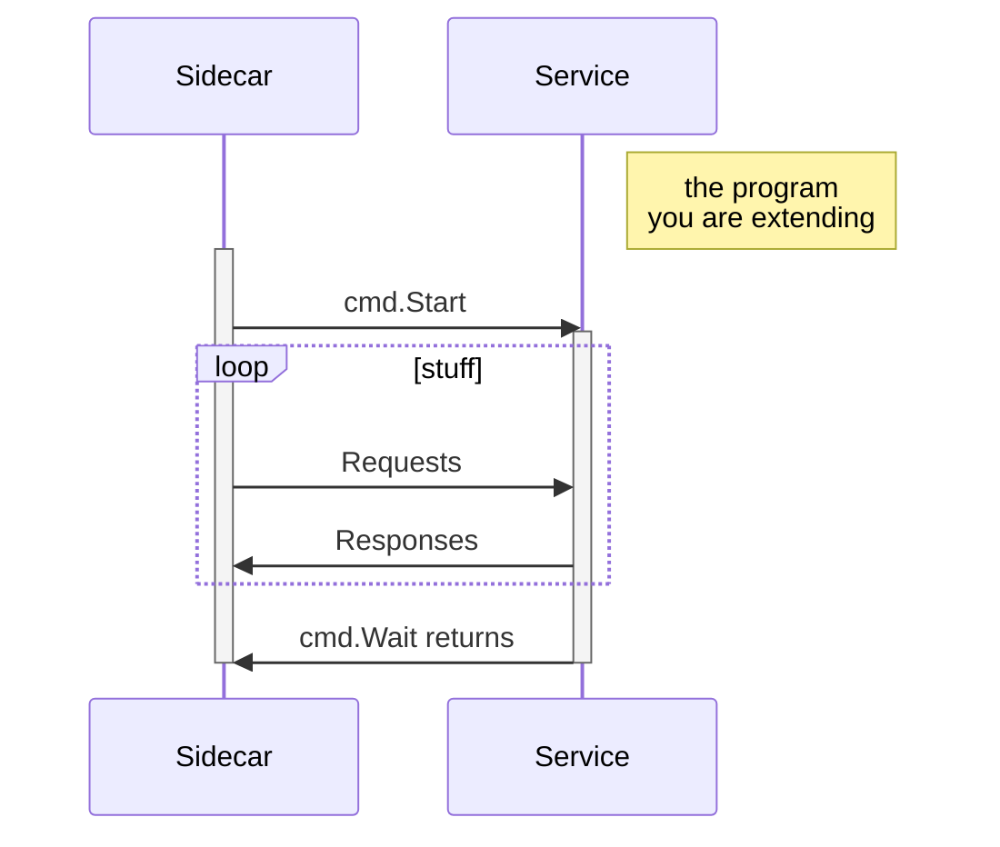
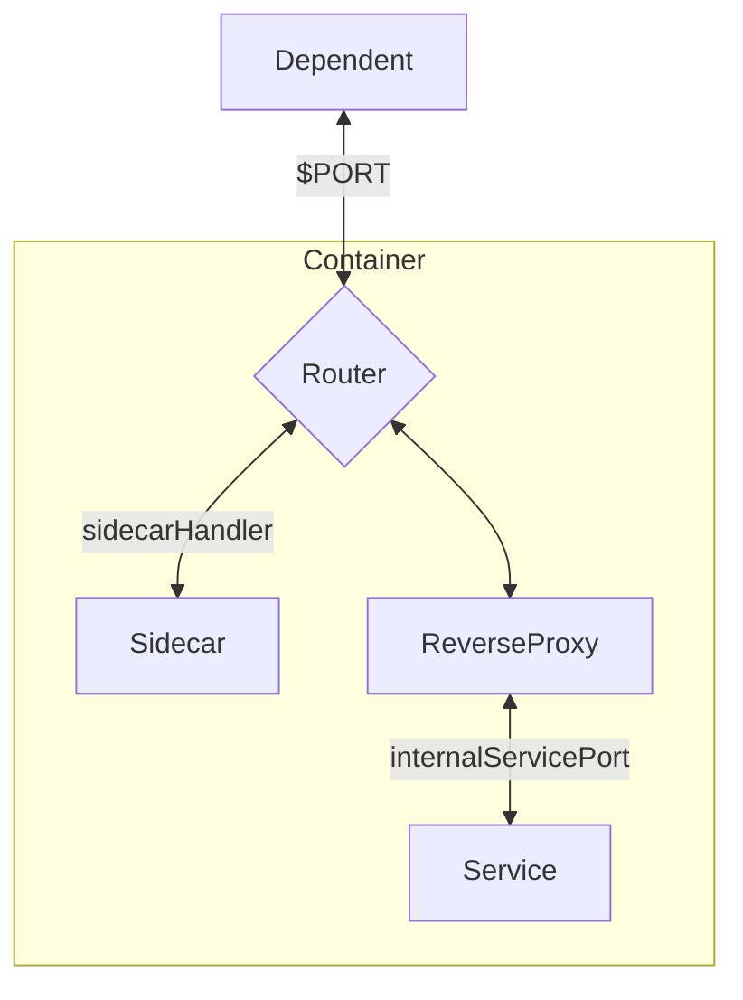

Many open-source services are distributed as [Docker images](https://docs.docker.com/get-started/overview/#docker-objects), and since the purpose of these things is to be deployed and run, sometimes you'll want to extend the functionality slightly - whether it be adding your own endpoints, manipulating configuration of the service within the Docker image, or something along those lines.

In some cases, such as for manipulating configuration, most images will allow you to mount configuration within the container or use environment variables, so you can build a proper sidecar service to do whatever updates you want and restart the target container. The same goes for extending endpoints - a proper sidecar can serve you well. You can have one service manage the a large number of containers, which is what I did for [a project I worked on at RTrade, *Nexus*](/ipfs-orchestrator).

There's a significant convenience factor to keeping your service as a single container however - it's far easier to distribute and easier to deploy, and if you are trying to extend an off-the-shelf service like [Grafana](https://grafana.com/) that lives within a [large, multi-service deployment like Sourcegraph](https://docs.sourcegraph.com/dev/architecture), adding additional services becomes quite a pain. Heck, even adding an additional port is something that must have additional configuration propagated across an entire fleet of services across various deployment methods.

This article goes over the approach I took to achieve the following without significantly changing the public interface of our Grafana image:

* subscribe to core Sourcegraph configuration from another service
* apply changes to the Grafana instance through API calls or configuration changes
* report problems in the sidecar process

While I'll generally refer to Grafana in this writeup, you can apply it to pretty much any service image out there. I also use Go here, but you can draw from the same concepts to leverage your language of choice as well.

* TOC
{:toc}

## Wrapping the sidecar and the service

In a nutshell, the primary change made to the Grafana image is an adjustment to the entrypoint script:

```diff
- exec "/run.sh"               # run the Grafana image's default entrypoint
+ exec "/bin/grafana-wrapper"  # run our sidecar program, implemented as a wrapper
```

I'll go over the specifics of the wrapper in the next section, since I think it'll help to understand how we're extending the vanilla image. You'll want to set up a [Dockerfile](https://docs.docker.com/engine/reference/builder/) that builds the program and copies it over to the final image, which should be based on the vanilla image:

```Dockerfile
FROM golang:latest AS builder

# ... build your sidecar

FROM grafana/grafana:latest AS final

# copy your compiled program from the builder into the final image
COPY --from=builder /go/bin/grafana-wrapper /bin/grafana-wrapper

ENTRYPOINT ["/entry.sh"]
```

The goal here is to start a wrapper program that will start up your sidecar and the actual service within the image you are trying to extend (`grafana/grafana` in this case).

## Implementing the wrapper

Depending on what level of functionality you want to achieve, this program can be as simple as a server that makes API calls to the main service. For example:



This can be achieved using the Go standard library's [`os/exec` package](https://golang.org/pkg/os/exec/) to run the main image entrypoint, start up the sidecar, and simply wait for the entrypoint to exit.

```go
import (
    "errors"
    "os"
    "os/exec"
)

// newGrafanaRunCmd instantiates a new command to run grafana.
func newGrafanaRunCmd() *exec.Cmd {
    cmd := exec.Command("/run.sh")
    cmd.Env = os.Environ() // propagate env to grafana
    cmd.Stderr = os.Stderr
    cmd.Stdout = os.Stdout
    return cmd
}

func main() {
    grafanaErrs := make(chan error)
    go func() {
        grafanaErrs <- newGrafanaRunCmd().Run()
    }()

    go func() {
        // your sidecar
    }()

    // wait for grafana to exit
    err := <-grafanaErrs
    if err != nil {
        // propagate exit code outwards
        var exitErr *exec.ExitError
        if errors.As(err, &exitErr) {
            os.Exit(exitErr.ProcessState.ExitCode())
        }
        os.Exit(1)
    } else {
        os.Exit(0)
    }
}
```

### Adding endpoints

What if both your sidecar and the extended service expose endpoints over the network? Sure, you could simply have the sidecar listen on a separate port, but that would involve adding another port to expose on your container, and adds another point of configuration that dependents need to be aware of before they can connect to your service.

My solution to this is to keep the same container "interface" by having a reverse proxy listen on the exposed port, which would handle forwarding requests to either the main service or the sidecar.



Again, the Go standard library comes to the rescue with the [`net/http/httputil` package](https://golang.org/pkg/net/http/httputil/). We also use `gorilla/mux` for routing in this example, but you can choose any routing library that serves your needs.

```go
import (
    "net/http/httputil"
    "github.com/gorilla/mux"
)

func main() {
    // ... as before

    router := mux.NewRouter()

    // route specific paths to your sidecar's endpoints
    router.Prefix("/sidecar/api", sidecar.Handler())

    // if a request doesn't route to the sidecar, route to your main service
    router.PathPrefix("/").Handler(&httputil.ReverseProxy{
        // the Director of a ReverseProxy handles transforming requests and
        // sending them on to the correct location, in this case another port
        // in this container (our service's internal port)
        Director: func(req *http.Request) {
            req.URL.Scheme = "http"
            req.URL.Host = fmt.Sprintf(":%s", serviceInternalPort)
        },
    })

    go func() {
        // listen on our external port - the port that will be exposed by the
        // container - to handle routing
        err := http.ListenAndServe(fmt.Sprintf(":%s", exportPort), router)
        if err != nil && !errors.Is(err, http.ErrServerClosed) {
            os.Exit(1)
        }
        os.Exit(0)
    }()

    // ... as before
}
```

### Restarting the service

In my case, I eventually had to add restart capabilities, since some configuration changes required the service to be restarted.

Simply restarting the container was not an option, since it would complicate how the configuration would persist, and would cause us to lose the advantage of having a single self-isolated container that required no external care.

Fortunately, `exec.Cmd`, once started, provides an [`*os.Process`](https://golang.org/pkg/os/#Process) that we can use to stop an existing process. I introduced a controller that would expose functions through which the sidecar can stop and start the main service:

```go
type grafanaController struct {
    mux  sync.Mutex
    proc *os.Process
}
```

Stopping is pretty straight-forward - if the service is running, `proc` will be non-nill, and we can simply signal it to stop:

```go
func (c *grafanaController) Stop() error {
    c.mux.Lock()
    defer c.mux.Unlock()

    if c.proc != nil {
        if err := c.proc.Signal(os.Interrupt); err != nil {
            return fmt.Errorf("failed to stop Grafana instance: %w", err)
        }
        _, _ = c.proc.Wait() // this can error for a variety of irrelvant reasons
        if err := c.proc.Release(); err != nil {
            c.log.Warn("failed to release process", "error", err)
        }
        c.proc = nil
    }
    return nil
}
```

Notice how this is starting to look a bit gnarly:

* A failed `proc.Wait()` does not strictly indicate that the shutdown failed, but could also indicate that the process shut down immediately (before `proc.Wait()` could run). However, it is still import to wait, since a signal does not indicate the service has stopped completely.
* A failed `proc.Release()` does not strictly indicate a fatal error, so we log and continue as if nothing has happened.

Starting the service is even less appealing - we can't just start the service on a goroutine and ignore it, since we want to be aware of and log errors. However, not every error should be fatal, and the line is blurry.

```go
func (c *grafanaController) RunServer() error {
    c.mux.Lock()
    defer c.mux.Unlock()

    // spin up grafana and track process
    c.log.Debug("starting Grafana server")
    cmd := newGrafanaRunCmd()
    if err := cmd.Start(); err != nil {
        return fmt.Errorf("failed to start Grafana: %w", err)
    }
    c.proc = cmd.Process

    // capture results from grafana process
    go func() {
        // cmd.Wait output:
        // * exits with status 0 => nil
        // * command fails to run or stopped => *ExitErr
        // * other IO error => error
        if err := cmd.Wait(); err != nil {
            var exitErr *exec.ExitError
            if errors.As(err, &exitErr) {
                exitCode := exitErr.ProcessState.ExitCode()
                // unfortunately grafana exits with code 1 on sigint
                if exitCode > 1 {
                    c.log.Crit("grafana exited with unexpected code", "exitcode", exitCode)
                    os.Exit(exitCode)
                }
                c.log.Info("grafana has stopped", "exitcode", exitCode)
                return
            }
            c.log.Warn("error waiting for grafana to stop", "error", err)
        }
    }()

    return nil
}
```

Just like errors in libraries, exit codes are often up to the jurisdiction of the developer, and in this case Grafana does not give us a useful indication of whether a process has stopped because of an intentional `SIGINT`, or if a fatal error occurred causing it to exit (and indicating that we should exit our controller).

You can add some additional management (i.e. a thread-safe flag or channel to indicate that a shutdown has been triggered intentionally, and only exit on code 1 if this flag is not set), but the complexity of what is meant to be a simple wrapper will quickly ramp up.

At the time of writing I'm not sure that any additional handling is required for a reasonable experience, but I'll be keeping an eye on how this code behaves.

Note that this also means we can no longer just block on the main program until the service exits, since it can exit (intentionally) at any time - instead, we must depend on an external `SIGINT` to tell us when to stop:

```go
import (
    "os"
    "os/signal"
)

func main() {
    // ... mostly as before

    c := make(chan os.Signal, 1)
    signal.Notify(c, os.Interrupt)
    <-c
    if err := grafana.Stop(); err != nil {
        log.Warn("failed to stop Grafana server", "error", err)
    }
}
```

## Source code and pull requests

And that's it for a rudimentary sidecar service that allows you to continue treating a service container as a completely isolated unit!

Some relevant pull requests implementing these features:

* [#11427](https://github.com/sourcegraph/sourcegraph/pull/11427) - I ended up reverting this due to bugs in certain environments and adding it back in [#11483](https://github.com/sourcegraph/sourcegraph/pull/11483), but both PRs include relevant discussions. These PRs implements a basic sidecar without start and restart capabilities.
* [#11554](https://github.com/sourcegraph/sourcegraph/pull/11554) adds the ability for the sidecar to start and restart the main service.

---

**⚠️ Update**: The source code *was* available in the main `sourcegraph/sourcegraph` repository in [`docker-images/grafana`](https://sourcegraph.com/github.com/sourcegraph/sourcegraph@master/-/tree/docker-images/grafana), but we have since pivoted on the plan (context: [#11452](https://github.com/sourcegraph/sourcegraph/issues/11452#issuecomment-648628953)) and the wrapper no longer lives in our Grafana distribution, but is instead a part of our Prometheus deployment - see [#11832](https://github.com/sourcegraph/sourcegraph/pull/11832) for the new implementation.

---

Learn more about Sourcegraph [here](https://about.sourcegraph.com/).
