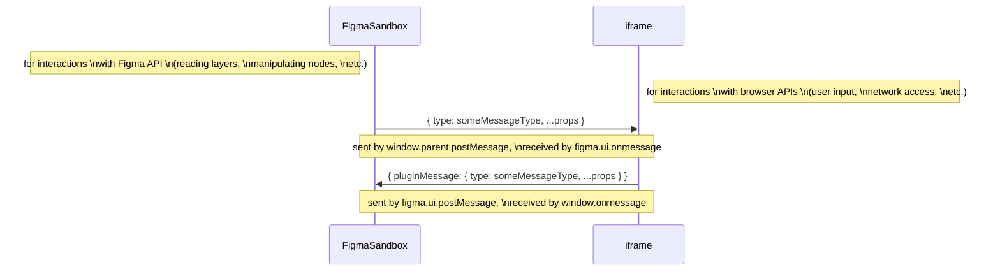
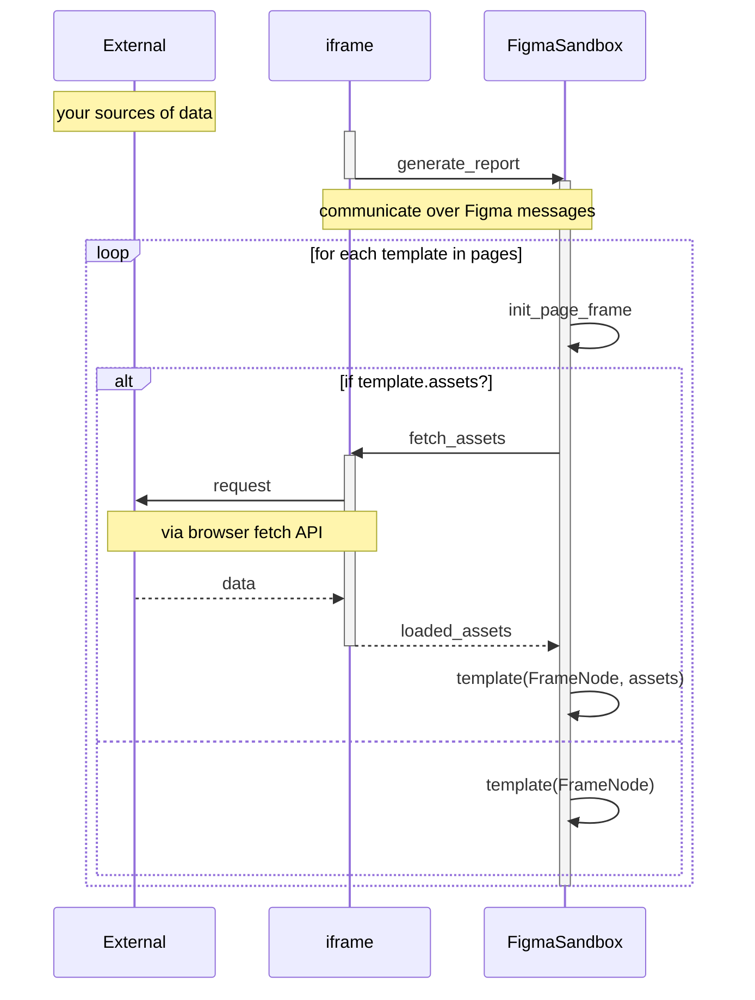

  <b>
    :warning: This post is a work in progress!
  </b>

My second chunk of work for my [part-time remote position at Sumus](/sumus) (read about
[the first chunk here](/appengine-branch-previews)) involved building a Figma plugin to generate
a property pitch report from data about a property collected by employees, mostly aggregated on a
central [Wordpress](https://wordpress.com/) instance. For the unfamiliar, [Figma](https://www.figma.com/)
is a neat web-based tool for collaborative design, featuring a very robust set of APIs, which made
choosing it for automating the property pitch report process a pretty obvious one.

In this post I'll write about approaching the Figma plugin API and leveraging it to automate aggregating
data from various sources to generate a baseline report that can easily be customized further!

- [Requirements](#requirements)
- [Implementation](#implementation)
  - [Figma Plugins Rundown](#figma-plugins-rundown)
  - [Collecting Input and using React as our iframe](#collecting-input-and-using-react-as-our-iframe)
  - [Manipulating Figma Nodes and Working with the FigmaSandbox](#manipulating-figma-nodes-and-working-with-the-figmasandbox)
  - [Other Considerations](#other-considerations)

## Requirements

This plugin would have to be able to:

* retrieve basic data collected by employees from our Wordpress instance
* download images, generate maps, and retrieve miscellaneous assets from various sources to augment the report
* splat all this data onto a Figma document in an attractive, organized manner

As far as implementation goes, this posed a few problems when using Figma Plugins - read on for more
details!

## Implementation

### Figma Plugins Rundown

To start off I am going to give a quick overview of how Figma Plugins work. This is also covered in
["How Plugins Run"](https://www.figma.com/plugin-docs/how-plugins-run/) from the official documentation,
but for some reason it still took me quite a while to figure things out, so I'll explain it slightly
differently here:

Sometimes the `FigmaSandbox` is referred to as the "main thread", and the `iframe` is also called a "worker".
The "why" of this setup is explained in the official documentation:

> For performance, we have decided to go with an execution model where plugin code runs on the main
> thread in a sandbox. The sandbox is a minimal JavaScript environment and does not expose browser APIs.

That means that you'll have two components to your plugin: a user interface that has code that runs
in the `iframe`, which *also* handles any browser API usage (any network requests, the DOM, and so on),
while any code that does the actual work of handling interactions with Figma (reading layers,
manipulating nodes, setting views, and so on) runs in an entirely separate `FigmaSandbox`. The only
way these two can communicate is through *message passing* via the Figma plugin framework, as described
in the above diagram.

This means that to build this thing, we'd either have to:

* front-load everything in the `iframe` before passing everything onto the `FigmaSandbox` - this would
  require knowing all such dependencies beforehand, and passing a lot of information around
* do some ping-ponging between the `iframe` and `FigmaSandbox`, where each page we generate can declare
  its own dependencies and fetch them appropriately

We ended up going with the second option, which lended itself to a more compartmentalized approach,
as outlined below:

### Collecting Input and using React as our iframe

TODO

### Manipulating Figma Nodes and Working with the FigmaSandbox

TODO

### Other Considerations

TODO
