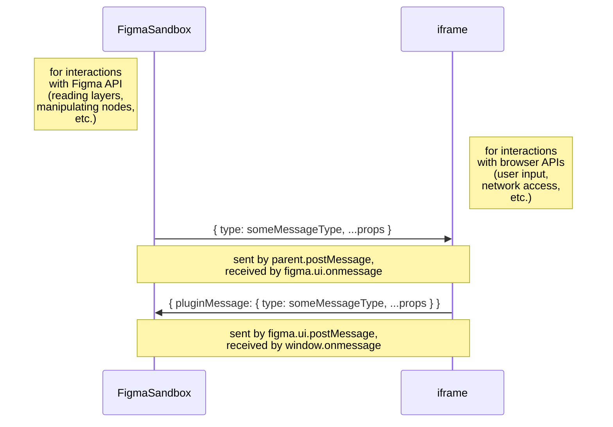
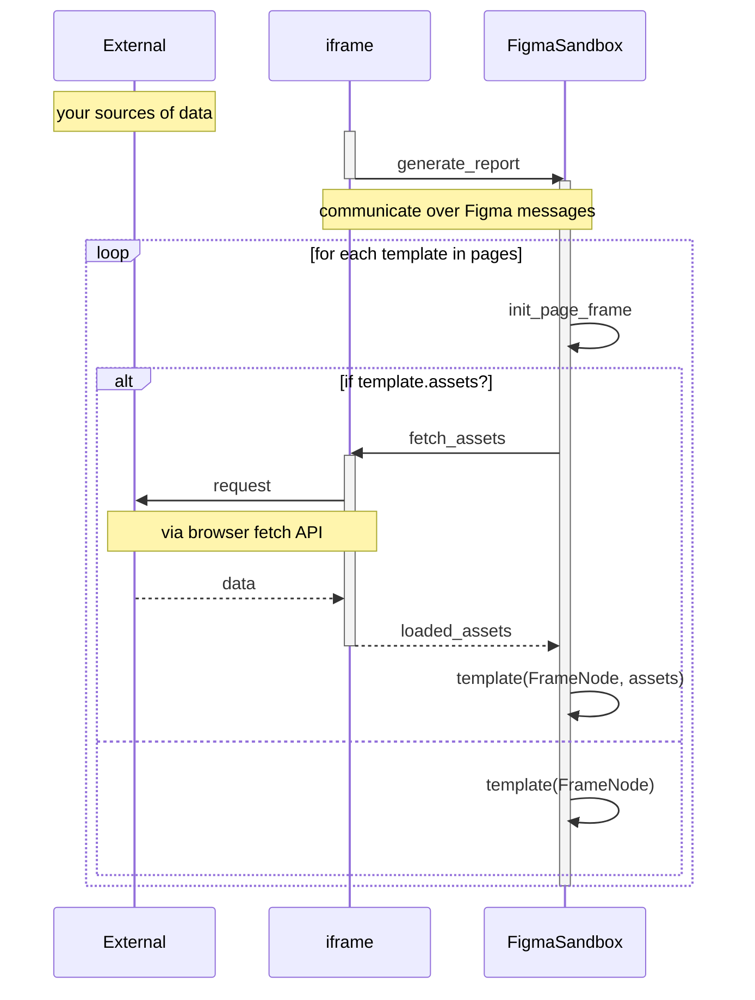

My second chunk of work for my [part-time remote position at Sumus](/sumus) (read about
[the first chunk here](/appengine-branch-previews)) involved building a Figma plugin to generate
a property pitch report from data about a property collected by employees, mostly aggregated on a
central [Wordpress](https://wordpress.com/) instance. For the unfamiliar, [Figma](https://www.figma.com/)
is a neat web-based tool for collaborative design, featuring a very robust set of APIs, which made
choosing it for automating the property pitch report process a pretty obvious one.

In this post I'll write about approaching the Figma plugin API and leveraging it to automate aggregating
data from various sources to generate a baseline report that can easily be customized further! :electric_plug:

- [Requirements](#requirements)
- [Implementation](#implementation)
  - [Figma Plugins Rundown](#figma-plugins-rundown)
    - [Structuring Our Plugin](#structuring-our-plugin)
  - [Collecting Input and using React as our iframe](#collecting-input-and-using-react-as-our-iframe)
  - [Manipulating Figma Nodes and Working With the FigmaSandbox](#manipulating-figma-nodes-and-working-with-the-figmasandbox)
    - [Example: Declaring, Downloading, and Using an Image Asset](#example-declaring-downloading-and-using-an-image-asset)
- [Final Thoughts](#final-thoughts)

## Requirements

This plugin would have to be able to:

* retrieve basic data collected by employees from our Wordpress instance
* download images, generate maps, and retrieve miscellaneous assets from various sources to augment the report
* splat all this data onto a Figma document in an attractive, organized manner

As far as implementation goes, this posed a few problems when using Figma Plugins - read on for more
details!

## Implementation

### Figma Plugins Rundown

To start off I am going to give a quick overview of how Figma Plugins work. This is also covered in
["How Plugins Run"](https://www.figma.com/plugin-docs/how-plugins-run/) from the official documentation,
but for some reason it still took me quite a while to figure things out, so I'll explain it slightly
differently here:



Sometimes the `FigmaSandbox` is referred to as the "main thread", and the `iframe` is also called a "worker".
The "why" of this setup is explained in the official documentation:

> For performance, we have decided to go with an execution model where plugin code runs on the main
> thread in a sandbox. The sandbox is a minimal JavaScript environment and does not expose browser APIs.

That means that you'll have two components to your plugin: a user interface that has code that runs
in the `iframe`, which *also* handles any browser API usage (any network requests, the DOM, and so on),
while any code that does the actual work of handling interactions with Figma (reading layers,
manipulating nodes, setting views, and so on) runs in an entirely separate `FigmaSandbox`. The only
way these two can communicate is through *message passing* via the Figma plugin framework, as described
in the above diagram.

This means that to build this thing, we'd either have to:

* front-load everything in the `iframe` before passing everything onto the `FigmaSandbox` - this would
  require knowing all such dependencies beforehand, and passing a lot of information around
* do some ping-ponging between the `iframe` and `FigmaSandbox`, where each page we generate can declare
  its own dependencies and fetch them appropriately

#### Structuring Our Plugin

We ended up going with the second option, which lended itself to a more compartmentalized approach,
as outlined below:



The following sections cover [the `iframe`](#collecting-input-and-using-react-as-our-iframe) and
[the `FigmaSandbox` and the outside world](#manipulating-figma-nodes-and-working-with-the-figmasandbox)
in more detail, complete with examples!

### Collecting Input and using React as our iframe

I started off using a template I found, [`nirsky/figma-plugin-react-template`](https://github.com/nirsky/figma-plugin-react-template),
which I quickly forked and made a variant of for my own preferences (mostly related to tooling and
styles), which you can find at [`bobheadlabs/figma-plugin-react-template`](https://github.com/bobheadlabs/figma-plugin-react-template).

The template sets up the `iframe` part of our plugin as a Typescript-based React application, which
is handy because [Figma provides an API typings file](https://www.figma.com/plugin-docs/api/typings/)
that saved me a lot of time. Inputs are collected in standard React fashion with some
[hooks](https://reactjs.org/docs/hooks-intro.html):

```ts
const projectIDInput = React.useRef<HTMLInputElement>(undefined);
const projectIDRef = React.useCallback((element: HTMLInputElement) => {
  projectIDInput.current = element;
}, []);
```

And later, in your JSX:

```tsx
<p>Project ID: <input ref={projectIDRef} /></p>
```

There are a number of ways to do this, so just use whatever you prefer! Once you've collected your
parameters, as denoted in above diagrams, when the user kicks off the report generation process we
can fire a messsage to the `FigmaSandbox` via `parent.postMessage`:

```ts
const onSubmit = React.useCallback(() => {
  parent.postMessage({ pluginMessage: {
    type: actions.LoadProject,
    // ... other params
  } }, '*');
}, []);
```

To enable bidirectional message passing (in our case, to enable asset loading on the fly), we'll
need to hook onto incoming messages to the `iframe` via `window.onmessage`:

```ts
React.useEffect(() => {
  window.onmessage = async (event) => {
    const { pluginMessage } = event.data;
    const { type } = pluginMessage;
    try {
      switch (type) {
      /**
       * handle your plugin's various action types - these handlers can also use
       * `parent.postMessage` to pass results back to the FigmaSandbox!
       */
      }
    } catch (err) {
      console.error(type, { err });
    }
  }
}
```

Remember that browser API access requires being in the `iframe`, so any network requests and so on
should probably happen in one of these `window.onmessage` handlers.

### Manipulating Figma Nodes and Working With the FigmaSandbox

Similar to the `iframe`, the first step is to listen for messages, this time via `figma.ui.onmessage`:

```ts
figma.showUI(__html__, { height: 300 }); // https://www.figma.com/plugin-docs/manifest/
figma.ui.onmessage = async (msg) => {
  const { type } = msg;
  try {
    switch (type) {
    /**
     * handle your plugin's various action types - remember to make use of the figma API with the
     * `figma` object, and use `figma.ui.postMessage` to send messages back to the iframe!
     */
    }
  } catch (err) {
    console.error(err);
    figma.closePlugin(`Error occured: ${err}`);
  }
};
```

Since we have no UI component in the `FigmaSandbox`, this code can just be plain Typescript. 

Unlike the `iframe`, the actual Figma API is accessible to the plugin here via the `figma` object.
For example, to set up an A4-sized frame for each page and set your view onto them:

```ts
for (let i = 0; i < pages.length; i += 1) {
  const { name, template } = pages[i];

  // set up frame for this page
  const frame = figma.createFrame();
  frame.name = `Page ${i}: ${name}`;
  frame.resize(PAGE_A4.x, PAGE_A4.y);
  frame.y = i * (PAGE_A4.y + 100);

  // add frame to page
  figma.currentPage.appendChild(frame);
  newNodes.push(frame);

  // ...
}

// select new nodes and zoom to fit
figma.currentPage.selection = newNodes;
figma.viewport.scrollAndZoomIntoView(newNodes);
```

Working with nodes is pretty straight-forward: like any other graph-like structure, each node
represents an element (in this case, an element on your Figma document), and attaching them to other
nodes gives your elements a bit of structure. Each node exposes a variety of configuration options.
For example, see the `TextNode` definition from the [Figma API typings file](https://www.figma.com/plugin-docs/api/typings/):

```ts
interface TextNode extends DefaultShapeMixin, ConstraintMixin {
  readonly type: "TEXT"
  clone(): TextNode
  readonly hasMissingFont: boolean
  textAlignHorizontal: "LEFT" | "CENTER" | "RIGHT" | "JUSTIFIED"
  textAlignVertical: "TOP" | "CENTER" | "BOTTOM"
  textAutoResize: "NONE" | "WIDTH_AND_HEIGHT" | "HEIGHT"
  paragraphIndent: number
  paragraphSpacing: number
  autoRename: boolean
  // ...
}
```

Refer to the typings and [official node types documentation](https://www.figma.com/plugin-docs/api/nodes/)
to find out what you need!

#### Example: Declaring, Downloading, and Using an Image Asset

Recall from the [earlier diagram](#structuring-our-plugin) that for our templates to declare asset
dependencies, a bit of ping-ponging needed to happen between our `iframe` and `FigmaSandbox` components
to make the appropriate network requests.

Here is an example of a simple template function (which is our way of organizing page generation -
feel free to use whatever system suits you best!) that allows the declaration of some dependencies.
The interface is described as follows:

```ts
export type Asset = ImageAsset | MapAsset;

export type Assets = {[name: string]: Asset}

export interface Template {
  /**
   * Optional assets function allows templates to declare image dependencies. This callback should
   * return a set of URLs keyed by a useful identifier. If provided, hashes of loaded images will be
   * provided to Template.
   */
  assets?: (data: ProjectData) => Assets;

  /**
   * Calling a template should populate the given frame with this template. The `assets` argument is
   * only provided if `Template::assets` is declared.
   */
  (frame: FrameNode, data: ProjectData, assets?: {[name: string]: string}): Promise<void>;
}
```

Note that in the `template` function, `assets` is a simple key to string value dictionary, while in
the `assets` property, the function returns `Assets`. This is
because Figma images are referenced by a hash - once we have image data, it is easier to simply
store the images in Figma first before passing the identifying hashes as values in the `asset`
dictionary to the template function. For declaring assets, a bit more detail is needed - hence
the `Assets` type.

Here's an example function:

```ts
async function template(frame: FrameNode, _: ProjectData, assets?: {[name: string]: string}) {
  // set up a simple coloured background via a helper function we made
  Background(frame, LIGHT_BEIGE);

  // create a rectangle to populate with our logo
  const imgN = figma.createRectangle();
  imgN.name = 'logo';
  imgN.fills = [{
    type: 'IMAGE',
    scaleMode: 'FILL',
    imageHash: assets.logo, // image hash for Figma, as described above
  }];
  // center our logo
  imgN.x = frame.width / 2 - imgN.width / 2;
  imgN.y = frame.height / 2 - imgN.height / 2;
  // add the logo to the frame
  frame.appendChild(imgN);
}
// declare a dependency on our logo
template.assets = (): Assets => ({
  logo: {
    type: AssetType.IMAGE,
    uri: `${env.wordpressInstance}/wp-content/uploads/2020/02/Dark-Full-LogoLarge.png`,
  },
});
```

In our [`FigmaSandbox` message receiver](#manipulating-figma-nodes-and-working-with-the-figmasandbox),
we'll have to check for asset dependencies before calling the template function:

```ts
if (template.assets) {
  // load assets if provided and let main runtime dispatch template load
  figma.ui.postMessage({
    type: actions.LoadAssets,
    assets: template.assets(projectData),
    // used to re-establish context once we've loaded our assets
    frameID: frame.id,
    pageID: i,
    projectData,
  });
} else {
  // if no assets are provided, just load the template directly
  await template(frame, projectData);
}
```

Then, back over in the [`iframe` message receiver](#collecting-input-and-using-react-as-our-iframe),
we'll want to retrieve these assets when requested:

```ts
export async function getImage(imageURI: string): Promise<Uint8Array> {
  const resp = await fetch(imageURI);
  // convert image data into Uint8Array to send back to FigmaSandbox
  const blob = await resp.blob();
  return new Promise((resolve, reject) => {
    const reader = new FileReader();
    reader.onload = () => resolve(new Uint8Array(reader.result as ArrayBuffer));
    reader.onerror = () => reject(new Error('Could not read from blob'));
    reader.readAsArrayBuffer(blob);
  });
}
```

```ts
switch (type) {
  case actions.LoadAssets: {
    const assets = pluginMessage.assets as Assets;
    const names = Object.keys(assets);
    // prepare to load all declared assets
    const loads = [];
    const loaded = {};
    for (let i = 0; i < names.length; i += 1) {
      const n = names[i];
      const ast = assets[n];
       const assetLoader = async () => {
        switch (ast.type) {
          case AssetType.IMAGE: {
            loaded[n] = await getImage(ast.uri);
            break;
          }
          // ...
        }
      }
      loads.push(assetLoader());
    }
    // await for all promises to resolve
    await Promise.all(loads);
    // send results back to the FigmaSandbox
    parent.postMessage({ pluginMessage: {
      ...pluginMessage, // retain context for the FigmaSandbox
      assets: loaded, // note that at this point, the values in assets is raw image data
      type: actions.AssetsLoaded,
    } }, '*');
  }
}
```

Now, back to the `FigmaSandbox` again (woo! ping pong!), we'll want to put all this image data
straight into Figma to avoid moving all this raw data around, and generate our template!

```ts
// load up context
const frameID = msg.frameID as string;
const pageID = msg.pageID as number;
const projectData = msg.projectData as ProjectData;
const { name, template } = pages[pageID];

// add assets to figma and set up references
const assets = {};
Object.keys(msg.assets).forEach((n) => {
  const data = msg.assets[n] as Uint8Array;
  const imageN = figma.createImage(data);
  assets[n] = imageN.hash;
});

// execute template with loaded assets!
await template(figma.getNodeById(frameID) as FrameNode, projectData, assets);
```

For the example template, this back-and-forth results in a page that looks like this:


If you find this example hard to follow, try and read through it again and match it up against
the [plugin sequence diagram](#structuring-our-plugin) illustrated previously - each action should
more or less align with the arrows on the diagram. It definitely took me a little while to get the
hang of as well :sweat_smile:

## Final Thoughts

The Figma plugin documentation is quite robust (except for loading images and a good way to do the
back-and-forth described in the above example, which I had to spend a good amount of time figuring
out for myself), and feature-wise it's pretty comprehensive as well. If your team has any sort of
design needs, I would highly recommend looking into automating some of your processes with Figma!

That said, it can be a bit of work to do seemingly trivial things (at least at first), but when you
get the hang of things you can do some pretty cool tricks with it - I'll probably follow up this post
with another one about the map generation work I am about to do!

As an aside: the charts in this post were created with [Mermaid](https://github.com/mermaid-js/mermaid),
which I recently (re)discovered - very nifty.
