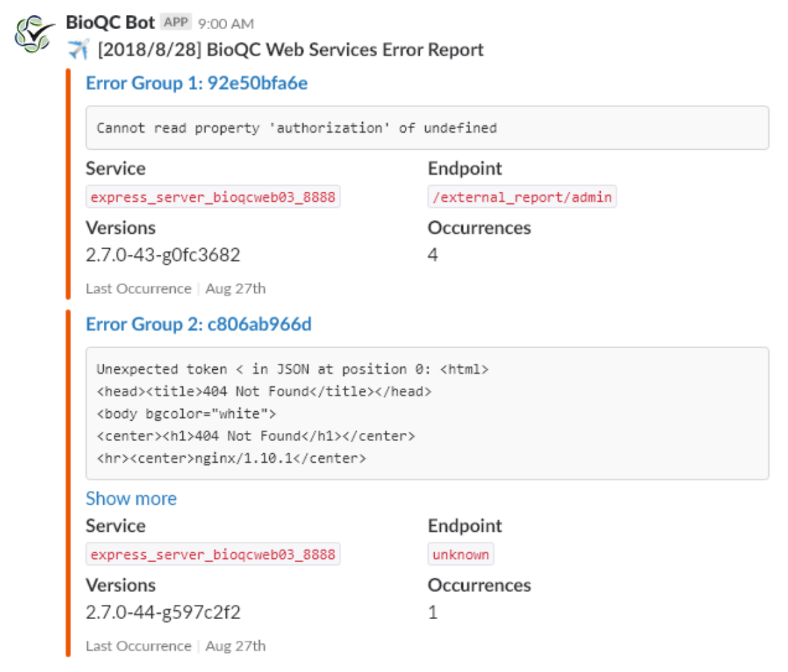
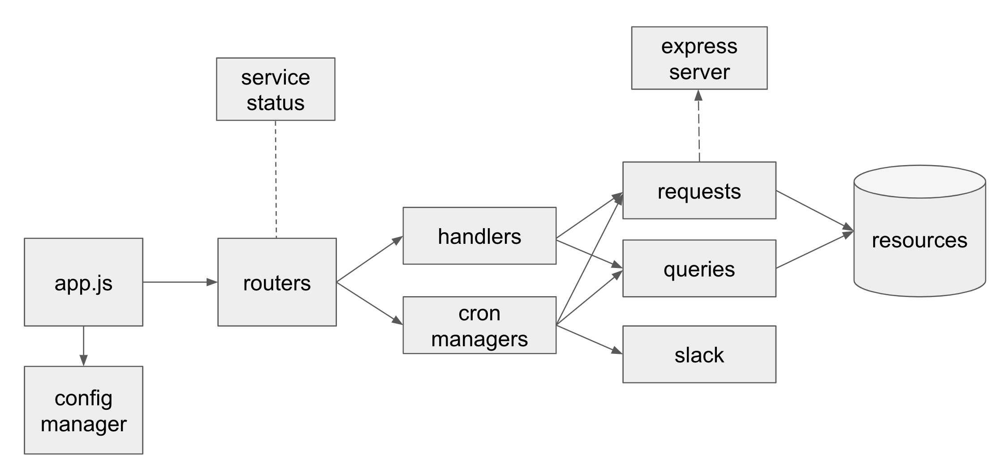
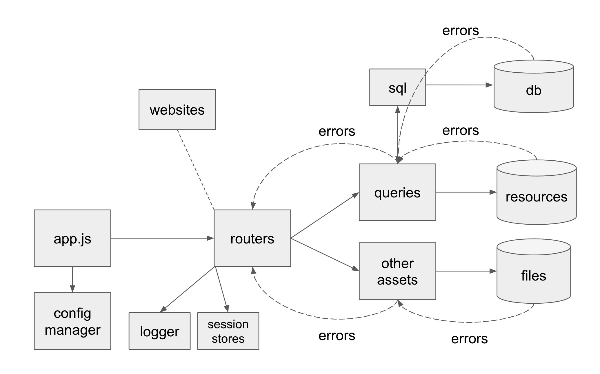

From January to August 2018 I worked as a software developer for the Bioinformatics
Quality Control team in [Canada's Michael Smith Genome Sciences Centre](#about-the-michael-smith-genome-sciences-center).

During my time with the team I leveraged technologies like [Node.js](https://nodejs.org/en/about/),
[Python](https://www.python.org/), [PostgreSQL](https://www.postgresql.org/),
[Elasticsearch](https://www.elastic.co/), [AngularJS](https://angularjs.org/),
and [ReactJS](https://reactjs.org/) for a variety of projects:

* designed and built a well-tested modularized, maintainable **Node.js server**
  from scratch that became the core of all of the team's workflows and websites.
* worked extensively with **PostgreSQL databases to set up queries and data pipelines**
  that needed to scale and handle thousands of row updates at a time, and designed
  new tables to handle additional data points.
* set up an **Elasticsearch and APM deployment for operational visibility** into
  the team's pipelines, and developed application integrations for the platform.
* built a **new utilisation, uptime, and status website to offer visibility into
  the team's compute resources, pipelines, and services** in ReactJS for teams
  dependent on our work based on the new monitoring data enabled by Elasticsearch,
  featuring a plugin-based cron system for executing regular checks.
* fixed bugs and developed new features for the team's internal sample review
  website and their researcher-facing analysis summary website, both built in
  AngularJS.
* **built bioinformatic utilities** using sequence analysis tools like
  [BLAST](https://blast.ncbi.nlm.nih.gov/Blast.cgi) to aid in the team's work.

 

<figure>
    
    <figcaption>
    Example notification from the new service status server I built, which delivers
    the output of cron jobs directly to the appropriate channels. Below is an
    architecture diagram of the service showing its various components.
    </figcaption>
</figure>

<figure>
    
</figure>

 

<figure>
    
    <figcaption>
    Diagram illustrating the component dependency graph and how error flows
    through the new core server I built to handle the team's processed data and
    websites.
    </figcaption>
</figure>

 

While I was at the BCGSC I wrote a few blog posts about some of the work I did:

* [object casting with polymorphic objects in javascript](https://bobheadxi.dev/object-casting-in-javascript/)
* [determining the uniqueness of oligonucleotide sequences](https://bobheadxi.dev/unique-sequences/)

 

### About the Michael Smith Genome Sciences Center

[Canada's Michael Smith Genome Sciences Center](http://www.bcgsc.ca/) is a
leading international centre for genomics and bioinformatics research. Their
mandate is to advance knowledge about cancer and other diseases, to improve human
health through disease prevention, diagnosis and therapeutic approaches, and to
realise the social and economic benefits of genomics research. As of September 2019,
the facility has sequenced over [two and a half quadrillion raw DNA bases](http://www.bcgsc.ca/).
