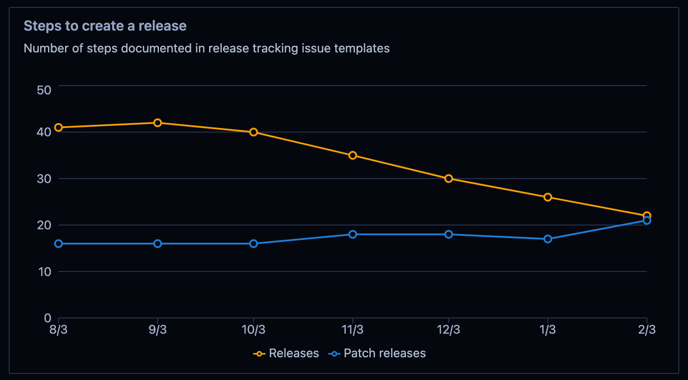
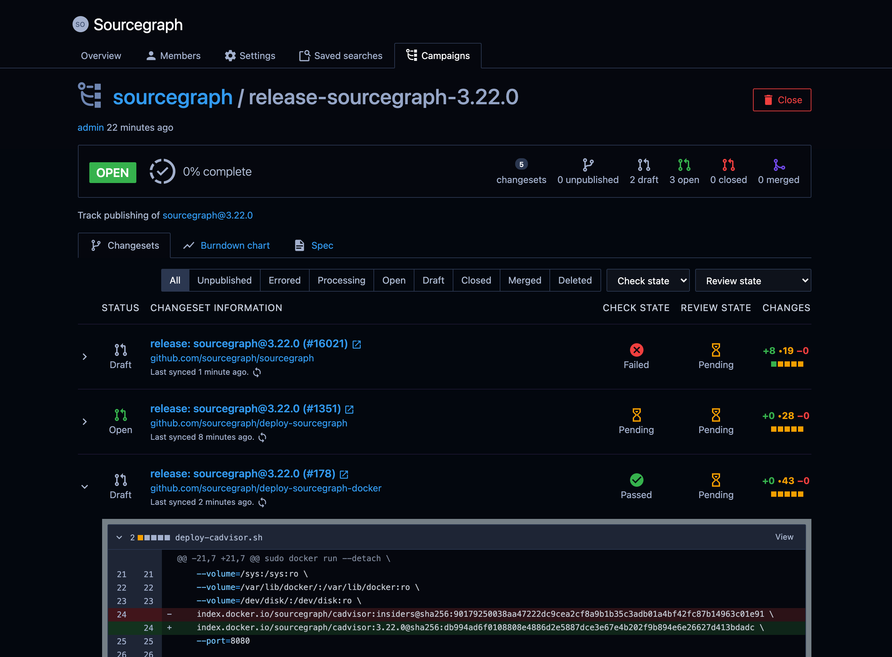

From May 2020 to January 2021, I worked as a software engineer intern at [Sourcegraph](#about-sourcegraph) on the Distribution team.
The Distribution team is responsible for making Sourcegraph easy to deploy, scale, monitor, and debug.
The team also solves challenging problems that our customers face when they deploy and scale Sourcegraph on-premise in a variety of environments, and that Sourcegraph faces when we deploy and scale [Sourcegraph Cloud](https://sourcegraph.com/search) (the largest Sourcegraph installation in the world).

My work as an intern had several areas of focus:

* building out the [monitoring stack that ships with Sourcegraph](#monitoring-at-sourcegraph)
* improving the [process for creating Sourcegraph releases](#sourcegraph-releases) to on-premise deployments with new capabilities
* experimenting with changes to the [pipelines that help us roll out Sourcegraph changes](#deployment-pipelines) to the various deployments we manage ourselves

Most of the company's work is open-source, so you can [see my pull requests for Sourcegraph on GitHub](https://github.com/search?o=desc&q=org%3Asourcegraph+author%3Abobheadxi+is%3Amerged&s=comments&type=Issues)! If you poke around, you might spot me chiming in on a variety of other pull requests and issue discussions as well.

A brief hiatus after my internship, I [returned to Sourcegraph full-time](2021-7-5-sourcegraph.md).

 

## Monitoring at Sourcegraph

During my time at Sourcegraph, a major part of my focus has been on expanding the capabilities of Sourcegraph's built-in monitoring stack and improving the experience for administrators of Sourcegraph deployments, Sourcegraph engineers, and Sourcegraph support.

* I created a new sidecar service to ship with the [Sourcegraph Prometheus image](https://docs.sourcegraph.com/dev/background-information/observability/prometheus), which I wrote a bit about in [this blog post](../_posts/2020-06-21-docker-sidecar.md). This service enabled me to build:
  * [alerting capabilities and configuration](https://docs.sourcegraph.com/admin/observability/alerting) directly within Sourcegraph, which now powers all alerting needs (routing, paging, and more) at Sourcegraph and [completely replaced our old alerting infrastructure](https://github.com/sourcegraph/sourcegraph/issues/5370#issuecomment-629406540)
  * the ability to [include recent alerts data in bug reports](https://github.com/sourcegraph/sourcegraph/pull/10704) and [render service status within the Sourcegraph app](https://github.com/sourcegraph/sourcegraph/pull/11957)

<figure>
  
  <figcaption>The Prometheus sidecar allows for detailed diagnostic feedback within the main Sourcegraph application.</figcaption>
</figure>

* I built features for and refactored the [Sourcegraph monitoring generator](https://docs.sourcegraph.com/dev/background-information/observability/monitoring-generator), which generates the Grafana dashboards, Prometheus rules and alerts definitions, documentation, and more that ship with Sourcegraph from a [custom monitoring specification](https://github.com/sourcegraph/sourcegraph/blob/main/monitoring/monitoring/README.md) that teams use to declare monitoring relevant to their services. Some changes include:
  * [team ownership of alerts](https://github.com/sourcegraph/sourcegraph/issues/12010), which is part of what drives our alerting infrastructure and also guides support request routing.
  * [new API design for customising graph panels](https://github.com/sourcegraph/sourcegraph/pull/17112) within our monitoring specification
  * generated [dashboard overlays](https://github.com/sourcegraph/sourcegraph/pull/17198) for alert events and version changes
  * driving a cross-team discussion to [overhaul the principles that drive our work on this tooling](https://github.com/sourcegraph/about/pull/2000) to help guide the future of monitoring at Sourcegraph

<figure>
  
  <figcaption>Generated Grafana dashboard for a Sourcegraph service, including annotations and panels that work for out-of-the-box for all services, providing a consistent experience across dashboards.</figcaption>
</figure>

I also made a wide range of other improvements such as:

* [Shipping cAdvisor with Sourcegraph](https://github.com/sourcegraph/sourcegraph/issues/9791), which now serves container metrics for our standardised dashboards across deployment types
* [Update dashboards to scale with deployment sizes](https://github.com/sourcegraph/sourcegraph/pull/12756)

 

## Sourcegraph Releases

Previously, creating Sourcegraph releases was a lengthy, complex process that involved a large number of manual steps that would frequently delay our monthly releases.

* I made extensive improvements to the [Sourcegraph release tool](https://about.sourcegraph.com/handbook/engineering/distribution/tools/release), which handles automation of release tasks such as generating multi-repository changes, creating tags, setting up tracking issues, adding calendar events, making announcements, and more.
  * New automated changes and consolidated features as part of work to [reduce the number of steps to create a release](https://github.com/orgs/sourcegraph/projects/90)
  * [Multi-repository changeset tracking](https://github.com/sourcegraph/sourcegraph/pull/15032)
  * Extensive refactors to improve the tool's extensibility and reliability
  * Overall, helped reduce time to cut a release from several days to just a few hours

<figure>
  
  <figcaption>
  Chart of downwards trend of steps required to create a release, based on checklist items in our generated release tracking issues (for example, <a href="https://github.com/sourcegraph/sourcegraph/issues/17727">sourcegraph#17727</a>).
  Patch release steps increased due to improved documentation and standardisation of the process.
  </figcaption>
</figure>

* Improved our integration and regression testing suite by introducing the capability to [directly leverage candidate images in tests, generalising test setup tooling, and migrating our automated upgrade tests to ensure compatibility](https://github.com/sourcegraph/sourcegraph/pull/14974)
  * Work on automated end-to-end testing by the Distribution team also contributed to the removal of many release steps
  * The use of shared per-build candidate images is now the standard way to run integration tests, saving a lot of build time previously spent building images for each individual test

The long-term vision of this work is to enable releases to be handled by any engineer at Sourcegraph, as seamlessly and painlessly as possible, improving the pace at which we can confidently ship releases to our customers.

<figure>
  
  <figcaption>
    Pull requests to create a release are generated by the release tool, some of which require additional actions.
    A generated release campaign provides release captains an overview of the progress of a release.
    <a href="https://docs.sourcegraph.com/campaigns">Sourcegraph campaigns</a> was a feature undergoing extensive development by another team, and I made this fun integration to build to check out their work and help out our own team's management of releases!
  </figcaption>
</figure>

 

## Deployment Pipelines

Sourcegraph maintains a [variety of Sourcegraph instances in addition to Sourcegraph Cloud](https://about.sourcegraph.com/handbook/engineering/deployments/instances). Deployment at Sourcegraph generally consists of two distinct steps:

* Building and publishing images
* Propagating published images

You can read more about this in [the handbook page about instances](https://about.sourcegraph.com/handbook/engineering/deployments/instances).

I worked on making adjustments to our build and publish pipelines, such as enabling direct integration testing of candidate images and making it easier to build tooling that interacts with our images.

Deployment methodology varies from instance to instance, but when I first joined Sourcegraph we did not have any instance that was kept closely up to date synchronously with both the state of our monorepo, [`sourcegraph/sourcegraph`](https://github.com/sourcegraph/sourcegraph), and the state of our primary method of distributing Sourcegraph, [`sourcegraph/deploy-sourcegraph`](https://github.com/sourcegraph/deploy-sourcegraph). To amend this, I built a trigger-based pipeline that would keep `deploy-sourcegraph` in sync with the latest images, and immediately propagate changes in `deploy-sourcegraph` to an [internal dogfood instance](https://about.sourcegraph.com/handbook/engineering/deployments/instances#k8s-sgdev-org).

I also developed tooling to automate the upgrades of our [managed Sourcegraph instances offering](https://docs.sourcegraph.com/admin/install/managed).
The tooling performs Terraform rewrites, configuration updates, and more - a previously a very manual process - greatly reducing the time it takes to conduct an upgrade, and minimizing the possibility of mistakes.
This tooling has enabled the team to operate increasing numbers of managed instances with minimal overhead.

 

### About Sourcegraph

[Sourcegraph](https://about.sourcegraph.com/about) provides code search and intelligence on the web across massive collections of codebases.
Their [long-term vision](https://about.sourcegraph.com/company/strategy) is to make it so everyone, in every community, in every country, and in every industry — not just the ones working at the half-dozen dominant tech companies — can create products using the best technology.
Sourcegraph is a fully distributed company with employees across the world.
