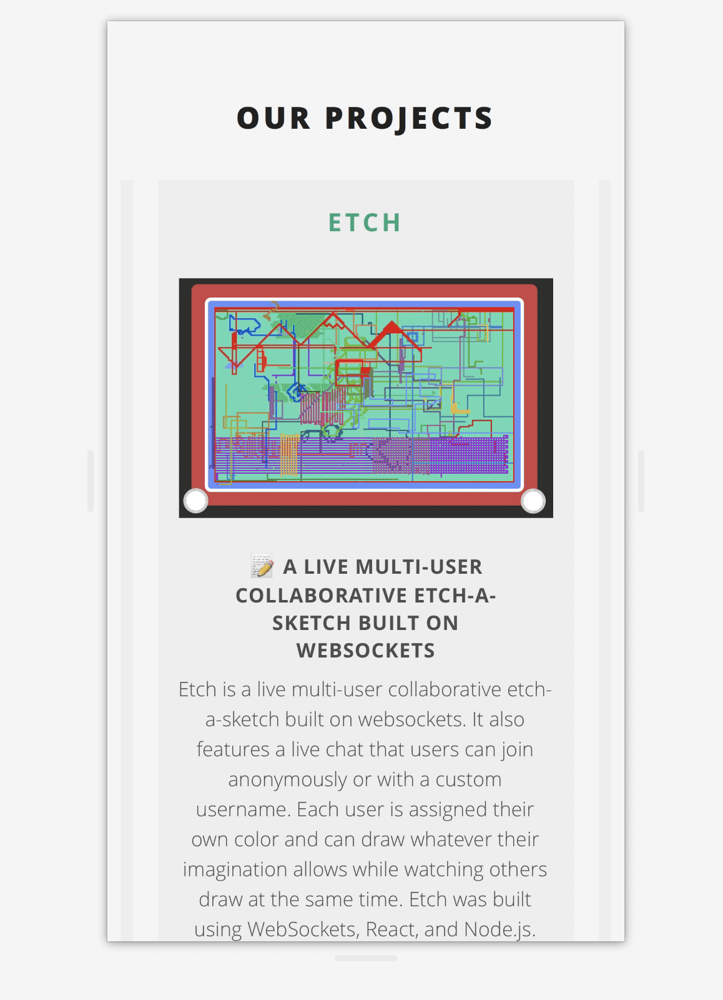

*⚠️ This project has been superseded by [a new website that I built](/open-source/ubclaunchpad-dot-com)!*

 

<figure>
    
</figure>

    

    

I worked briefly on adding some new features to the UBC Launch Pad website,
including:

* a **completely redesigned project showcase** section, featuring automatic
  scrolling, a responsive layout, and more! ([#50](https://github.com/ubclaunchpad/ubclaunchpad.github.io-old/pull/50))
* minor improvements such as [emoji support](https://github.com/ubclaunchpad/ubclaunchpad.github.io-old/pull/58)
  and other updates

<figure>
    
    <figcaption>The redesigned project showcase scales for mobile
    users.</figcaption>
</figure>

Check out my pull requests in more detail
[here](https://github.com/ubclaunchpad/ubclaunchpad.github.io-old/pulls?q=is%3Apr+author%3Abobheadxi+is%3Aclosed).

Also see [the new website that I built](2020-4-26-ubclaunchpad-dot-com.md) to replace this one!

 
