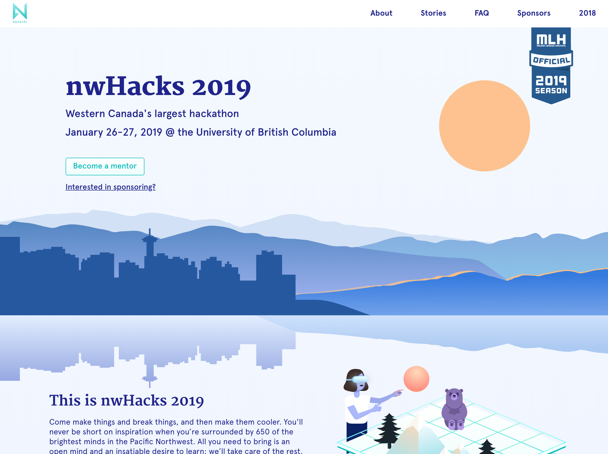
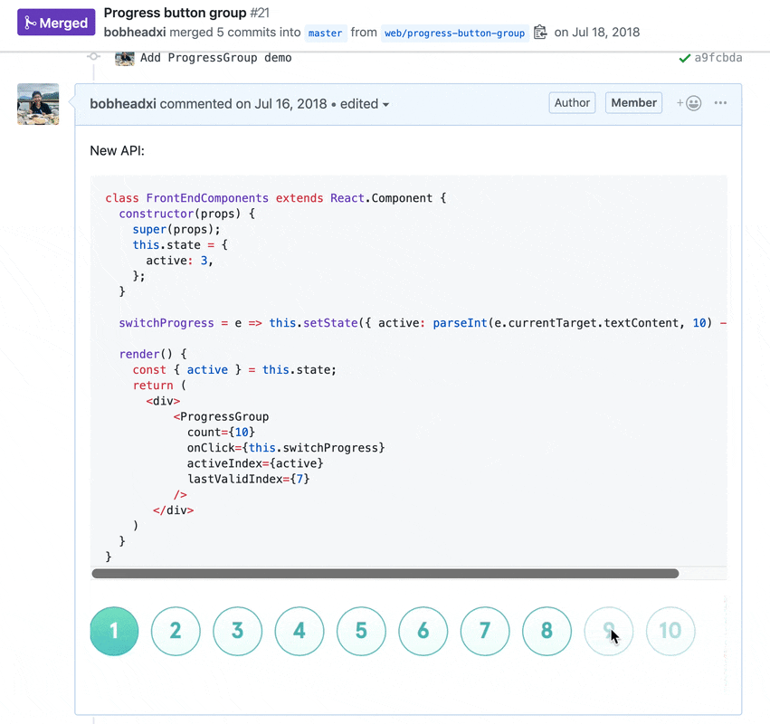
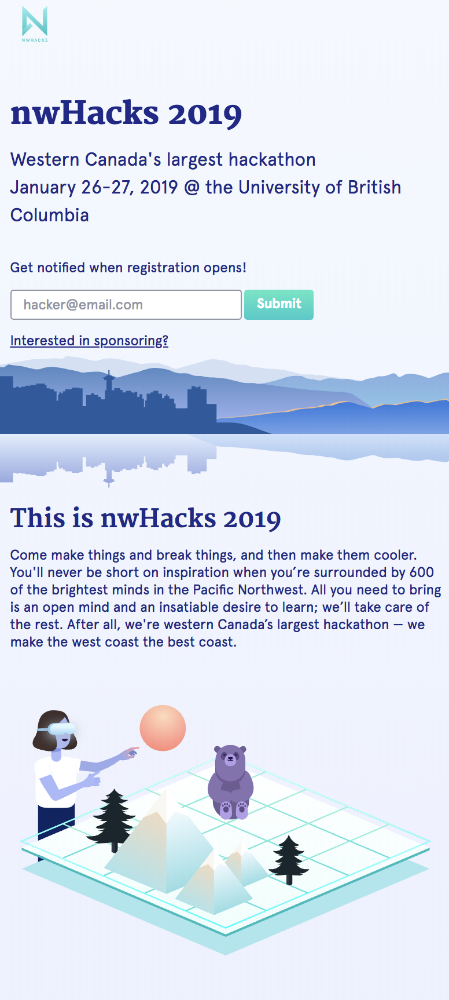

<figure>
  
</figure>

    

    
    

I joined the [nwPlus](https://www.nwplus.io/) team to work for a while on their
web projects, which powers events like [nwHacks](https://www.nwhacks.io/) - one
of the biggest hackathons in western Canada. During my time with their team, I
helped kickstart work on the nwHacks 2019 website with contributions such as:

* project setup and configuration
* **implementations of design assets** provided by the nwPlus design team
  ([#20](https://github.com/nwplus/nwhacks2019/pull/20), [#21](https://github.com/nwplus/nwhacks2019/pull/21),
  [#41](https://github.com/nwplus/nwhacks2019/pull/41), etc.)
* setting up **implementation of responsive layouts**
  ([#56](https://github.com/nwplus/nwhacks2019/pull/56), etc.)
* internal structuring
  ([#30](https://github.com/nwplus/nwhacks2019/pull/30), [#39](https://github.com/nwplus/nwhacks2019/pull/39), [#14](https://github.com/nwplus/nwhacks2019/pull/14), etc.)
* setting up a development deployment using another student-made tool,
  [Inertia](https://github.com/ubclaunchpad/inertia), that
  **enabled faster feedback and development cycles** ([#32](https://github.com/nwplus/nwhacks2019/pull/32))
* helped set up [Google Cloud Firestore](https://firebase.google.com/docs/firestore/)
  rules and document designs

Check out my pull requests in more detail [here](https://github.com/nwplus/nwhacks2019/pulls?q=is%3Apr+author%3Abobheadxi+is%3Aclosed),
and see the website [live](https://nwplus.github.io/nwhacks2019)!

 

<figure>
  
  <figcaption>Experimented with different internal APIs and
  discussed various implementations with feedback from teammates - from
  <a href="https://github.com/nwplus/nwhacks2019/pull/21" target="_blank">#21</a>.</figcaption>
</figure>

 

<figure>
  
  <figcaption>Fully response website! More examples and
  implementation details at
  <a href="https://github.com/nwplus/nwhacks2019/pull/56" target="_blank">#56</a>.</figcaption>
</figure>

 

<figure>
  
  <figcaption>Navigation bar implementation demo from
  <a href="https://github.com/nwplus/nwhacks2019/pull/41" target="_blank">#41</a>.
  Demos were very helpful for both the dev team and the designers to quickly
  give feedback to each other and improve designs that maybe don't look so great
  in practice - for example, <a href="https://github.com/nwplus/nwhacks2019/pull/41#pullrequestreview-145049016" target="_blank">the navigation bar design was changed</a>
  once a designer had a look at the implementation.</figcaption>
</figure>

 
