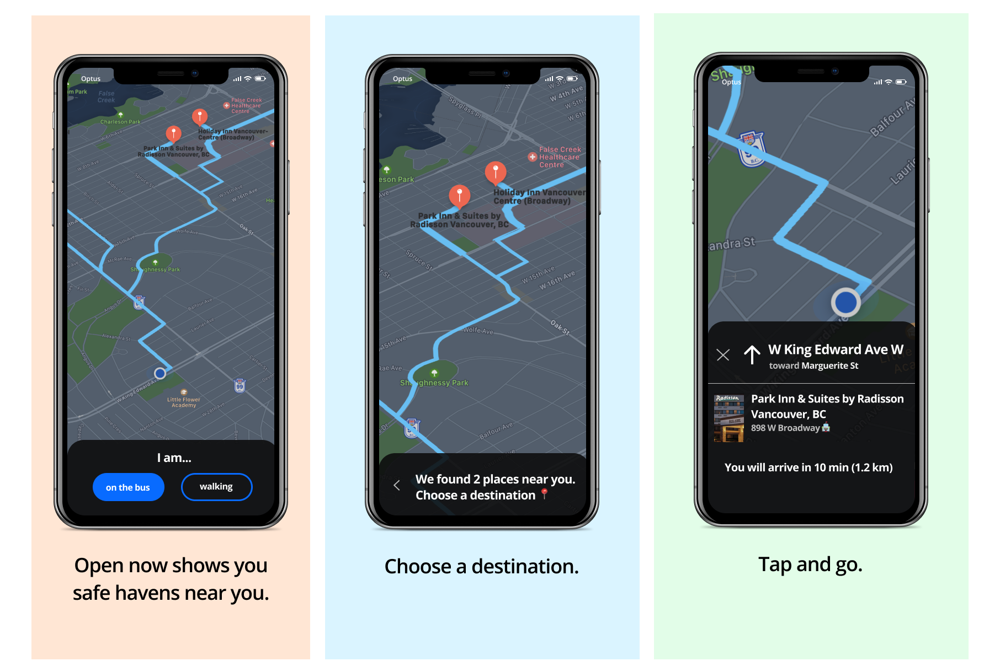

    

    

    
    
    

*Open Now* presents a simple, easy-to-parse interface that immediately shows
you with a number of options for reaching the nearest accessible safe haven, as
recommended based on contextual data, in a sleek mobile application. It was built
by a team of 4 during [nwHacks 2019](https://nwhacks2019.devpost.com).

## Features

* Quick, at-a-glance overview of possible routes nearby safe havens and destinations
* Intelligent suggestions based on contextual data such as your current and predicted trajectory, public transit mode, walking pace, and weather
* Detailed, turn-by-turn directions and destination details just a tap away
* Dark theme optimised for night-time environments

    

## How we built it

*Open Now* is an iOS app built in Swift, backed by a server written in Golang that powers our intelligent point-of-interest recommendations. The app and the server communicates using protocol buffers to serialise data transfer over Google’s remote procedure call framework, gRPC.

The server communicates with open-source public transit databases as well as the Google Maps Platform to generate recommendations, and is hosted using [Inertia](https://github.com/ubclaunchpad/inertia) — a continuous deployment tool that we previously built — to handle automated updates on our cloud instance.

 
