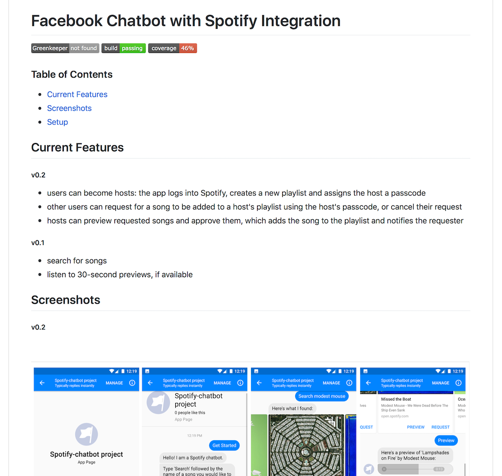
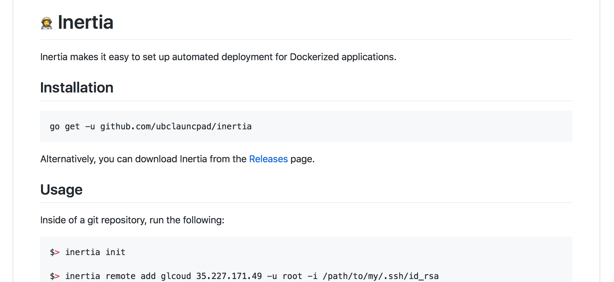

There isn't too much a project on GitHub can do in terms of looking attractive and professional outside of a clean name, concise description, and a clean README. In the past I hadn't really thought much about it since my projects were of rather... low quality and were unlikely to see widespread use. Take this README from my [very first personal project](/open-source/facebook-spotify-bot/):

<figure>
    
    <figcaption>Hmmm...</figcaption>
</figure>

I figured pretty early on that I really liked the look of badges, and given their popularity it doesn't seem like I'm the only one. I'm not really sure what makes them so comfortable to look at - perhaps it's something about their colourfulness, or their nice rectangular roundness, or how easy they are to parse at a glance. There is even an [entire project](https://github.com/badges/shields) dedicated to making these badges. If you're interested, they have a neat [design document](https://github.com/badges/shields/blob/master/spec/SPECIFICATION.md) specifying what makes a good badge as well as a [brief history](https://github.com/badges/shields/blob/master/spec/motivation.md) of the badges.

Badges aren't just nice in READMEs - I also use them in my [Project](/open-source/) pages:

<figure>
    
    <figcaption>Badges!</figcaption>
</figure>

With such limited room to make an impression on a reader, badges in READMEs convey a lot of important information to potential users and contributors, such as the presence of continuous integration and tests or whether the project is well-maintained (dependency statuses, etc), which can contribute a lot (for me at least) to the perceived quality of the project.

And, as with all things, an eye-catching logo goes a long way.

<figure>
    
    <figcaption>IGListKit</a> library.</figcaption>
</figure>

I learned quite a few things when I first saw [IGListKit's README](https://github.com/Instagram/IGListKit/blob/master/README.md):
* you can use HTML to some degree in README's, which are typically pure Markdown and doesn't support overly fancy shenanigans
* with HTML you can center things
* badges can convey a lot more than continuous integration status - IGListKit lists their supported platforms in their badges

## The Inertia README and Logo

So of course I had to do something similar for [Inertia](https://github.com/ubclaunchpad/inertia), a project that we are hoping hobbyist users both within [UBC Launch Pad](https://ubclaunchpad.com) and in the wider Docker community will find useful, needed a bit of snazz. Here's what our README looked like originally:

<figure>
    
    <figcaption>Ehhhhh</figcaption>
</figure>

As a Golang project, I figured we might as well use a [Golang gopher](https://blog.golang.org/gopher)-inspired logo - it's a pretty popular option that is [widely](https://github.com/kataras/iris) [used](https://github.com/golang/dep) [amongst](https://github.com/goreleaser/goreleaser) [Golang](https://github.com/containous/traefik) [libraries](https://github.com/src-d/go-git), both official and unofficial.

<figure>
    
</figure>

<figure>
    <figcaption>my first Inertia presentation.</a></figcaption>
</figure>

I wanted to preserve the typical lighthearted gopher style and convey the same feeling of momentum, but without the plane in the gopher that I first used. The goal of the Inertia project is to allow simple, painless continuous and manual deployment management.

<figure>
    
    <figcaption>Renee French</a>, who is amazing.</figcaption>
</figure>

As a visitor to the Inertia repository, these goals should hopefully be immediately conveyed by the logo. So I decided that the Inertia gopher would be unclothed (gasp!) and without any extraneous apparatuses. As for colour, I initially felt a simple black and white image would be fine, but after trying my hand at colouring it I thought it turned out fine.

<figure>
    
    <figcaption>Some initial drafts.</figcaption>
</figure>

A calm, leaping gopher seemed to do the trick. It took a very long time to make the speed trail thingos look right (and to be honest it still feels a bit off). Either way it felt like something was still missing - I figured a helmet might add a bit more of a "speedy" feel to the gopher, and give it some more character, despite what I said about extraneous apparatuses at first.

<figure>
    
    <figcaption>Safety first everyone!</figcaption>
</figure>

I was personally pretty happy with this version. In my eyes the gopher even seemed to be smiling a little as it joyfully leapt towards the heavens. I considered tacking on the word "Inertia" alongside the gopher, since I felt some handwritten text would go along nicely with a handdrawn image - I did something similar with [my first Inertia presentation](https://github.com/ubclaunchpad/inertia/blob/master/.static/inertia-v0-0-2-slides.pdf), albeit with a stylised font instead.

<figure>
    
    <figcaption>Doesn't seem quite right...</figcaption>
</figure>

Over the course of half an hour I must have written the word "Inertia" at least a hundred times. My awful handwriting did not help in the slightest and it drove me insane. Towards the end I gave up trying to write in a straight line and resorted to manually moving words and characters until they looked alright. After several iterations I also gave up on including "UBC Launch Pad" - it didn't add much and it seemed rather pointless.

Eventually, though, I thinned out the text and finally ended up with something that I thought was okay, although in hindsight maybe the text is a bit too small relative to the gopher but oh well:

<figure>
    
    <figcaption>Wheeeeeeeeeeeeeeee!</figcaption>
</figure>

The Inertia gopher then moved onto the [Inertia README](https://github.com/ubclaunchpad/inertia) alongside some nice badges and lived happily ever after.
