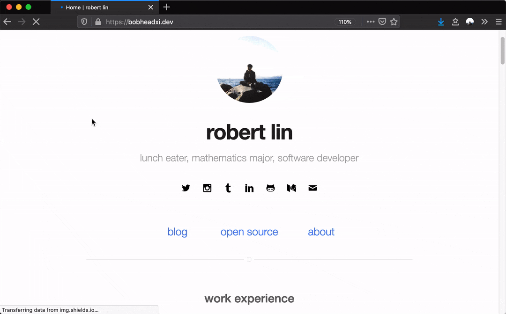

Every semester, quarantine or not, there comes a time where I tell myself - look, you've got to stop
procrastinating! Assignments need to get done, material needs to be studied, grades need to be
salvaged! So I sit down in a cosy spot, whip out my laptop, open up all my course notes and...

...proceed to tackle dozens of hours of small pursuits, whether it be planning projects, fiddling with
libraries, or playing with fancy new tools. Often this takes the form of improvements to this website,
for example when I [made a ridiculous dynamic chart of my GitHub activity](/rough-github-chart).
My [abandoned project *Timelines*](/open-source/timelines) is another example of such a project, amongst a
myriad of other things that I never wrote about.

So I figured I might as well write a little about the changes to my website from this end-of-semester
season, sort of like a little "changelog".

First off, some background on this site: it's a [Jekyll site](https://jekyllrb.com/) hosted on
[GitHub pages](https://pages.github.com/) that started off as a copy of the
[sergiokopplin/indigo](https://github.com/sergiokopplin/indigo) Jekyll theme but has, over the years,
grown into a convoluted monstrosity of my hacks and extensions (for example, adding
[work experiences](https://bobheadxi.dev/#work-experience), [projects](https://bobheadxi.dev/#open-source-highlights),
[dynamic charts](/rough-github-chart), extended analytics, custom styles, and more that I'll talk
about in this post). I keep thinking that I'll one day rework it from scratch into something cleaner
and leaner, but it's holding together for the time being. You can check out the
[source code here](https://github.com/bobheadxi/bobheadxi.github.io).

* TOC
{:toc}

## Hypothes.is Integration for Annotations


[Hypothes.is](https://web.hypothes.is/) is an open web annotation platform that aims to provide
a collaborative discussion layer on top of web content. I'm exploring using it as a note-taking
platform, and since they have a very ergonomic integration I figured, why not tack it on my blog
posts as well?



```html
<script>
window.hypothesisConfig = function() {
    return {
        branding: {
            accentColor: '#5A85F3',
        },
    };
};
</script>
<script src="https://hypothes.is/embed.js" async></script>
```



This barely counts as any real work but I spent an awful lot of time fiddling with Hypothes.is and
looking through their [open-source codebases](https://github.com/hypothesis) because I'm a nerd like
that. 🙃

## Annoying Popups



This mostly stemmed from my [new Hypothes.is integration](#hypothesis-integration) - how do I let
the little traffic I get know that they can leave comments? Then I remembered, hey, I came across
a really nice library for doing this a while back! After a bit of hunting through my
[stars](https://github.com/bobheadxi?tab=stars) I found [`needim/noty`](https://github.com/needim/noty),
a (self-proclaimed) lightweight library for adding alerts to a page. This one was pretty simple to
set up, so after adding an alert for Hypothes.is I set up an additional welcome alert for my homepage. 😛

### Conditional Popups



The template language used by [Jekyll](https://jekyllrb.com/), [Liquid](https://shopify.github.io/liquid/)
(which I'm surprised to learn is made by [Shopify](https://www.shopify.com/)!), offers many ways to
add conditional elements to your pages, so I figured I could leverage it just a little more to add some more conditional alerts, such as
one to advertise other places my posts are published in. I was pleasantly surprised at how this one
*just worked*. 🍎


```diff
---
title: "GitHub Activity Chart with Rough.js"
layout: post
...
description: Create a simple GitHub activity chart for your personal website!
+ alt_location: # alternative place to read this post
+  type: DEV
+  url: https://dev.to/bobheadxi/github-activity-chart-with-rough-js-1c3d
---
```



```html
<!-- alert guest to alternative places to view this post on desktop -->

    <script>
        if (!isMobile) {
            /* liverage liquid templating to inject parameters */
            let altPlatform = '{{ page.alt_location.type }}';
            let altURL = '{{ page.alt_location.url }}';
            new Noty({
                type: 'success',
                text: `📣 This post is also available on ${altPlatform}!`,
                timeout: 5000,
                buttons: [
                    Noty.button(`Read on ${altPlatform}`, 'btn-box',
                        function() { window.open(altURL); }),
                ],
            }).show();
        }
    </script>

```



### Popup Interaction Analytics


I have no idea if anyone will ever interact with these new annoying popups so I figured I should do
some simple interaction measurements (though realistically, even if nobody clicked them I'll
probably keep them around).

I have some Google Analytics set up on this site and after a quick search, it turns out the easiest
way to track custom events is to simply make a call to the Google Analytics `ga` client at the
appropriate times:

```diff
new Noty({
    type: 'success',
    text: `📣 This post is also available on ${altPlatform}!`,
    timeout: 5000,
    buttons: [
        Noty.button(`Read on ${altPlatform}`, 'btn-box',
-            function() { window.open(altURL); }),
+            function() {
+                ga('send', 'event', 'Notification', 'click', 'alt_location', {
+                    hitCallback: function() { window.open(altURL); }
+                });
+            }),
    ],
}).show();
```

I'm only collecting counts on button clicks at the moment, but I might add more later on (such as
alert dismissals). Now that I know I can do this I might add trackers on more specific site elements
as well, although most interesting interactions are related to link clicks, which are automatically
tracked already via [`outboundLinkTracker`](https://github.com/googleanalytics/autotrack/blob/master/docs/plugins/outbound-link-tracker.md).

Say what you will about Google's analytics monopoly, but it's easy and free, so...

## Minor Optimizations

This one's a little boring, but my [diagramming library *Mermaid*](https://mermaidjs.github.io)
was previously configured to load on all pages. Now they only load on pages that require it - once
again leveraging some sweet [Liquid](https://shopify.github.io/liquid/) templating.

```diff
---
title: "Generating Reports in Figma with a Custom Figma Plugin"
layout: post
description: Building a Figma Plugin for generating reports in Figma from various data sources
+ diagrams: true
...
---
```



```html
<!-- diagraming stuff -->

    <script src="https://cdnjs.cloudflare.com/ajax/libs/mermaid/8.4.8/mermaid.min.js"></script>


<!-- ... content -->

<!-- diagramming stuff -->

    <script>
        mermaid.initialize({/* ... */});
        window.mermaid.init(undefined, document.querySelectorAll('.language-mermaid'));
    </script>

```



## Content Updates

I spent some time making significant updates to:

* [Experience: Sumus Property Group](https://bobheadxi.dev/sumus/)
* [Experience: Riot Games](https://bobheadxi.dev/riot-games/)

A variety of broken links, outdated images, and minor formatting issues were also fixed as I wasted
a lot of time clicking around the site.
