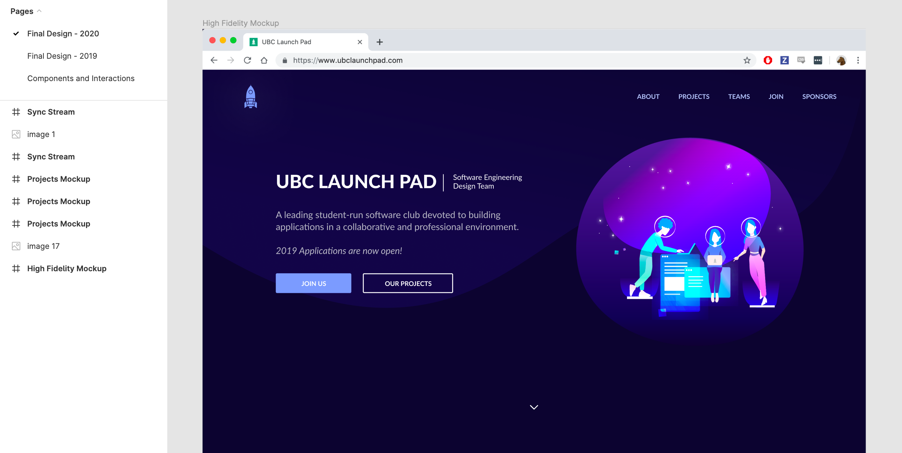
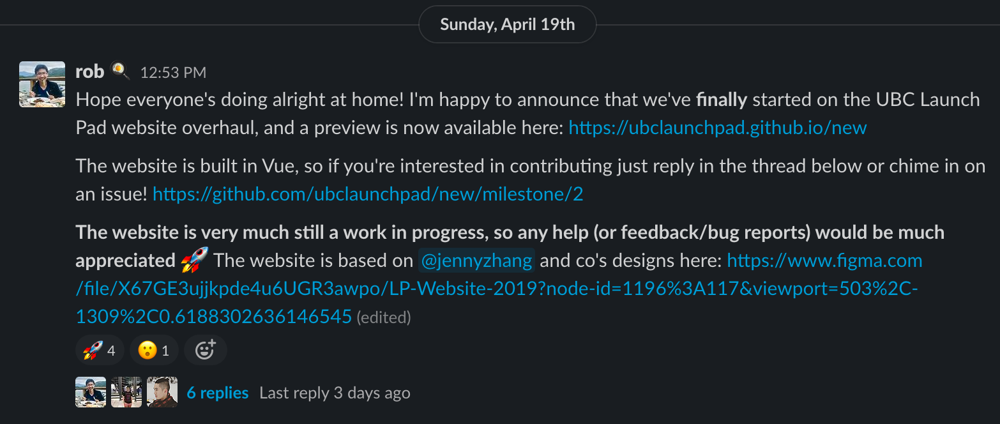

We've had a design sitting around for a while now, but this year we've finally decided to get to work and churn out a brand new, from-the-ground-up refresh of our 4-year-old website to showcase our new branding and this semester's projects!

* toc
{:toc}

## The New Website

We’re launching our new website today on [ubclaunchpad.com](https://ubclaunchpad.com)! The revamped website features:

* **completely refreshed design**
* brand new sections featuring current and past projects
* each project now has a shareable modal where teams can showcase their work
* everything is still fully responsive!

 

<figure>
  
</figure>

 

This revamp has been in the works for a long time, but development only started less than 2 weeks ago - so if you find any issues [please let us know](TODO)!

## Behind the Scenes

### Design

Our design team, lead by our wonderful designer [Jenny](https://github.com/cowjuh), first prepared a set of refreshed branding and designs for a new website in early 2019. The design went through several iterations, we showed it off to the club, and... never got around to building it, which is unfortunately because the team did a great job with the designs and it looked *great*.

<figure>
  
</figure>
<figure>
  
</figure>

By the time April 2020 rolled around, we were in desperate need of an online platform aligned with the branding we were sending out to sponsors and partners to showcase this year's projects.

### Development

There were two main pain points of the existing website (which is over 4 years old at this point) that I wanted to tackle with a rewrite:

* The old website was written with the bare minimum amount of web technologies possible. While this has its advantages, it also meant that nobody really wanted to work on it - learning is a big motivator, and web development at larger firms tend to revolve around trendy web frameworks nowadays. It also meant that adding any sort of interactive required adding gnarly JavaScript and jQuery that nobody really wanted to maintain. It also meant that code resuse could be rather difficult, even though the CSS classes were reasonably well-maintained.
* The website was difficult for non-technical folks (and frankly anyone not familiar with the codebase) to update. With everything piled up in one massive `index.html` and a handful of random JavaScript files, the website quickly lagged behind in content, and there were times when we didn't even add club signup links on the website until well into a recruitment season.

In hopes of remedying these issues, I made two major decisions right as I started:

* I chose an approachable web framework, in this case [Vue.js](https://vuejs.org/). Its template-based approach seemed well-suited to the mostly-static website that we were going to build, while being reasonably trendy and flexible enough to accommodate new integrations in the future (for example, with our [Slack bot](https://github.com/ubclaunchpad/rocket2)). To go with it I chose [TypeScript](https://www.typescriptlang.org), a typed superset of JavaScript, which would serve as a form of self-documentation for future Launch Pad students to leverage.
* I wanted as much of the website's information configurable through a familar yet easily validated format. Updating the projects featured on the website or our sponsors or the positions open for application should be a simple matter of editing a single file and redeploying the website. To do this, I added [TypeScript types for the data we would need](https://github.com/ubclaunchpad/ubclaunchpad.com/blob/master/src/data/types.ts) and a [single file, `config.ts`, where all the website data could be viewed and edited](https://github.com/ubclaunchpad/ubclaunchpad.com/blob/master/src/config.ts). Accompanying this is an automatically generated [configuration guidelines website](https://ubclaunchpad.com/config) that provides additional instructions and presents documentation on every single field in a hopefully digestible and not-overly-intimidating matter.

We'd made a few attempts at starting development on the website before, but unfortunately since it was always treated as more of a club "side project" or an off-season project, it was quite difficult to get the ball rolling and development would quickly fizzle out. To get the project off the ground with some momentum, I decided I would build the initial implementation by myself. I [started off on my own on April 17th](https://github.com/ubclaunchpad/ubclaunchpad.com/commit/64e720c4bb1fd74f9aa49fd4096b10a25a5212fe), [finished implementing a first pass of the entire website just *two* days later](https://github.com/ubclaunchpad/ubclaunchpad.com/issues/16), set up what documentation I could, and opened the project up to contributions from the club!

<figure>
  
</figure>

Despite having a website you could scroll through that looked pretty close to the actual design, there was still a significant amount of work to be done:

* mobile-friendliness was pretty poor in some sections
* content had to be created and collected for projects, both old and new, to feature on the website
* nothing was interactive - most notably, there wasn't even a way to see a project's description at first
* parts of the design were a bit rough around the edges once implemented

...and the list went on and on, and grew as we continued to add features. Thankfully, a couple of members stepped up and did some *great* work helping bring the project to a state where we could retire the old website! I'd like to give special thanks to:

* [Rachit](https://github.com/RachitMalik12) for [wireframing and implementing the first iteration of the project modal](https://github.com/ubclaunchpad/ubclaunchpad.com/pull/45), amongst many other contributions
* [Srijon](https://github.com/srijonsaha) for improvements like [some awesome on-hover interactions](https://github.com/ubclaunchpad/ubclaunchpad.com/pull/42) and providing tons of feedback
* [Rene](https://github.com/renehuang8822) and [Sophie](https://github.com/SophieMBerger) for trying out the new configuration format to add content to the website
* Everyone who gave the website trial runs and provided feedback!
* [Jenny](https://github.com/cowjuh) who lead the design of the website (and all our recent branding efforts!), as well as everyone who participated in our previous attempts at building the website

All together, this entire project took us **just 8 days** (April 17th to April 25th) to bring to launch, which I think is not too shabby of an achievement. Thank you to everyone who participated!
