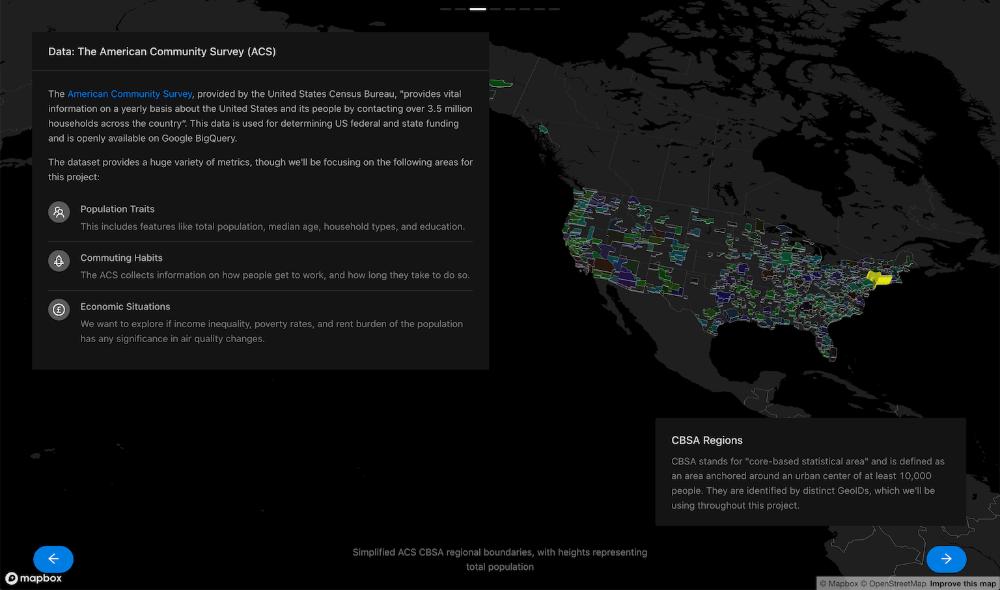
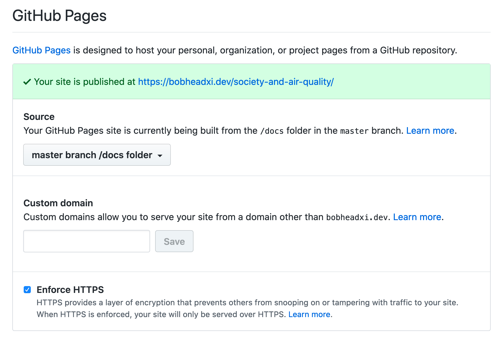

To scratch my visualisation itch, I invested in a lively period of trying to hack together an interactive website for a course project.
Featured in this post: some [Python + Notebooks](https://jupyter.org/),
[BigQuery](https://cloud.google.com/bigquery), [React](https://reactjs.org/), [Uber's `deck.gl`](https://github.com/uber/deck.gl)
visualisation framework, [GitHub Pages](https://pages.github.com/), and a lot of hand-wringing.

<figure>
  
</figure>

I started this little visualisation project in earnest on April 5th as a personal stretch
goal for a course project I was working on, and stopped when I handed in the things that were actually due for the assignment on April 7th.

You can probably skip the first section of this post if you just want to see a brief writeup of the
work behind this screenshot (or just go [straight to the final website](https://bobheadxi.dev/society-and-air-quality/)). As always, please feel free to
[leave comments and questions](/march-2020-site-updates/#hypothesis-integration-for-annotations)
on this post by highlighting some text!

<br />

* TOC
{:toc}

<br />

## A Stroll Through Memory Lane

I've always wanted to make pretty things, but the tedium of front-end always proved rather
intimidating. My time with [nwPlus](/open-source/nwhacks2019) did get the ball rolling though - implementing
a nice design and seeing it come to life was quite satisfying.

<figure>
  
  <figcaption>Wheeee - see my
  <a href="/nwhacks2019" target="_blank">nwPlus recap</a> for more!</figcaption>
</figure>

I tried to learn more on making nice user interfaces briefly with my cancelled project,
[Timelines](/open-source/timelines), and when I went to [Riot Games](/experience/riot-games) last year, I tried yet
again with a project that has been in limbo for a while: [Seer](https://github.com/bobheadxi/seer)
(I didn't even do a writeup for this one yet :sweat_smile:)

<figure>
  
  <figcaption>
  The state I got <a href="" targe="_blank">Seer</a> to last summer - surpisingly
  <a href="https://seer.bobheadxi.dev/5ee20284" target="_blank">still accessible</a> at time
  of writing! Guess I never took down my Heroku instance.
  </figcaption>
</figure>

As you can see neither of these projects made it very far, since I got caught up making my backends
all well-architected and stuff. I did get some traction with [`gobenchdata`](https://bobheadxi.dev/gobenchdata-project/),
which was a simple visualisation generator for benchmark results over time, but that wasn't a super
sexy project or anything.

<figure>
  
</figure>

Fortunately, I finished my first intern project at Riot Games with some time to spare so I decided
to dive into the making of pretty things more - this time using a design library that was used by my team,
[Ant Design](https://ant.design/), and focusing more on data visualisation. My team was very supportive
of the project and I got the go-ahead to hack on it for about 2 weeks of my internship which was
awesome. :rocket:

<figure>
  
  <figcaption>
  The alert visualisation tool I made, as seen in
  <a href="https://technology.riotgames.com/news/technology-interns-riot-games">
  a blog post I contributed to on the official Riot Games Technology blog</a>.
  See my <a href="/nwhacks2019" target="_blank">Riot Games recap</a> for more!
  </figcaption>
</figure>

Since this was a lot of fun, I asked around about data visualisation, downloaded some books, failed
to sign up quickly enough for my university's visualisation course, and proceeded to not do much on
this front for almost a year.

So this semester, to accompany the final project for one of my courses - a small analysis of societal
changes and air quality trends - I decided to give it a go again.

<br />

## The Visualisation

I often get asked: so what's the best way to *make a website*? Do I need some GCP? Some AWS?
Some MongoDB? How webscale????

I honestly think for the vast majority of folks the answer is just *no*, when what they have in
mind is a simple portfolio or a showcase or a product website or a signup page. I've found that
something as available as (and as **free** as) [GitHub Pages](https://pages.github.com/) alone
provides everything most people need for simple use cases, and there are affordable services that
can fill in the gaps for slightly more complicated needs.

In a similar vein, when it came more recently to me procrastinating my final project by spending a
bunch of time attempting to build a rather extravagant and overkill website when all I needed to
submit was a slideshow, of course I had to live by my own words and do this all entirely as a
React single-page application hosted on GitHub Pages (including using Pages to host my data!)

### Aggregating Data

For this particular project we were required to choose some datasets and do some analysis on them.
We chose two datasets available on [Google BigQuery](https://cloud.google.com/bigquery) datasets,
the American Community Survey (ACS) from the US Census Bureau (it's similar to the census, but
includes data for every year) and the Historical Air Quality dataset from the EPA (Environmental
Protection Agency).

Without a backend it's not entirely feasible to query massive amounts of data every time a user
loads up my website, so I had to do some aggregation to pick out the data I wanted (I mean, I had
to do this anyway for the project). I did the majority of this work in Jupyter Notebooks.

1. Download CBSA region geometries (ACS data is grouped using these regions) *for each year*, since
   they are not fixed. This was a pain to find, and a pain to parse... it was just a pain.
   See [this notebook](https://github.com/bobheadxi/society-and-air-quality/blob/master/exploration/1_acs_boundaries.ipynb)
   for details. I also converted these into GeoJSON and later simplified the geometries as well
   (from ~3GB total to ~2MB total - see [this script](https://github.com/bobheadxi/society-and-air-quality/blob/master/tools/acs_geojson_filter.py))
   so I could use them in the visualisation app without blowing up your browser.

```py
for y in years:
    save_to = out_template % y
    if y == '2007': # 2007 has a special naming scheme...
        target = 'fe_%s_us_cbsa' % y
        url = 'https://www2.census.gov/geo/tiger/TIGER%sFE/%s.zip' % (y, target)
        download_url(url, save_to)
    else:
        target = 'tl_%s_us_cbsa' % y
        if y == '2008' or y == '2009': # some random years have special naming schemes too...
            url = 'https://www2.census.gov/geo/tiger/TIGER%s/%s.zip' % (y, target)
        elif y == '2010': # this single year has a slightly different path...
            url = 'https://www2.census.gov/geo/tiger/TIGER2010/CBSA/2010/tl_2010_us_cbsa10.zip'
        else:
            url = 'https://www2.census.gov/geo/tiger/TIGER%s/CBSA/%s.zip' % (y, target)
        try:
            download_url(url, save_to)
        except:
            print('failed to fetch "%s"' % url)
```

2. The EPA data is provided as measurements collected by stations, where the coordinates of each
   station is provided. Converting the geometries (shapefiles in this case) into GeoJSON allowed
   me to just dump it all into BigQuery and use some [geospatial functions](https://cloud.google.com/bigquery/docs/gis-intro)
   to do the magic of finding out which stations should belong to which ACS CBSA regions. See
   [this notebook](https://github.com/bobheadxi/society-and-air-quality/blob/master/exploration/2_aligning_acs_and_epa.ipynb)
   for details. BigQuery is honestly quite nice.

```py
def get_relations_for_year(year) -> pd.DataFrame:
    resp = bq.query('''
        SELECT DISTINCT
            acs.year,
            acs.geoid AS acs_geoid,
            acs.name AS acs_cbsa_name,
            CONCAT(epa.state_code, ".", epa.county_code, ".", epa.site_num) AS epa_site,
            epa.longitude,
            epa.latitude
        FROM
            `eosc410-project.data.epa_air_quality_annual` as epa,
            `eosc410-project.data.acs_cbsa_boundaries_%s` as acs
        WHERE
            epa.year = %s
            AND acs.year = %s
            AND ST_WITHIN(ST_GEOGPOINT(epa.longitude, epa.latitude), ST_GEOGFROMGEOJSON(acs.geometry))
            AND (epa.datum='NAD83' OR epa.datum='WGS84') # guard against irrelevant coordinates
    ''' % (year, year, year))
    return resp.to_dataframe()
```

3. Then I aggregated everything into what I dubbed "flat" formats, where columns names have the region
   and parameter information encoded into them, and exported them as CSV files for use in the visualisation.
   I also exported the station coordinates as GeoJSON as well for use in with `deck.gl`.

This isn't very exciting so let's move on.

### React and DeckGL

See the [code for the web app here](https://github.com/bobheadxi/society-and-air-quality/tree/master/vis)!

Project setups are a pain, so I just used [`create-react-app`](https://github.com/facebook/create-react-app),
and despite all its pitfalls I would honestly recommend anyone set on using React to just use it.
I wish it came with automatic formatting configuration (it only offers basic style checks) but
given my time constraints I didn't bother setting it up.

The first thing I did is delete almost all the code generated by `create-react-app`, pick a UI library,
set it up, and just stick with it. For a fast turnaround this was a great way to get the ball rolling,
since React UI libraries often come with comprehensive setup instructions for `create-react-app`
that you can follow without thinking. For this project I went with [`antd`](https://ant.design/docs/react/introduce),
a well-documented and (in my opinion) sufficiently nice-looking UI library for React. It came with
[wonderful setup instructions specifically for `create-react-app`](https://ant.design/docs/react/use-with-create-react-app),
which is where `react-app-rewired` came in (this came in handy later for some other changes I made
to the base `create-react-app` configuration).

I structured the entire app around the [`antd` carousel](https://ant.design/components/carousel/),
where each slide is a React component. Data gets loaded upon initialization from two [Contexts](https://reactjs.org/docs/context.html)
and is provided to slide components.

```
src/
├── App.js
├── slides/
│   ├── Intro.js
│   ├── Questions.js
│   └── ...
└── contexts/
    ├── EPAContext.js
    └── ACSContext.js
    └── ...
```

A wrapper `SingleLoader` abstracts away the work of downloading data and providing it to the Context -
[see the code for more details](https://sourcegraph.com/github.com/bobheadxi/society-and-air-quality/-/blob/vis/src/contexts/SingleLoader.js).



```jsx
return (
  <Layout style={{ height:"100vh"}}>
    <Layout.Content>
      <SingleLoader context={ACSContext}>
        <SingleLoader context={EPAContext}>
          <Carousel
            ref={ref => { slider.current = ref; }}
            dotPosition="top"
            beforeChange={(_, to) => { setSlide(to); }}
            children={carouselNodes} />
        </SingleLoader>
      </SingleLoader>
    </Layout.Content>
  </Layout.Content>
)
```



Each slide can subscribe to the ACS or EPA data (or both!) as needed by initialising as a consumer
of the context:

```jsx
return (
  <EPAContext.Consumer>
    {(epa) => {
      // do stuff with data
    }}
  </EPAContext.Consumer>
)
```

I then set up `deck.gl` alongside the carousel:



```jsx
return (
  <Layout style={{ height:"100vh"}}>
    <Layout.Content>
      <DeckGL
        viewState={mapState.viewState}
        layers={mapState.layers}>
        <StaticMap
          viewState={mapState.viewState}
          mapStyle={mapStyles.DARK}
          reuseMaps
          preventStyleDiffing
          mapboxApiAccessToken={MAPBOX_API_TOKEN} />
      </DeckGL>

      {/* carousel */}
    </Layout.Content>
  </Layout.Content>
)
```



Each slide is provided with a callback that can be used to update the map state by providing a new
`viewState` or new `layers` to render. A `viewState` defines where and how the camera is looking at
the visualisation - for example, the introduction slide sets the following `viewState` and `layers`:

```jsx
updateMapState({
  viewState: {
    // california area
    longitude: -128.41669,
    latitude: 37.7853,
    // zoom close
    zoom: 5,
    // look top-down
    pitch: 0, bearing: 0,
  },
  layers: [
    new GeoJsonLayer({
      id: 'intro-epa-layer',
      // stations in most recent year
      data: epa.stations[epa.stations.length-1],
      // fill each with a color generated from their GeoID (region)
      pointRadiusMinPixels: 3,
      getFillColor: (d) => {
        const { properties: { acs_geoid: geoid } } = d;
        return geoidToColor(geoid);
      },
    }),
  ],
});
```

Then, when you visit the website and land on the intro slide, the map loads up like this:

<figure>
  
</figure>

Changing the pitch and bearing also yields cool results, this example using the simplified CBSA region
geometries I collected earlier, and adds some extrusion for dramatic effect:

```js
const { timeseriesFlat, regions } = acs;
updateMapState({
  viewState: VIEW_STATES.US_LEFT, // pitch: 45, bearing: 15
  layers: [
    new GeoJsonLayer({
      id: 'questions-acs-layer',
      data: regions[regions.length-1], // most recent year data
      pointRadiusMinPixels: 3,
      // set color as geoid, as before
      filled: true,
      getFillColor: (d) => geoidToColor(d.properties.geoid),
      // scale polygon height using total population
      extruded: true,
      getElevation: (d) => {
        const { properties: { geoid } } = d;
        // get row of most recent year, and take column with total_pop parameter for this region
        const pop = timeseriesFlat[timeseriesFlat.length-1][`${geoid}.acs.total_pop`] || 0;
        return Math.sqrt(pop) * 100;
      },
    }),
  ]
});
```

<figure>
  
  <figcaption>
    Pitch and bearing changes the angle of the viewport, and a logarithmic scale on the
    <code>acs.total_pop</code> value provides a neat-looking extrusion based on the population of each region.
  </figcaption>
</figure>

Also note that thanks to `antd`, positioning nice-looking elements all over the screen is pretty
easy, and offers a lot of knobs to tweak to adapt your content across different screen sizes. I
didn't try too hard to make it mobile-friendly, but it's nice to know the capability is there and that
you don't have to do it yourself.

<figure>
  
</figure>

This is probably my favourite slide - [see the source code here](https://sourcegraph.com/github.com/bobheadxi/society-and-air-quality/-/blob/vis/src/slides/methodology/DataACS.js).
This particular slide only took 83 lines of code on its own!

#### A Big Mistake... Mis-state?

While cool, unfortunately it turns out that this setup is probably a **big mistake**. Here's how I
wrote the callback:

```js
const [slideID, setSlide] = useState(0);
const carouselNodes = slides.map((Slide, id) => (
  <Slide
    slideID={id}
    isSlideSelected={id === slideID}
    updateMapState={(newState, updateID) => {
      const stateUpdateID = updateID || id;
      // TODO making mapState a dependency of carousel causes infinite loops.
      if (stateUpdateID !== mapState.prevUpdateID) {
        setMapState({
          prevUpdateID: stateUpdateID,
          // ... assign params from newState
        });
      } else { console.log(`discarding map update ${stateUpdateID}`); }
    }} />
))
```

As noted in my hasty TODO, a huge problem arises in my state in between map updates and keeping track
of what slide is currently active, the following happens on each render:


<p align="center">

</p>

I hacked in an `updateID` to prevent a slide from making multiple map updates, but it also means that
later on for my data exploration slides, the map is not interactive - a slide cannot make more than
one update at a time :cry: This **really kills the vibe** because I had wanted a slider on the panel
to let you slide through the entire country's data over the years, as well as highlight selected regions,
and show different data on the map based on the selected parameter.

<figure>

</figure>

I'll have to revisit this at some point - I'm sure there's a "right" way to do this, and that I'm
just holding React all wrong, but I've already spent a lot of time getting everything to this point
so for now I'm just stuck with a rather uninteractive map.

---

> **✅ Update(4/10/2020)**: I spent some time fiddling with this and managed to get some basic
interactions working by moving context subscription to the topmost level (I suppose rendering it
pointless, but oh well) and removing all `mapState` depenedencies from `updateMapState`. Slides then
check for loading/error state, and if they are selected, call `updateMapState` through `useEffect`.
Check out the commit [here](https://github.com/bobheadxi/society-and-air-quality/commit/23ef2fac30edd373958526e5397b8bbb7cc3950c)! It's not very clean, and I still can't get map transitions
working so I suspect I'm still doing something wrong, but it's something.

<figure>

</figure>

---

### GitHub Pages

<figure>
  
  <figcaption>You can find this page under repository settings on GitHub.</figcaption>
</figure>

To make all my aggregated data available through GitHub pages I opted for the option of deploying
the `docs` folder in my `master` branch, though you can do it through any of the other options as
well. Putting my aggregated data into this folder meant it's available to my GitHub pages-hosted
React app, both locally and when deployed:

```js
const fetches = [
    '/_data/epa/timeseries_flat.csv',
    '/_data/epa/timeseries_vert.csv',
].map((f) => fetchCSV(f));
const results = await Promise.all(fetches);
```

On the React side (which I'll get into soon!), I'll just point out that you must make two adjustments
when using GitHub pages + the `/docs` folder:

* set `homepage` to your GitHub pages URL (by default, something like `username.github.io/reponame`)

```diff
+++ package.json
{
-
+  "homepage": "https://bobheadxi.dev/society-and-air-quality",
}
```

* add `PUBLIC_URL=/` to override the `homepage` setting when you are running the app locally

```diff
+++ package.json
  "scripts": {
-    "start": "react-app-rewired start",
+    "start": "PUBLIC_URL=/ react-app-rewired start",
  }
```

* move your data into `public` during development, and move your data out during build so that it
  doesn't included - this makes the data accessible from the same `/_data/...` URLs that you'll use
  when the app is deployed

```diff
+++ package.json
  "scripts": {
+    "data": "mkdir -p ./public/_data/epa ; mkdir -p ./public/_data/acs ; cp -r ../docs/_data/epa/. ./public/_data/epa && cp -r ../docs/_data/acs/. ./public/_data/acs",
+    "clean": "rm -rf ./public/_data",
+    "prebuild": "npm run clean",
-    "build": "react-app-rewired build",
+    "build": "react-app-rewired build && cp -r ./build/* ../docs",
+    "postbuild": "npm run data"
  }
```

Note that `react-app-rewired` is equivalent to `react-scripts` from `create-react-app`, and was set
up so that I could customise the `antd` theme.

And that's all you have to do! Deploy your pages with a `npm run build` and push it to `master`, and
it'll be available on the world wide web - all for a grand cost of $0.

### Final Results

If the screenshots so far weren't satisfactory, the entire unfinished website is available at
[`bobheadxi.dev/society-and-air-quality`](https://bobheadxi.dev/society-and-air-quality/). Not
everything works entirely as I want it to at the moment, but enjoy!

Writing this up has also made me realise this all looks kinda easy. Did this really take me almost
two straight days of work? I suppose it's a lesson that in between reading documentation and getting
through small issues or bugs or misunderstandings and all sorts of miscellany, time can fly by rather
fast, and it's easy to underestimate work.

Or maybe I just need to *git gud* as they say :upside_down_face:
