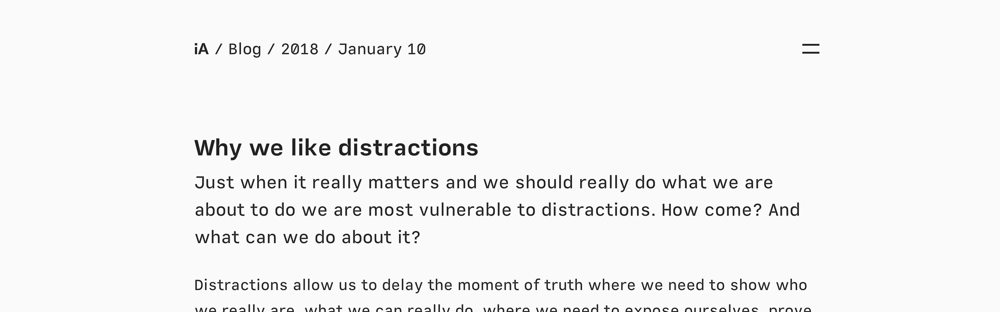
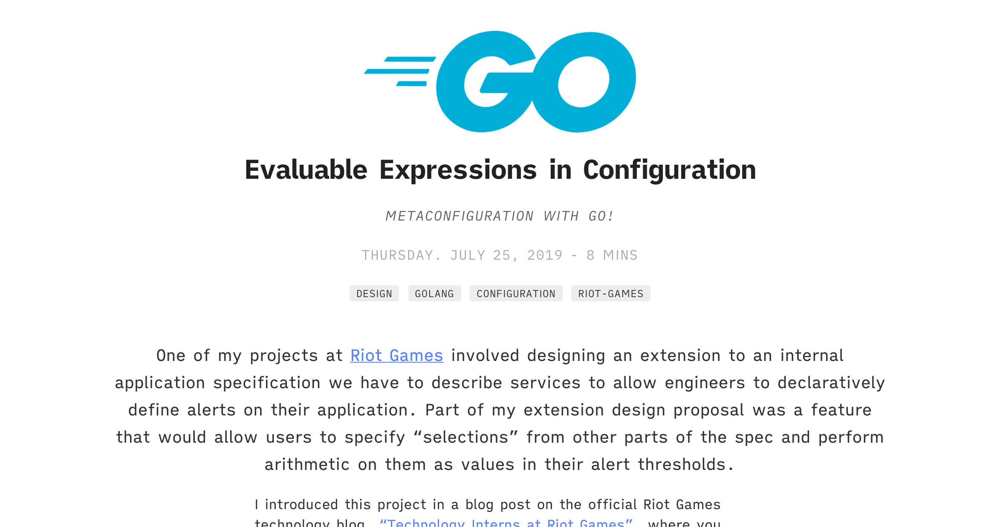
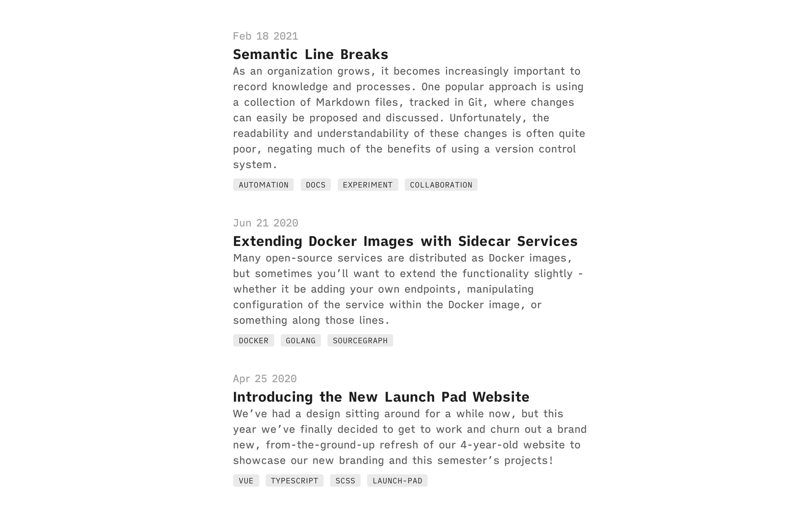
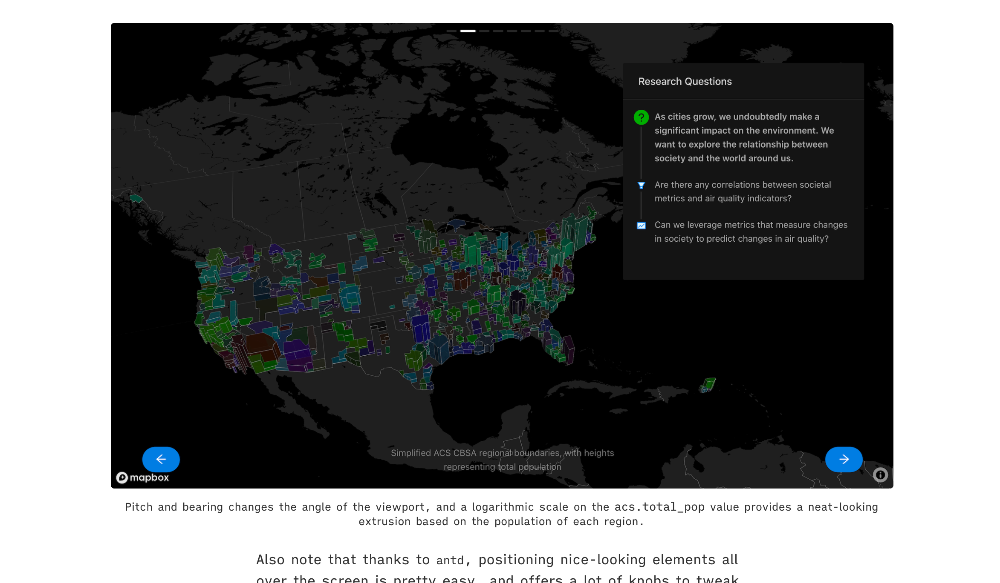
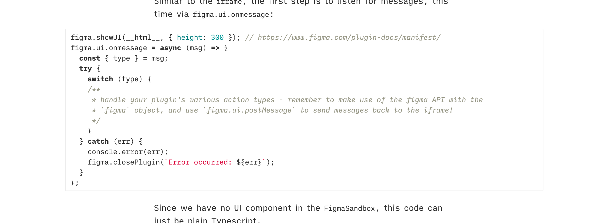
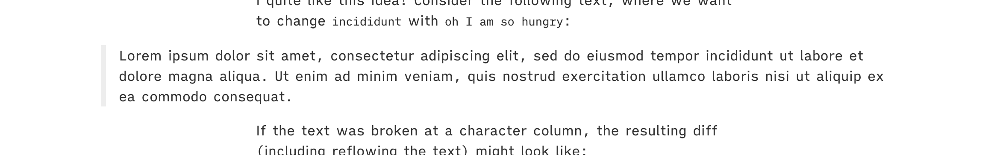
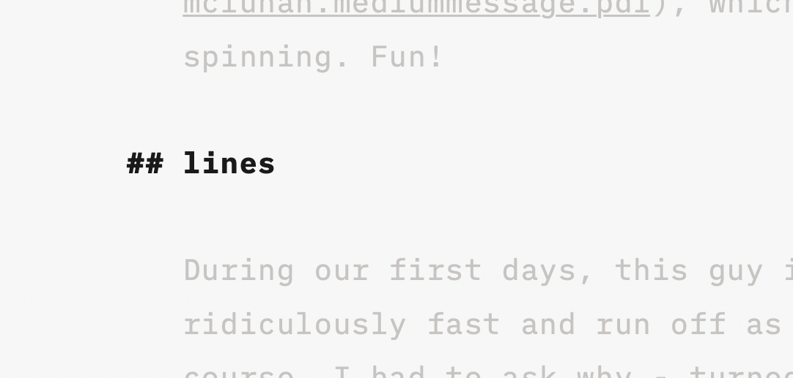
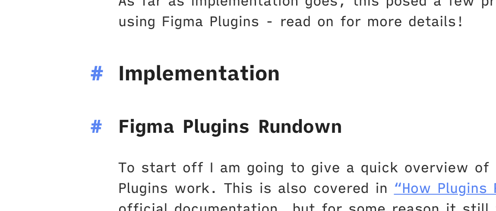
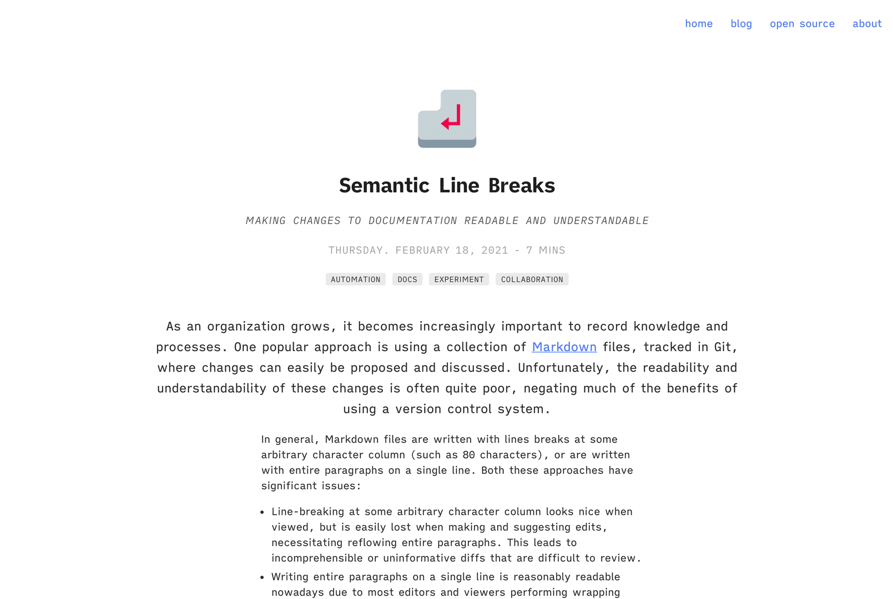
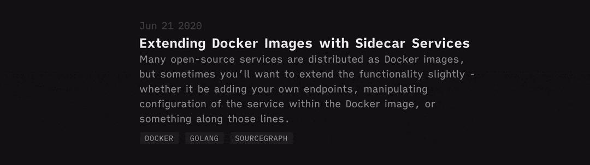

With dark mode on every website nowadays, my website seems to have fallen a bit behind the times. I decided it was about time to give my website a bit of a facelift!

This round of improvements didn't strictly happen this month, but a lot of it was spurred on by my recent reading of the [iA Design Blog](https://ia.net/design/blog). I think their website is absolutely gorgeous, and it made the lacklustre of `bobheadxi.dev` all the more apparent.

For the unfamiliar, my site started off over 2 years ago with the [indigo Jekyll theme](https://github.com/sergiokopplin/indigo). I have since made quite a number of changes to it, and started writing about these changes [last year](/march-2020-site-updates).

I quite like how things turned out for this set of changes - hope you do as well!

## Refinements

### Updated typography

A big part of `bobheadxi.dev` is my blog posts, even though I'm unsure how many people read them (Google Analytics indicates a lot of traffic, particularly on my *really* old [Object Casting in Javascript](/object-casting-in-javascript/) post). Anyway, I've always been rather dissatisfied with the reading experience on my site, but could never quite put my finger on what exactly was wrong with it.

All I knew was that I didn't like the previous fonts - *‌Helvetica Neue* - but until I started using [iA Writer](https://ia.net/writer) recently, I didn't have much of an inkling of what font I would like.

iA Writer uses these gorgeous fonts - aptly named *Mono*, *Duo*, and *Quattro* - that I think looks *so nice* when typing and reading. They have a [neat blog post introducing these fonts](https://ia.net/writer/blog/a-typographic-christmas), and while I'm not really sure what this stuff means, I decided to  make the switch.

This site now uses *Quattro* as its serif font, and *Mono* as its monospaced font. I think the results are quite nice.

### Bold introductions

Some books and blogs get big first letters for the first paragraph of a chapter or article. The effect looks nice on books, but I was never really sold on its usage in blog posts - though the look of an emphasized introduction is certainly striking. As I browsed through [iA Design Blog](https://ia.net/design/blog), I noticed that their first paragraphs were *big*, and it made each essay feel much more compelling.



However, as I went about considering different options for making *my* intros real big as well, I realized a lot of my introductory paragraphs were complete garbage. While sometimes that was the intent - leading with a tangent before diving into the article's main topic - they definitely did not age well.

So perhaps a fortunate side effect is that this prompted me to go back through my posts and make the bare minimum effort to make them a bit more interesting. At least the new styling on each introduction looks nice now.



### Insightful lists

I just learned about Jekyll's `post.excerpt` feature that gives you the first paragraph of a blog post. Again inspired by the iA Design Blog, which uses excerpts instead of custom descriptions to great effect, I decided to use them here as well.



I think this gives a far better preview into the content of each post, and makes them look a lot more important.

I also made minor improvements such as adding an on-hover effect to the clickable tags, which previously had no indication they were clickable.

### The big picture

I like to include all sorts of media in my blog posts - images, code snippets, diagrams, quotes, and more. Unfortunately, I also like somewhat narrow widths for my content, which makes for a poor viewing experience for various forms of media.

On [articles in the Sourcegraph Blog](https://about.sourcegraph.com/blog/optimizing-a-code-intel-commit-graph/#Performance-improvements) (and I recall that you can do this on Medium as well), I noticed that images were "blown up" - wider than the content - and I thought the effect looked quite nice, giving an expansive canvas for media to be enjoyed while still maintaining a nice reading experience for all the other stuff.

To do this myself, I turned images I wanted to be blown up into `<figure>` elements, and gave them expanded widths, along with `<figcaption>`. This also served nicely to standardize the raw HTML I'd been previously using to give images captions.



Code blocks ran into similar problems, where snippets I didn't careful adjust to adhere to an 80-character line limit would have to be scrolled to viewed, even on very wide screens. So I made them massive.



I've also always liked the big quotes used in magazine and newspaper sites to give quotes an even more authoritative and dramatic feel - so quotes joined the big club.



[Mermaid diagrams](https://mermaid-js.github.io/mermaid) and some other things I might have forgotten also got this treatment. Hopefully these changes make the reading experience more exciting!

### Outdented heading anchors

While editing in iA Writer, headings get nicely outdented '#'s like so:



I quite like how this looks, so I tried to replicate it on my site. I currently generate somewhat similar-looking (but not outdented) anchor links using [`allejo/jekyll-anchor-headings`](https://github.com/allejo/jekyll-anchor-headings), which allows a little bit of customization - I can give the anchor link elements a class, for example, and style it through that.



```html
<div class="post-content">
    
</div>
```



Turns out the outdenting can be achieved using the handy `translateX` transformation, and a bit of `@media` helps me scale this effect for smaller screens (where outdenting could position the anchors very close to the edge of your screen).

```sass
h1, h2, h3, h4
	// ... some CSS
	> .heading-anchor
		position: absolute
		transform: translateX(-2rem)
		@media #{$tablet}, #{$mobile}
			position: inherit
			transform: none
```

Sadly, I wasn't able to figure out a nontrivial way to have the number of '#'s correspond to the depth of the heading, but I figured this was close enough, and is definitely an improves the look of headings (in my opinion).



## Dark mode

And last but not least, the star of today's show... dark mode! Because no site is complete without one.



Luckily for me, the theme my site was based on made decent use of SASS variables for colours (though the naming of the colors left quite a bit to be desired, as you'll see in a moment).

I found to my dismay that because these variables are compiled away at build time, they cannot be used to respond to [`prefers-color-scheme: dark`](https://developer.mozilla.org/en-US/docs/Web/CSS/@media/prefers-color-scheme), which seems to be the standard way to detect for what theme you should show to the user.

Instead, I found some blog posts talking about [CSS variables](https://developer.mozilla.org/en-US/docs/Web/CSS/Using_CSS_custom_properties), which turns out to be the only way to have properly variable variables in stylesheets. To be honest this is the first time I've had to do something like this myself, and this was news to me!

My implementation ended up pretty straight forward, using [universal selectors](https://www.w3.org/TR/CSS2/selector.html#universal-selector) and setting the theme in JavaScript, though I'm sure there are other ways to do this too (maybe even JavaScript-free?).

```sass
[data-theme="theme-light"]
    --background: #ffffff
    --alpha: #333
    --beta: #222
    --gama: #aaa
    --delta: #5A85F3
    --epsilon: #ededed
    --zeta: #666

[data-theme="theme-dark"]
    --background: #141414
    --alpha: #aaa
    --beta: #eeeeee
    --gama: #474747
    --delta: #5A85F3
    --epsilon: #202020
    --zeta: #929292
```

```js
var prefersDark = false;
function setDarkMode(isDark) {
    const theme = `theme-${isDark ? 'dark' : 'light'}`;
    document.querySelector('html').dataset.theme = theme;
    prefersDark = isDark;
    console.log(`Set ${theme}`);
}

// set the initial theme
const prefersDarkMatch = window.matchMedia('(prefers-color-scheme: dark)');
setDarkMode(prefersDarkMatch.matches);

// watch for changes to the user's dark mode configuration
prefersDarkMatch.addEventListener('change', (e) => setDarkMode(e.matches));
```

Having the `setDarkMode` function available is useful for development, allowing me to switch between the modes via console, and I added the `prefersDark` variable... just because, I guess. Maybe handy if I want to add a button to toggle dark mode?

In the end, despite picking the colours semi-randomly and not making an awful lot of adjustments, I'm pretty happy with how this (in my opinion) quick effort turn out! I'm particularly pleased with how the blog listings look:



## Up next

There are still a lot of issues with dark mode - most noticeably the company logos I'm using that don't have transparent backgrounds, but also a few contrast issues in code highlighting.

There also seems to be an issue with the tags page where posts from different collections do not get included that I definitely want to fix now that interaction with tags is more prominent.

I recently wrote a newsletter featuring a ludicrous number of footnotes, and at some point I want to get [Tufte "sidenotes"](https://edwardtufte.github.io/tufte-css/#sidenotes) here so that I can abuse footnotes in my blog posts as well. Sadly, I haven't found a particularly elegant solution to this, so I'm putting it off for now.

That's all for now - feel free to highlight anything on this post if you have comments for questions!