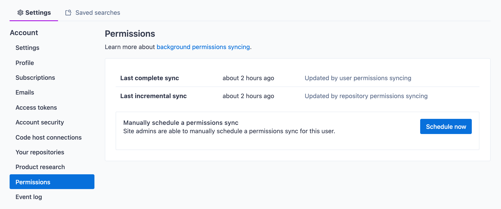

As a tool for searching over all your code, accurately mirroring repository permissions defined in the relevant code hosts is a core part of [Sourcegraph](https://about.sourcegraph.com/)'s functionality. Typically, the only way to do this is through the APIs of code hosts, though rate limits can mean it can take several *weeks* to work through a large number of users and repositories.

This article goes over some of the work I did on improving GitHub permissions mirroring at Sourcegraph, with the help of several co-workers - primarily [Joe Chen](https://github.com/unknwon) (who wrote most of Sourcegraph's original permissions mirroring code and helped me get up to speed - and is also the author of some big open-source projects like [gogs/gogs](https://github.com/gogs/gogs) and [go-ini/ini](https://github.com/go-ini/ini)) and [Ben Gordon](https://github.com/benjaminwgordon) (who helped a ton on the customer-facing side of things).

## GitHub rate limits

The GitHub API has a [base rate limit of 5000 requests an hour](https://docs.github.com/en/rest/overview/resources-in-the-rest-api#rate-limiting). Let's look at what it takes to provide access lists for a user: with [page size limits of 100 items per page](https://docs.github.com/en/rest/guides/traversing-with-pagination#basics-of-pagination), iterating over all users can take can take up to the following number of requests, all of which should ideally fall under the rate limit constraints:

$$\dfrac{\text{users} \times \text{repositories}}{100} < 5000$$

This means that we will need $\text{users} \times \text{repositories}$ to be greater than 500000 to hit rate limiting.

To come up with a hopefully representative example for this post, I found a [random article](https://insights.dice.com/2019/10/14/compaies-hiring-software-developers-engineers/) that claims some companies are hiring upwards of 3000 to 5000 developers, so let's consider a case of 4000 developers and 5000 repositories ([Microsoft has about 4.5k public repos alone](https://github.com/microsoft), not including anything private or hosted in different organizations), and we get the following time to sync:

$$\left(\dfrac{\text{4000} \times \text{5000}}{100} \times 2 \right) / 5000 = 80 \text{ hours}$$

Three days is *okay*, but definitely enroaching into the territory of "cannot be done in a weekend". In practice, implementation details mean that realistically we will consume far more requests than this, since we currently perform several types of sync[^two], so the process will likely take longer than 80 hours.

[^two]: See [Two-way sync](#two-way-sync).

The time to sync increases dramatically for even larger numbers of users and repositories - such as one customer that was projected to take upwards of *an entire month* to perform a full sync. Imagine paying thousands of dollars for a software product, only to have it unusable for the first month! Excessive rate limiting also means that permissions are far more likely to go stale, and can cause issues with other parts of Sourcegraph that also leverage GitHub APIs. The issue became a blocker for this particular customer, so we had to devise a solution to this issue.

## Sourcegraph and repository authorization

I got my first hands-on experience with Sourcegraph's authorization providers when [expanding `p4 protect` support for the Perforce integration](https://github.com/sourcegraph/sourcegraph/pull/23755).

In a nutshell, Sourcegraph internally defines an interface *authorization providers* can implement to provide access lists for users (*user-centric* permissions) and repositories (*repo-centric* permissions) - [`authz.Provider`](https://sourcegraph.com/github.com/sourcegraph/sourcegraph@8685a6bef8c3e9d2556335cb25448dbc1b356a4a/-/blob/internal/authz/iface.go) - to populate a single source-of-truth table for permissions.
This happens continuously and passively in the background. The populated table is then queried by various code paths that use the data to decide what content can and cannot be shown to a user.

<figure>

<figcaption>
Sourcegraph's repository permissions sync state indicator shows when the last sync occurred.
Site administrators can also trigger a manual sync.
</figcaption>
</figure>

---

**⚠️ Update:** Since the writing of this post, I've contributed an improved and more in-depth description of how permissions sync works in Sourcegraph, if you are interested in a better overview: [*Repository permissions - Background permissions syncing*](https://docs.sourcegraph.com/admin/repo/permissions#background-permissions-syncing).

---

For something like Perforce, user-centric sync is as simple as building a list of patterns from the Perforce protections table that work with [PostgreSQL's `SIMILAR TO` operator](https://www.postgresql.org/docs/12/functions-matching.html#FUNCTIONS-SIMILARTO-REGEXP), like so:

```go
// For the following p4 protect:
//    open user alice * //Sourcegraph/Engineering/.../Frontend/...
//    open user alice * //Sourcegraph/.../Handbook/...
// FetchUserPerms would return:
repos := []extsvc.RepoID{
    "//Sourcegraph/Engineering/%/Frontend/%",
    "//Sourcegraph/%/Handbook/%",
}
```

Repo-centric sync is left unimplemented in this case.

For GitHub, we [query for all private repositories a user can explicitly access](https://docs.github.com/en/rest/reference/repos#list-repositories-for-the-authenticated-user) via their OAuth token, and return a list in a similar manner:

```go
hasNextPage := true
for page := 1; hasNextPage; page++ {
	var err error
	var repos []*github.Repository
	repos, hasNextPage, _, err = client.ListAffiliatedRepositories(ctx, github.VisibilityPrivate, page, affiliations...)
	if err != nil {
		return perms, errors.Wrap(err, "list repos for user")
	}
	for _, r := range repos {
		addRepoToUserPerms(extsvc.RepoID(r.ID))
	}
}
```

Note that for public repositories, Sourcegraph simply doesn't enforce permissions, so authorization only needs to care about explicit permissions.

The above is where we bump into [GitHub's rate limits](#github-rate-limits) easily - in a organization with 5000 repositories, that's up to 50 API requests for each and every user to page through all their repositories. The GitHub authorization implementation also does the same thing for repo-centric permissions by listing all users with access to each repository.

## Introducing a cache

Caches don't solve all problems, but in this case there was an opportunity to save significant amounts of work through caching. GitHub repository permissions at companies are typically distributed through teams and organizations - membership to either would grant you access to relevant repositories, and teams are strict subsets of organizations. There are still instances of direct permissions - where a user is explicitly added to a repository - but it is unlikely to find a case of repositories without thousands of users added explicitly.

This means that in the vast majority of cases, when querying for user Foo's repositories, we are actually asking what teams and organizations Foo is in. At a high level, we could do the following instead:

1. Get Foo's direct repository affiliations
2. Get the organizations Foo is in
	1. Get the teams a user is in within this organization
3. For each organization and team:
	1. If organization allows read permissions on all repositories, or Foo is an organization administrator, get all organization repositories from cache as part of this Foo's access list
	2. Get all team repositories from cache eas part of Foo's access list

Cache misses would prompt a new query to GitHub to mirror access lists for specific teams and organizations. In the best-case scenario, where all users are part of large teams and organizations and there are very few instances of being directly granted access to a repository, cache hits should be very frequent and greatly reduce the amount of work required. Going back to the earlier example of 4000 developers and 5000 repositories, we get a best case performance of:

$$\dfrac{(\text{teams} + \text{organizations}) \times \text{5000}}{100} = (\text{teams} + \text{organizations}) \times 50$$

Even if we had a 100 teams and organizations, this would fall under the hourly rate limit - a huge improvement from the previously projected 80 hours. Even in the worse case, this would only be marginally less efficient than the existing implementation.

To mitigate outdated caches, a flag to the provider interface was added to allow partial cache invalidation along the path of a sync (important because you don't want every single team and organization queued for a sync all at once) and tying it into the various ways of triggering a sync (notably webhook receivers and the API).

The approach was promising, and a feature-flagged[^flagged] user-centric sync backed by a Redis cache was implemented in [sourcegraph#23978 authz/github: user-centric perms sync from team/org perms caches](https://github.com/sourcegraph/sourcegraph/pull/23978).

[^flagged]: Well, admittedly, it was only feature-flagged to off by default [in a follow-up PR](https://github.com/sourcegraph/sourcegraph/pull/24318) when I realised this required additional authentication scopes we do not request by default against the GitHub API (in order to query organizations and teams).

## Two-way sync

As mentioned earlier, Sourcegraph's authorization providers provide two-way sync: user-centric and repo-centric. To make the cache-backed sync complete, equivalent functionality had to be implemented for repo-centric sync.

Because GitHub organizations are conveniently supersets of teams (unlike *some* code hosts), user-centric cache was implemented with either `organization` or `organization/team` as keys and a big list of repositories as its value:

```
org/team: {
    repos: [repo-foo, repo-bar]
}
```

To make this cache work both ways, I simply added `users` to the cache values, and implemented a similar approach to finding a repository's relevant organizations and teams. In this case, a relevant organization would be one that has default-read access (otherwise members of an organization do not necessarily have access to said repository).

This makes for somewhat large cache values, but also makes it easy to perform partial cache updates. For example, if user `user-foo` is created and added to `org/team`, the user can be added to the cache for `org/team` during user-centric sync, and subsequent syncs of `repo-foo` and `repo-bar` will include the new user without having the perform a full sync, and vice versa.

```
org/team: {
    repos: [repo-foo, repo-bar]
    users: [user-bar, user-foo]
}
```

On paper, the performance improvements gained here are similar to the ones when implementing caching for user-centric sync, except scaling off the number of users in teams and organizations instead of repositories.

This was implemented in [sourcegraph#24328 authz/github: repo-centric perms sync from team/org perms caches](https://github.com/sourcegraph/sourcegraph/pull/24328).

## Scaling in practice

Throughout the implementation of the cache-backed GitHub permissions mirroring, a [large number of unit tests were included](https://sourcegraph.com/search?q=context:global+repo:%5Egithub%5C.com/sourcegraph/sourcegraph%24%408685a6b+file:%5Eenterprise/internal/authz/github/github_test%5C.go+t.Run%28%22cache+enabled%22%2C+:%5Btests%5D%29+count:9999&patternType=structural), as well as [a few integration tests](https://sourcegraph.com/github.com/sourcegraph/sourcegraph@8685a6b/-/blob/enterprise/cmd/repo-updater/internal/authz/integration_test.go), that tested the behaviour of various combinations of cache hits and misses.

To write integration tests, we use "golden testing", where we [record network interactions to a file (called "VCRs")](https://sourcegraph.com/search?q=context:global+repo:%5Egithub%5C.com/sourcegraph/sourcegraph%24%408685a6b+file:%5Eenterprise/cmd/repo-updater/internal/authz/testdata/vcr/TestIntegration_GitHubPermissions+lang:yaml&patternType=literal). Tests then use the recorded network interactions instead of reaching out to external services by default, unless explicitly asked to update the recordings. Interestingly, despite the significant improvements of this approach for larger numbers of users and repositories, this also made clear just how inefficient the cache-based approach is for smaller instances:

- with [caching disabled](https://sourcegraph.com/github.com/sourcegraph/sourcegraph@8685a6b/-/blob/enterprise/cmd/repo-updater/internal/authz/testdata/vcr/TestIntegration_GitHubPermissions/repo-centric/no-groups.yaml), the integration test recorded just 2 network requests for repo-centric sync.
- with [caching enabled](https://sourcegraph.com/github.com/sourcegraph/sourcegraph@8685a6b/-/blob/enterprise/cmd/repo-updater/internal/authz/testdata/vcr/TestIntegration_GitHubPermissions/repo-centric/groups-enabled.yaml), the integration test recorded a whopping 22 network requests for repo-centric sync with the exact same number of repositories and users

This is why we continue to leave the [cache-backed sync as a opt-in behaviour](https://docs.sourcegraph.com/admin/repo/permissions#teams-and-organizations-permissions-caching).

However, despite reasonably robust testing of the behaviour of the code, we had no way to easily perform and end-to-end test of this at the scale of thousands of repositories and users with the appropriate teams and organizations. In hindsight, I could have invested some effort into generating VCRs to emulate such an environment and test against it, but with the agreement of the customer requesting this the decision was made to ship the changes and ask them to try it out.

### Debug logging

All was well at first in the trial run - the backlog of repositories queued for an initial permissions sync was very rapidly being worked through, with a projected 3-day time to full sync - a huge improvement from the the previously projected 30 days. However, with just a few thousand repositories left to process, the sync stalled.

Metrics indicated jobs were timing out, and a look at the logs revealed thousands upon thousands of lines of random comma-delimited numbers. It seemed that printing all this junk was causing the service to stall, and sure enough [setting the log driver to `none`](https://docs.docker.com/config/containers/logging/configure/#configure-the-logging-driver-for-a-container) to disable all output on the relevant service allowed to sync to proceed and continue.

Where did the log come from? [I left a stray `log.Printf("%+v\n", group)` in there when I was debugging cache entries](https://github.com/sourcegraph/sourcegraph/pull/24822). At scale these entries could contain many thousands of entries, causing the system to degrade. Be careful what you log!

### Postgres parameter limits

A service we call `repo-updater` has an internal service called `PermsSyncer` that manages a queue of jobs to request updated access lists using these authorization providers for users and repositories based on a variety of heuristics such as permissions age, as well as on events like webhooks and repository visits ([diagram](https://sourcegraph.com/github.com/sourcegraph/sourcegraph@8685a6bef8c3e9d2556335cb25448dbc1b356a4a/-/blob/enterprise/cmd/repo-updater/internal/authz/doc.go)). Access lists returned by authorization providers are upserted into a single [`repo_permissions` table](https://github.com/sourcegraph/sourcegraph/blob/main/internal/database/schema.md#table-publicrepo_permissions) that is the source of truth for all repositories a *Sourcegraph* user can access, and vice versa.

Entries can also be upserted into a table called [`repo_pending_permissions`](https://github.com/sourcegraph/sourcegraph/blob/main/internal/database/schema.md#table-publicrepo_pending_permissions), which is home to permissions that do not have a Sourcegraph user attached yet. When a user logs in via a code host's OAuth mechanism to Sourcegraph, the user's Sourcegraph identity attached to the user's identity on that code host (this allows a Sourcegraph user to be associated with multiple code hosts), and relevant entries in `repo_pending_permissions` are "granted" to the user.

This means that once the massive number of repositories in the trial run was fully mirrored from GitHub, a user attempting to log in could have a huge set of pending permissions granted to it all at once. Of course, this broke with a fun-looking error:

```
execute upsert repo permissions batch query: extended protocol limited to 65535 parameters
```

I was able to reproduce this in an integration test of the relevant query by generating a set of 17000 entries:

```go
{
	name:     postgresParameterLimitTest,
	updates: func() []*authz.UserPermissions {
		user := &authz.UserPermissions{
			UserID: 1,
			Perm:   authz.Read,
			IDs:    toBitmap(),
		}
		for i := 1; i <= 17000; i += 1 {
			user.IDs.Add(uint32(i))
		}
		return []*authz.UserPermissions{user}
	}(),
	expectUserPerms: func() map[int32][]uint32 {
		repos := make([]uint32, 17000)
		for i := 1; i <= 17000; i += 1 {
			repos[i-1] = uint32(i)
		}
		return map[int32][]uint32{1: repos}
	}(),
	expectRepoPerms: func() map[int32][]uint32 {
		repos := make(map[int32][]uint32, 17000)
		for i := 1; i <= 17000; i += 1 {
			repos[int32(i)] = []uint32{1}
		}
		return repos
	}(),
},
```

This would break because we were performing an insert of 4 values per row, and at 17000 rows we reach 68000 parameters bound to a query. [Postgres uses Int16 codes to denote bind variables](https://www.postgresql.org/docs/12/protocol-message-formats.html), which would mean a maximum of $2^{16} =$ 65536 parameters (hence the seemingly magic number indicated in the error).

```sql
INSERT INTO repo_permissions 
	(repo_id, permission, user_ids_ints, updated_at)
VALUES
	%s
ON CONFLICT ON CONSTRAINT
	/* ... */
```

Funnily enough, you can get around this [by providing columns as arrays](https://klotzandrew.com/blog/postgres-passing-65535-parameter-limit). In this case, if you can provide each of the 4 columns here as an array, that would only count for 4 parameters, allowing this insert to scale indefinitely!

Sadly, one of the columns here is of type `INT[]`. When I attempted to perform an `UNNEST` on an `INT[][]`, it completely unwrapped the array instead of just unwrapping it by a single dimension like one might expect:

```sql
SELECT * FROM unnest(ARRAY['hello','world']::TEXT[], ARRAY[[1,2],[3,4]]::INT[][])
```

Frustratingly returns:

| unnest | unnest |
| ------ | ------ |
| hello  | 1      |
| world  | 2      |
|        | 3      |
|        | 4      |

When the desired result was just a one-dimensional unwrapping:

| unnest | unnest   |
| ------ | -------- |
| hello  | \[1, 2\] |
| world  | \[3, 4\] |

I briefly toyed with the idea of hacking around this by combining the array type as a single string and splitting it on the fly:

```sql
SELECT
 a,
 string_to_array(b,',')::INT[]
FROM
 unnest(ARRAY['hello','world']::TEXT[], ARRAY['1,2,3','4,5,6']::TEXT[]) AS t(a, b)
```

An `EXPLAIN ANALYZE` on the 5000-row sample query that didn't hit the parameter limit, however, indicated that the performance of this was about 5x worse than before (with a cost of ~337.51, compared to the previous cost of ~62.50 before). It was also a bit of a dirty hack anyway, so I ended up resorting to simply paging the insert instead to avoid hitting the parameter limit. This was implemented in [sourcegraph#24852 database: page upsertRepoPermissionsBatchQuery](https://github.com/sourcegraph/sourcegraph/pull/24852).

However, it seemed that this was not the only instance of us exceeding the parameter limits. Another query was running into a similar issue on a different customer instance. This time, there were no array types in the values being inserted, so I was able to try out the insert-as-arrays workaround:

```diff
INSERT INTO user_pending_permissions 
  (service_type, service_id, bind_id, permission, object_type, updated_at) 
VALUES
- %s
+ (service_type, service_id, bind_id, permission, object_type, updated_at)
+ (
+   SELECT %s::TEXT, %s::TEXT, UNNEST(%s::TEXT[]), %s::TEXT, %s::TEXT, %s::TIMESTAMPTZ 
+ )
ON CONFLICT ON CONSTRAINT
  /* ... */
```

This implementation of the query was slower for smaller cases, but for larger datasets was either on par or faster than the original query:

| Case   | Accounts | Cost           | Clock        | Comparison  |
| ------ | -------- | -------------- | ------------ | ----------- |
| Before | 100      | `0.00..1.75`   | 287.071 ms   |             |
| After  | 100      | `0.02..1.51`   | 430.941 ms   | ~50% slower |
| Before | 5000     | `0.00..87.50`  | 7199.440 ms  |             |
| After  | 5000     | `0.02..75.02`  | 7218.860 ms  | ~same       |
| Before | 10000    | `0.00..175.00` | 16858.613 ms |             |
| After  | 10000    | `0.02..150.01` | 14566.492 ms | ~13% faster |
| Before | 15000    | fail           | fail         |             |
| After  | 15000    | `0.02..225.01` | 22938.112 ms | success     |

I originally had the function decide which query to use based on the size of the insert, but during code review it was recommended that we just stick to one implementation for simplicity, since permissions mirroring happens asynchronously and is not particularly latency-sensitive.

This was implemented in [sourcegraph#24972 database: provide upsertUserPendingPermissionsBatchQuery insert values as array](https://github.com/sourcegraph/sourcegraph/pull/24972/files).

## Results

After working through the issues mentioned in this article as well as a variety of other minor fixes, the customer was finally able to run a full permissions mirror to completion with everything working as expected. The final result was roughly 2.5 days to full sync, a **more than 10x improvement** to the previously projected 30 days. The improved performance unblocked the customer in question on this front and will hopefully open the door for Sourcegraph to function fully in even larger environments in the future!

## About Sourcegraph

Learn more about Sourcegraph [here](https://about.sourcegraph.com/).

---
