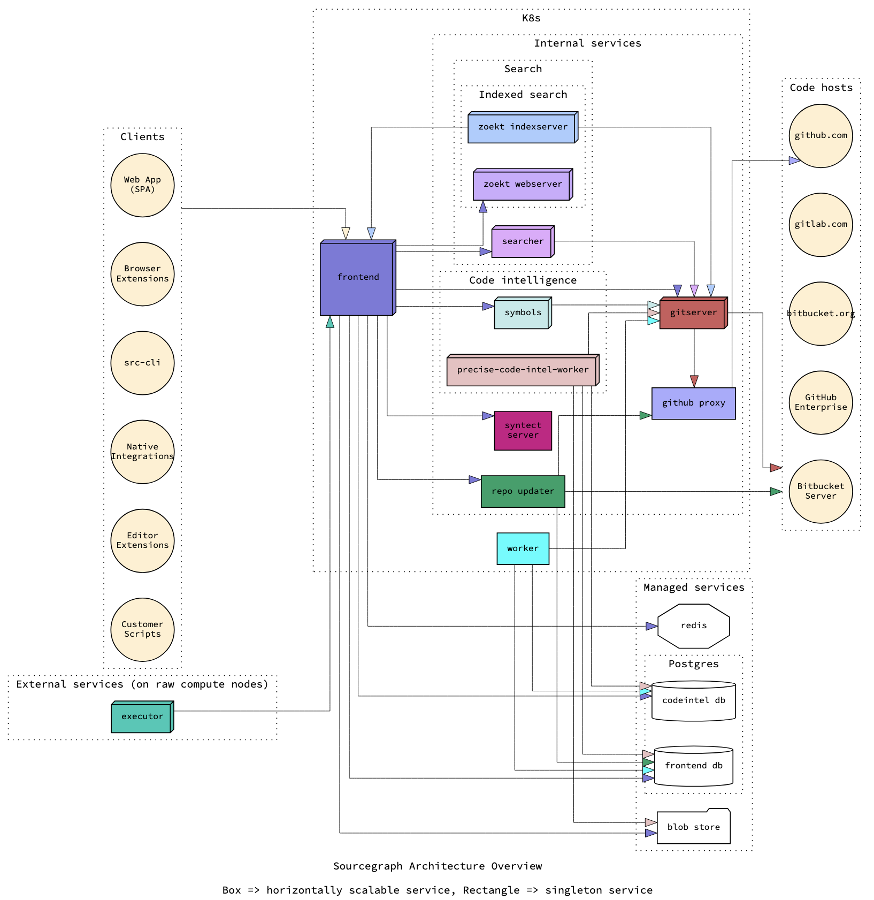

[Sourcegraph](https://about.sourcegraph.com/) is a universal code search platform that enables fast, complex queries over all your code, whether it be private code within an enterprise or [2M+ open source repositories](https://sourcegraph.com/search).
I recently had the opportunity to work on designing some changes that required me to familiarize myself at a high level with every component of the Sourcegraph product and the role each component plays - this article is a brief, unofficial overview of what goes on behind the scenes.

More specifically, [the change I was working on](https://github.com/sourcegraph/sourcegraph/issues/27916) was a project to introduce support for what we refer to as "sub-repository permissions": *not* [Git submodules](https://git-scm.com/book/en/v2/Git-Tools-Submodules), but support for granular permissions that some code hosts can enforce, most notably [Perforce's file-level permissions](https://www.perforce.com/manuals/cmdref/Content/CmdRef/p4_protects.html#p4_protects) and [Gerrit's per-branch access control](https://gerrit-review.googlesource.com/Documentation/access-control.html#_project_access_control_lists), though [CVS](https://www.gnu.org/software/trans-coord/manual/cvs/html_node/File-permissions.html) and [Gitolite](https://gitolite.com/gitolite/conf.html) both support access control at a level more granular than permissions as well.

<figure>
    
    <figcaption>
    Official Architecture diagram from <a href="https://docs.sourcegraph.com/dev/background-information/architecture#diagram">the official Sourcegraph architecture docs</a>.
    </figcaption>
</figure>

## Search

TODO
