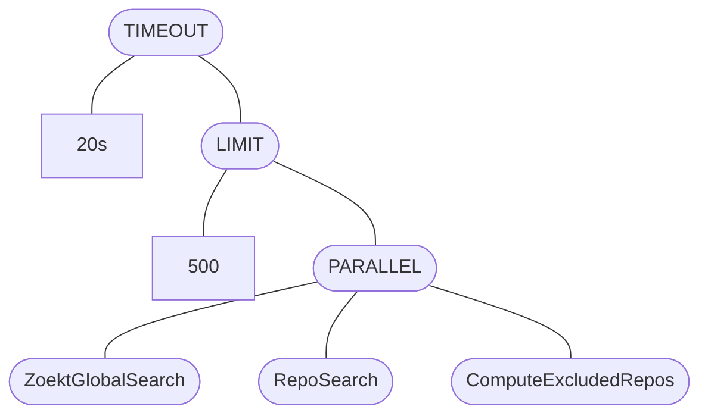
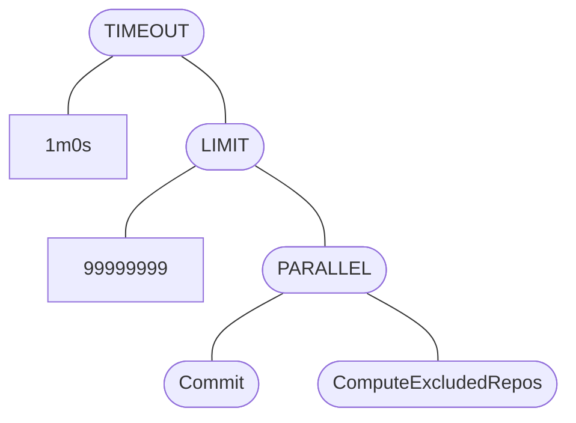
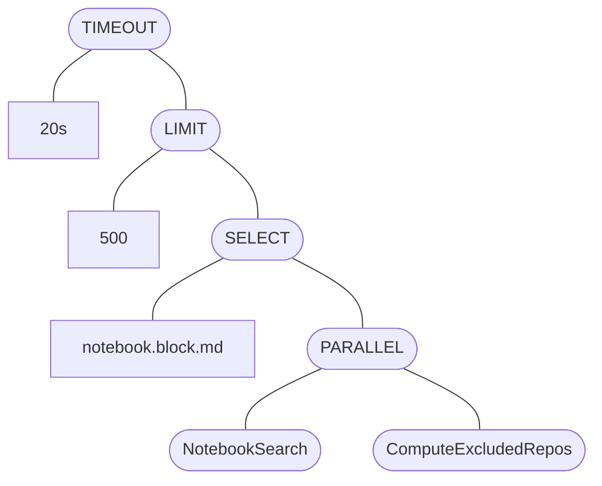

Last week, [Sourcegraph](../_experience/2021-7-5-sourcegraph.md) held a brief internal hackathon where we got to work on a variety of ideas related to our [freshly minted "Sourcegraph use cases"](https://about.sourcegraph.com/use-cases). One idea that was raised was extending Sourcegraph's [core code search functionality](https://about.sourcegraph.com/code-search) to allow queries over [search notebooks](https://docs.sourcegraph.com/notebooks), a new product that enables live and persistent documentation based on code search.


We would want to be able to do the following within the search language:

```none
type:notebook my notebook query
```

And render search notebooks within search results! The language also supports operators like `select:repo` today, so we set out to implement something similar for our MVP as well.

For some context, this is what code search results usually look like:


Note that all the code internals mentioned in this post may change - you can view the Sourcegraph repository at [`73a484e`](https://sourcegraph.com/github.com/sourcegraph/sourcegraph@73a484e) for a accurate picture of what the codebase looked like at the time!

## Introducing a search job

Jobs are structured behind a [`Job` interface](https://sourcegraph.com/github.com/sourcegraph/sourcegraph@73a484e/-/blob/internal/search/job/types.go?L23:6#tab=references):

```go
// Job is an interface shared by all individual search operations in the
// backend (e.g., text vs commit vs symbol search are represented as different
// jobs) as well as combinations over those searches (run a set in parallel,
// timeout). Calling Run on a job object runs a search.
type Job interface {
	Run(context.Context, database.DB, streaming.Sender) (*search.Alert, error)
	Name() string
}
```

The typical example here a search that calls out to our [Zoekt backend](https://github.com/sourcegraph/zoekt). A `Job` could also combine multiple search jobs, such as to [run some in parallel](https://sourcegraph.com/github.com/sourcegraph/sourcegraph@73a484e/-/blob/internal/search/job/combinators.go?L86:6) or to [prioritize results from certain jobs before others](https://sourcegraph.com/github.com/sourcegraph/sourcegraph@73a484e/-/blob/internal/search/job/combinators.go?L19:6).

For example, a typical query `foobar` will evaluate to something like this, calling out to a variety of search backends (`ZoektGlobalSearch`, `RepoSearch`, `ComputeExcludedRepos`) within certain limits, imposed by jobs for enforcing those limits.



The evaluated search job varies based on your search query - an exhaustive commit search (`foo type:commit count:all`) will create the following job instead, with a longer timeout and higher limit:



TODO implement the job

Nice! We can test evaluating the query `type:notebook select:notebook.block.md foobar` to see our new search job type being registered:



In this case, the `select:` term is just thrown in to demonstrate that it's a job that occurs *on top* of a child job, which contains the `NotebookSearch` job we created. This will be important later.
