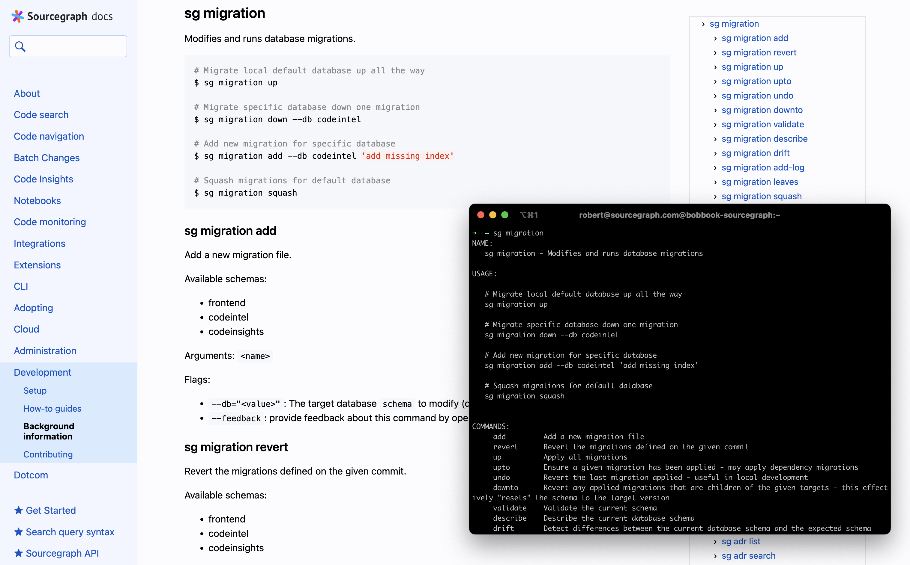
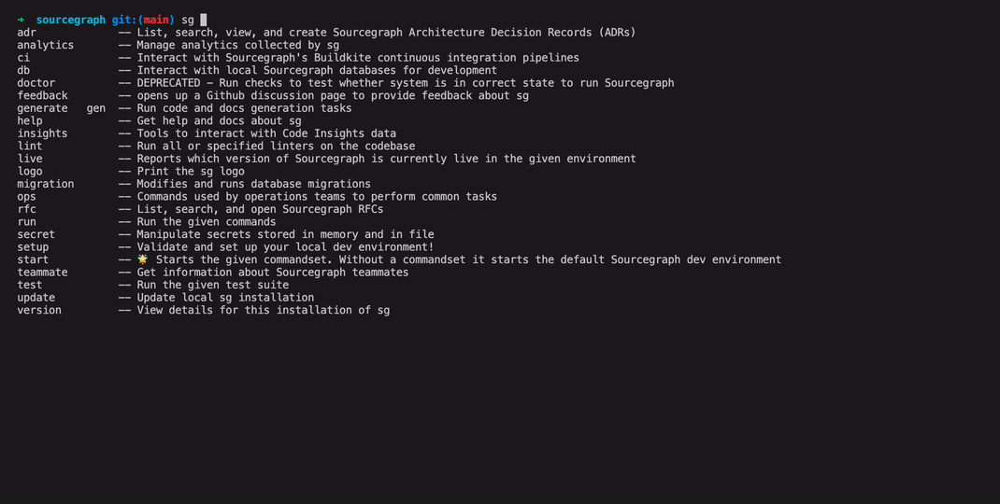
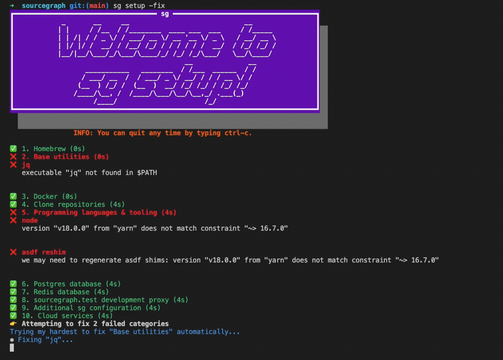
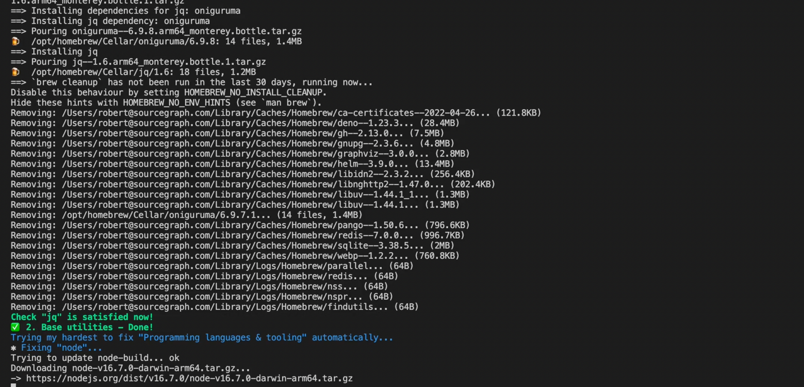

At [Sourcegraph](https://github.com/sourcegraph/sourcegraph) we have a developer tool called [`sg`](https://docs.sourcegraph.com/dev/background-information/sg), which has become the way we ensure the development of tooling continues to scale at Sourcegrpah.
But why invest in ensuring contributions to your dev tooling scales?

Imagine you’re developing a sizable application spanning multiple services - say, a code search and code intelligence platform like Sourcegraph.
You’ll want to be able to spin up everything to some degree locally to help you experiment.

So you pick up an off-the-shelf tool like [`goreman`](https://github.com/mattn/goreman), a Procfile runner we used to use - but this could be any tool, really, like docker-compose or something else.
A tool like this usually it takes a bit of configuration, but it works good enough to start off!

```sh
goreman -f dev/Procfile
```

Inevitably you add a few layers of configuration specific to your project for your tool of choice:

```sh
export SRC_LOG_LEVEL=${SRC_LOG_LEVEL:-info}
export SRC_LOG_FORMAT=${SRC_LOG_FORMAT:-condensed}

goreman --set-ports=false --exit-on-error -f dev/Procfile
```

This ends up going in a script or Makefile, to encode this setup as the de-facto way of running things that you can share with your team.

Then you realise your tool doesn’t have hot-reloading, or some other feature, which you end up writing some automation for.

[Your little start script](https://sourcegraph.com/github.com/sourcegraph/sourcegraph@a73993357386775c55d28cc2f3de69b1b6328b56/-/blob/dev/start.sh?L42) ends up with several hundred lines of configuration options, which you can only find out by reading it, and alongside that you have [dozens of scripts that do various dev-related tasks](https://sourcegraph.com/search?q=context:global+repo:%5Egithub%5C.com/sourcegraph/sourcegraph$@a739933+file:%5Edev/.*.sh&patternType=standard):

- running adjacent services,
- generating code,
- or running linters,
- or just parts of linters in particular ways in CI,
- or combining scripts and configured them in mysterious ways…

This eventually leads to a frustrating and brittle developer experience.

> It’s nearly impossible to find out which development tasks I can run. It’s really hard to run them standalone without knowing about some global state they depend on. It’s really hard to extend these, because who knows which global state might influence them or depend on their global state.
>
> — Thorsten Ball, [RFC 348: Lack of conventions](https://docs.google.com/document/d/18hrRIN0pUBRwUFF7vkcVmstJccqWeHiecNF2t1GAZfU/edit#heading=h.trqab8y0kufp)

It became hard to find out what tooling was available, how each script was configured, and how to extend them and add to them - hindering progress in our tooling.

That’s why we started `sg`, Sourcegraph’s developer tool, to become the centralised home for all development tasks.

`sg` started as a single command to run Sourcegraph locally in March 2021 - today it features over 60 commands covering all sorts of functionality and utilities that you might need throughout your development lifecycle:

- dev environment setup
- linters
- RFC/ADR browser
- migrations tooling
- CI status checker, flakes investigation tooling, etc.
- monitoring tooling
- and more!

The tool is built in Go, and thus has the usual good Go stuff - it’s self-contained and portable, so it’s easy to build self-updating for.
Installation is a simple one-liner, making `sg` very easy to distribute to teammates:

```sh
curl --proto '=https' --tlsv1.2 -sSLf https://install.sg.dev | sh
```

Introducing Go also enables more powerful, type-safe programming on top of just running commands - programming that is trickier to do in Bash, where you need to account for a more limited syntax and variants of unix commands and so on.

Using a CLI library with commands to represent tasks effectively encodes the available scripts in a powerful structured format, making documentation and configuration options easier to configure and access:

```go
dbCommand = &cli.Command{
    Name:  "db",
    Usage: "Interact with local Sourcegraph databases for development",
    UsageText: `
# Reset the Sourcegraph 'frontend' database
sg db reset-pg

# Reset the 'frontend' and 'codeintel' databases
sg db reset-pg -db=frontend,codeintel

# Reset all databases ('frontend', 'codeintel', 'codeinsights')
sg db reset-pg -db=all

# Reset the redis database
sg db reset-redis

# Create a site-admin user whose email and password are foo@sourcegraph.com and sourcegraph.
sg db add-user -name=foo
`,
    Category: CategoryDev,
    Subcommands: []*cli.Command{
        {
            Name:        "reset-pg",
            Usage:       "Drops, recreates and migrates the specified Sourcegraph database",
            Description: `If -db is not set, then the "frontend" database is used (what's set as PGDATABASE in env or the sg.config.yaml). If -db is set to "all" then all databases are reset and recreated.`,
            Flags: []cli.Flag{
                &cli.StringFlag{
                    Name:        "db",
                    Value:       db.DefaultDatabase.Name,
                    Usage:       "The target database instance.",
                    Destination: &dbDatabaseNameFlag,
                },
            },
            Action: dbResetPGExec,
        },
    },
}
```

But to make this kind of tool effective, you need more than just converting scripts into a Go program.
In developing `sg`, I’ve noticed some patterns come up that I believe are crucial to its utility - tooling should:

- [be approachable](#tooling-should-be-approachable)
- [work with your tools](#tooling-should-work-with-your-tools)
- [codify standards](#tooling-should-codify-standards)

## Tooling should be approachable

Firstly, tooling should be approachable, easy to learn and find out about, and easy to discover.
The goal is to abstract implementation details away behind a friendly, usable interface.

For example, with documentation, you might want to meet your users where they are, and provide options for learning -
whether it be through complete single-page references in the browser, or directly in the command line.

<figure>
  
</figure>

A structured CLI makes all this easy to generate from a single source of truth so that your documentation is available everywhere and always up-to-date.

Using the tool should be intuitive - to help with this, you can provide usability features like autocompletions, which in `sg` is configured for you during installation. This makes it easy to figure out what you can do on the fly!

<figure>
  
</figure>

When developing new sg commands, adding custom completions is also easy for commands that have a fixed set of possible arguments:

```go
	BashComplete: cliutil.CompleteOptions(func() (options []string) {
		config, _ := getConfig()
		if config == nil {
			return
		}
		for name := range config.Commands {
			options = append(options, name)
		}
		return
	}),
```

## Tooling should work with your tools

Secondly, tooling should interop and work with your tools - one of `sg`'s' goals is specifically to not become a build system or container orchestrator, but to provide a uniform and programmable layer on top of them that is specific to Sourcegraph’s needs.

Take `sg start`, the command that replaced the `goreman` setup we talked about earlier, for example.
`sg start` just uses whatever tools each service normally uses to build, run, and update itself, and provides some additional features on top that is specific to how Sourcegraph works.
A service configuration might look like:

```yaml
  oss-frontend:
    cmd: .bin/oss-frontend
    install: |
      if [ -n "$DELVE" ]; then
        export GCFLAGS='all=-N -l'
      fi
      go build -gcflags="$GCFLAGS" -o .bin/oss-frontend github.com/sourcegraph/sourcegraph/cmd/frontend
    checkBinary: .bin/oss-frontend
    env:
      CONFIGURATION_MODE: server
      USE_ENHANCED_LANGUAGE_DETECTION: false
      # frontend processes need this to be so that the paths to the assets are rendered correctly
      WEBPACK_DEV_SERVER: 1
    watch:
      - lib
      - internal
      - cmd/frontend
```

You’re not constrained to using `sg start` - you can run all these steps yourself still with tools of your choice, but sg start combines everything for you into tidied up output, complete with configuration, colours, hot-reloading, and everything you might need to start experimenting with your new features!

<figure>
  
</figure>

## Tooling should codify standards

Lastly, tooling should codify standards.
Automation and scripting encodes best practices that, when shared, builds on past learnings to provide a smooth experience for everyone.

Consider the typical process of setting up your development environment, we’ve all been there - a big page of things to install and set up in certain ways:

```md
### Prerequisites

- Install `A`
- Configure the thing
- Install `B`
- Install `C` (but not that version!)
```

Instead, at Sourcegraph we have `sg setup`, which automatically figures out what’s missing on your machine...



...and `sg` will take the steps required to get you set up!



Programming this fixes enables us to standardise installations over time, automatically addressing issues teammates run into so that future teammates won’t have to.

For example, we can configure `PATH` for you, or make sure things are installed in the right place and configured in the appropriate manner - building on top of other tool managers like [Homebrew](https://brew.sh/) and [asdf](https://asdf-vm.com/) to provide a smooth experience.

## Wrapup

Enabling the development of good tooling, scripting, automation makes a difference.
There’s a lot that can be done to improve how tooling is developed and improved, like the ideas I’ve brought up in this post - we don't have to settle for cryptic tooling everywhere!

If you’re interested in how all this is implemented, [`sg` is open source - come check us out on GitHub](https://github.com/sourcegraph/sourcegraph/tree/main/dev/sg)!

*Note - I had originally hoped to present this as a lightning talk at Gophercon Chicago 2022, but I was too late to queue up on the day of the presentations, so I figured might as well turn it into a post.*

<br />

## About Sourcegraph

Sourcegraph builds universal code search for every developer and company so they can innovate faster. We help developers and companies with billions of lines of code create the software you use every day.
Learn more about Sourcegraph [here](https://about.sourcegraph.com/).

Interested in joining? [We're hiring](https://about.sourcegraph.com/jobs/)!
