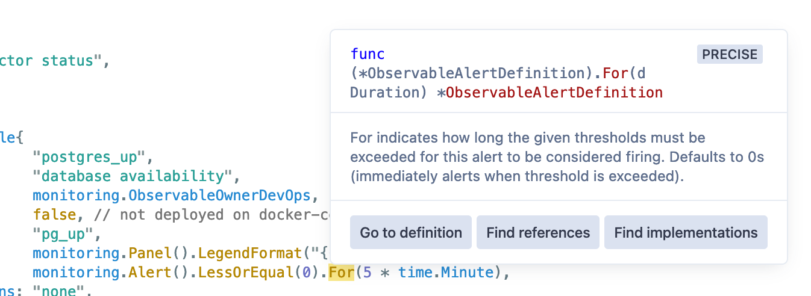

In a rapidly moving organization, documentation drift is inevitable as the underlying tools undergoes changes to suit business needs, especially for internal tools where leaning on tribal knowledge can often seem more efficient in the short term. Tools that rely on each other become increasingly difficult to build as each component becomes more complex. This introduces debt that makes for a confusing onboarding process and poor developer experience.

One approach for keeping documentation debt at bay is to choose tools that come with automated writing of documentation built-in. You can design your code in such a way that code documentation generators can also double as user guides (which I explored with [my rewrite of the UBC Launch Pad website](2020-4-25-introducing-new-launch-pad-site.md)'s generated [configuration documentation](https://ubclaunchpad.com/config)), or specifications that can generate both code and documentation (which I tried with [Inertia](2018-4-29-building-inertia.md)'s [API reference](https://inertia.ubclaunchpad.com/api/)). Some libraries, like Cobra, a Go library for build CLIs, can also generate reference documentation for commands (such as [Inertia](2018-4-29-building-inertia.md)'s [CLI reference](https://inertia.ubclaunchpad.com/cli/inertia_$%7Bremote_name%7D.html)). This allows you to meet your users where they are - for example, the less technically oriented can check out a website while the more hands-on users can find what they need within the code or in the command line - while maintaining a single source of truth that keeps everything up to date.

Of course, in addition to generated documentation you do still need to write documentation to tie the pieces together - for example, the [UBC Launch Pad website still had a brief intro guide](https://github.com/ubclaunchpad/ubclaunchpad.com/blob/master/README.md) and we did put together a [usage guide for Inertia](https://inertia.ubclaunchpad.com/), but generated documentation helps you ensure the nitty gritty stays up to date, and focus on high-level guidance in your handcrafted writing.

At [Sourcegraph](../_experience/2021-7-5-sourcegraph.md), I've been exploring avenues for taking this even further. Once you move away from off-the-shelf generators and invest in leveraging your code to generate exactly what you need, you can build a pretty neat ecosystem of documentation, integrations, and tooling that is always up to date by design. In this article, I'll talk about some of the things we've built with this approach in mind: Sourcegraph's [observability ecosystem](#observability-ecosystem) and [continuous integration pipelines](#continuous-integration-pipelines).

<br />

## Observability ecosystem

The Sourcegraph product has shipped with Prometheus metrics and Grafana dashborads for quite a while, used both by Sourcegraph for [Sourcegraph Cloud](https://sourcegraph.com) and by self-hosted customers to operate Sourcegraph instances. These have been created from our own Go-based specification since before I started working here. The spec would look something like this (truncated for brevity):



```go
func GitServer() *Container {
	return &Container{
        Name:        "gitserver",
        Title:       "Git Server",
        Description: "Stores, manages, and operates Git repositories.",
        Groups: []Group{{
            Title: "General",
            Rows: []Row{{
                // Each dashboard panel and alert is associated with an "observable"
                Observable{
                    Name:        "disk_space_remaining",
                    Description: "disk space remaining by instance",
                    Query:       `(src_gitserver_disk_space_available / src_gitserver_disk_space_total)*100`,
                    // Configure Prometheus alerts
                    Warning: Alert{LessOrEqual: 25},
                    // Configure Grafana panel
                    PanelOptions: PanelOptions().LegendFormat("{{instance}}").Unit(Percentage),
                    // Some options, like this one, makes changes to both how the panel
                    // is rendered as well as when the alert fires
                    DataMayNotExist: true,
                    // Configure documentation about possible solutions if the alert fires
                    PossibleSolutions: `
                        - **Provision more disk space:** Sourcegraph will begin deleting...
                    `,
                },
            }},
        }},
    },
}
```

<figure>
    <figcaption>
        Explore
        <a href="https://sourcegraph.com/github.com/sourcegraph/sourcegraph@3.17/-/blob/monitoring/git_server.go">what our monitoring generator looked like in Sourcegraph 3.17</a>
        (circa mid-2020)
    </figcaption>
</figure>



From here, a program will import the definitions and generate the appropriate Prometheus [recording rules](https://prometheus.io/docs/prometheus/latest/configuration/recording_rules/), Grafana [dashboard specs](https://grafana.com/docs/grafana/latest/dashboards/json-model/), and a simple customer-facing "alert solutions" page. Any changes that engineers made to their monitoring definitions using the specification would automatically update everything that needed to be updated, no additional work needed.

For example, the Grafana dashboard spec generation automatically calculates appropriate widths and heights for each panel you add, ensuring they are evenly distributed and include lines that indicate Prometheus alert thresholds, a uniform look and feel, and more.

I loved this idea, so I ran with it and worked on a series of changes that expanded the capabilities of this system significantly. Today, our monitoring specification powers:

- Multiple reference pages: a [revamped alerts reference](https://docs.sourcegraph.com/admin/observability/alert_solutions) and a page that [focuses on background information about each dashboard panel](https://docs.sourcegraph.com/admin/observability/dashboards), that both customers and engineers at Sourcegraph can reference. It now also includes information about which teams own what dashboards and alerts to help customer support better triage support requests and how to easily silence alerts through our new integration with Alertmanager.


- Grafana dashboards that now automatically includes links to the generated documentation, annotation layers for generated alerts, improved alert overview graphs, and more.

<figure>
    <video autoplay loop muted playsinline>
        <source src="/assets/images/posts/self-documenting/dashboard-annotations.webm" type="video/webm">
        <source src="/assets/images/posts/self-documenting/dashboard-annotations.mp4" type="video/mp4">
    </video>
    <figcaption>
        Version and alert annotations in Sourcegraph's generated dashboards. Dashboard like these are automatically provided by defining observables using our monitoring specification, alongside everything else mentioned previously.
    </figcaption>
</figure>

- Prometheus integration that now generates more granular [alert rules](https://prometheus.io/docs/prometheus/latest/configuration/alerting_rules/) that include additional metadata such as the ID of the associated generated dashboard panel, the team that owns the alert, and more.
- An entirely new Alertmanager integration ([related blog post](2020-06-21-docker-sidecar.md)) that allows you to [easily configure alert notifications via the Sourcegraph application](https://docs.sourcegraph.com/admin/observability/alerting#setting-up-alerting), which automatically sets up the appropriate routes and configures messages to include relevant information for triaging alerts: a helpful summary, links to documentation, and links to the relevant dashboard panel in the time window of the alert. This leverages the aforementioned generated Prometheus metrics!

<figure>
    
    <figcaption>
        Automatically configured alert notification messages feature a helpful summary and links to diagnose the issue further for a variety of supported notification services, such as Slack and OpsGenie.
    </figcaption>
</figure>

The API has changed as well to improve its flexibility and enable many of the features listed above. Nowadays, a monitoring specification might look like this (also truncated for brevity):



```go
// Definitions are separated from the API so everything is imported from 'monitoring' now,
// which allows for a more tightly controlled API.
func GitServer() *monitoring.Container {
    return &monitoring.Container{
        Name:        "gitserver",
        Title:       "Git Server",
        Description: "Stores, manages, and operates Git repositories.",
        // Easily create template variables without diving into the underlying JSON spec
        Variables: []monitoring.ContainerVariable{{
            Label:        "Shard",
            Name:         "shard",
            OptionsQuery: "label_values(src_gitserver_exec_running, instance)",
            Multi:        true,
        }},
        Groups: []monitoring.Group{{
            Title: "General",
            Rows: []monitoring.Row{{
                {
                    Name:        "disk_space_remaining",
                    Description: "disk space remaining by instance",
                    Query:       `(src_gitserver_disk_space_available / src_gitserver_disk_space_total)*100`,
                    // Alerting API expanded with additional options to leverage more
                    // Prometheus features
                    Warning: monitoring.Alert().LessOrEqual(25).For(time.Minute),
                    Panel: monitoring.Panel().LegendFormat("{{instance}}").
                        Unit(monitoring.Percentage).
                        // Functional configuration API that allows you to provide a
                        // callback to configure the underlying Grafana panel further, or
                        // use one of the shared options to share common options
                        With(monitoring.PanelOptions.LegendOnRight()),
                    // Owners can now be defined on observables, which allows support
                    // to help triage customer queries and is used internally to route
                    // pager alerts
                    Owner: monitoring.ObservableOwnerCoreApplication,
                    // Documentation fields are still around, but an 'Interpretation' can
                    // now also be provided for more obscure background on observables,
                    // especially if they aren't tied to an alert
                    PossibleSolutions: `
                        - **Provision more disk space:** Sourcegraph will begin deleting...
                    `,
                },
            }},
        }},
    }
}           
```



<figure>
    <figcaption>
        Explore
        <a href="https://sourcegraph.com/github.com/sourcegraph/sourcegraph/-/blob/monitoring/definitions/git_server.go">what our monitoring generator looks like today</a>!
    </figcaption>
</figure>

Since the specification is built on a typed language, the API itself is self-documenting in that authors of monitoring definitions can easily access what options are available and what each does through [generated API docs](https://sourcegraph.com/github.com/sourcegraph/sourcegraph/-/docs/monitoring/monitoring) or code intelligence available in Sourcegraph or in your IDE, making it very easy to pick up and work with.



<figure>
    
    <figcaption>
        Example <a href="https://about.sourcegraph.com/blog/api-documentation-for-all-your-code/">Sourcegraph API docs</a> of the monitoring API, though similar docs can also be generated by other language-specific tools.
    </figcaption>
</figure>

We also now have a tool, [`sg`](https://docs.sourcegraph.com/dev/background-information/sg), that enables us to spin up just the monitoring stack, complete with hot-reloading of Grafana dashboards, Prometheus configuration, and with a single command: `sg start monitoring`. You can even easily [test your dashboards against production metrics](https://docs.sourcegraph.com/dev/how-to/monitoring_local_dev#grafana)! This is all enabled by having a single tool and set of specifications as the source of truth for all our monitoring integrations.

This all comes together to form a cohesive monitoring development and usage ecosystem that is tightly integrated, encodes best practices, self-documenting (both in the content it generates as well as the APIs available), and easy to extend.

Learn more about our observability ecosystem in our [developer documentation](https://docs.sourcegraph.com/dev/background-information/observability), and check out the [monitoring generator source code here](https://sourcegraph.com/github.com/sourcegraph/sourcegraph/-/blob/monitoring/monitoring).

<br />

## Continuous integration pipelines

At Sourcegraph, our core continuous integration pipeline are - you guessed it - generated! Our [pipeline generator program](https://sourcegraph.com/github.com/sourcegraph/sourcegraph/-/tree/enterprise/dev/ci) analyses a build's variables (changes, branch names, commit messages, environment variables, and more) in order to create a pipeline to run on our [Buildkite](https://buildkite.com/) agent fleet.

Typically, [Buildkite pipelines](https://buildkite.com/docs/pipelines/defining-steps) are specified similarly to [GitHub Action workflows](https://docs.github.com/en/actions/using-workflows/workflow-syntax-for-github-actions) - by committing a YAML file to your repository that build agents pick up and run. This YAML file will specify what commands should get run over your codebase, and will usually support some simple conditions.

These conditions are not very ergonomic to specify, however, and will often be limited in functionality - so instead, we generate the entire pipeline on the fly:

```yaml
steps:
  - group: "Pipeline setup"
    steps:
      - label: ':hammer_and_wrench: :pipeline: Generate pipeline'
        # Prioritise generating pipelines so that jobs can get generated and queued up as soon
        # as possible, so as to better assess pipeline load e.g. to scale the Buildkite fleet.
        priority: 10
        command: |
          echo "--- generate pipeline"
          go run ./enterprise/dev/ci/gen-pipeline.go | tee generated-pipeline.yml
          echo "--- upload pipeline"
          buildkite-agent pipeline upload generated-pipeline.yml
```

This allows us to do a _ton_ of cool things. For example, we primarily condition pipelines on a combination of what we call "run types" and "diff types". A run type is specified as follows:

```go
// RunTypeMatcher defines the requirements for any given build to be considered a build of
// this RunType.
type RunTypeMatcher struct {
    // Branch loosely matches branches that begin with this value, unless a different type
    // of match is indicated (e.g. BranchExact, BranchRegexp)
    Branch       string
    BranchExact  bool
    BranchRegexp bool
    // BranchArgumentRequired indicates the path segment following the branch prefix match is
    // expected to be an argument (does not work in conjunction with BranchExact)
    BranchArgumentRequired bool

    // TagPrefix matches tags that begin with this value.
    TagPrefix string

    // EnvIncludes validates if these key-value pairs are configured in environment.
    EnvIncludes map[string]string
}
```

When matched, a `RunType = iota` is associated with the build, which can then be leveraged to determine what kinds of steps to include. For example:

- Pull requests run a bare-bones pipeline generated from what has changed in your pull requests (read on to learn more) - this enables us to keep feedback loops short on pull requests.
- Tagged release builds run our full suite of tests, and publishes finalised images to our public Docker registries.
- The `main` branch runs our full suite of tests, and publishes preview versions of our images to internal Docker registries. It also generates notifications that can notify build authors if their builds have failed in `main`.
- Similarly, a "main dry run" run type is available by pushing to a branch prefixed with `main-dry-run/` - this runs _almost_ everything that gets run on `main`. Useful for double-checking your changes will pass when merged.
- Scheduled builds are run with specific environment variables for browser extension releases and release branch health checks.

<figure>
    <div class="embed search-notebook">
    <iframe src="https://sourcegraph.com/embed/notebooks/Tm90ZWJvb2s6MTU5" frameborder="0" sandbox="allow-scripts allow-same-origin allow-popups">
    </iframe>
    </div>
    <figcaption>
        A <a href="https://sourcegraph.com/notebooks/Tm90ZWJvb2s6MTU5">search notebook walkthrough of how run types are used</a>!
    </figcaption>
</figure>

A "diff type" is generated by a diff detector that can work similarly to GitHub Action's `on.paths`, but also enables a lot more flexibility. For example, we detect basic "Go" diffs like so:

```go
if strings.HasSuffix(p, ".go") || p == "go.sum" || p == "go.mod" {
    diff |= Go
}
```

However, engineers can also define database migrations that might not change Go code - in these situations, we still want to run Go tests, and we also want to run migration tests. We can centralise this detection like this:

```go
if strings.HasPrefix(p, "migrations/") {
    diff |= (DatabaseSchema | Go)
}
```

Our `Diff = 1 << iota` type is constructed by bit-shifting an `iota` type, so we can easily check for what diffs have been detected with `diff&target != 0`, which is done by a helper function, `(*DiffType).Has`.

<figure>
    <div class="embed search-notebook">
    <iframe src="https://sourcegraph.com/embed/notebooks/Tm90ZWJvb2s6MTYw" frameborder="0" sandbox="allow-scripts allow-same-origin allow-popups">
    </iframe>
    </div>
    <figcaption>
        A <a href="https://sourcegraph.com/notebooks/Tm90ZWJvb2s6MTYw">search notebook walkthrough of how diff types are used</a>!
    </figcaption>
</figure>

The programmatic generation approach allows for some complex step generation that would be very tedious to manage by hand. Take this example:

```go
if diff.Has(changed.DatabaseSchema) {
    ops.Merge(operations.NewNamedSet("DB backcompat tests",
        addGoTestsBackcompat(opts.MinimumUpgradeableVersion)))
}
```

In this scenario, a group of checks (`operations.NewNamedSet`) is created to check that migrations being introduced are backwards-compatible. To make this check, we provide it `MinimunUpgradeableVersion` - a variable that is updated automatically the [Sourcegraph release tool](https://handbook.sourcegraph.com/departments/product-engineering/engineering/tools/release/) to indicate what version of Sourcegraph all changes should be compatible with. The tests being added look like this:

```go
func addGoTestsBackcompat(minimumUpgradeableVersion string) func(pipeline *bk.Pipeline) {
    return func(pipeline *bk.Pipeline) {
        buildGoTests(func(description, testSuffix string) {
            pipeline.AddStep(
                fmt.Sprintf(":go::postgres: Backcompat test (%s)", description),
                bk.Env("MINIMUM_UPGRADEABLE_VERSION", minimumUpgradeableVersion),
                bk.Cmd("./dev/ci/go-backcompat/test.sh "+testSuffix),
            )
        })
    }
}
```

`buildGoTests` is a helper that generates a set of commands to be run against each of the Sourcegraph repository's Go packages. It is configured to split out more complex packages into separate jobs so that they can be run in parallel across multiple agents. Right now, the generated commands for `addGoTestsBackcompat` look like this:

```
 • DB backcompat tests
      • :go::postgres: Backcompat test (all)
      • :go::postgres: Backcompat test (enterprise/internal/codeintel/stores/dbstore)
      • :go::postgres: Backcompat test (enterprise/internal/codeintel/stores/lsifstore)
      • :go::postgres: Backcompat test (enterprise/internal/insights)
      • :go::postgres: Backcompat test (internal/database)
      • :go::postgres: Backcompat test (internal/repos)
      • :go::postgres: Backcompat test (enterprise/internal/batches)
      • :go::postgres: Backcompat test (cmd/frontend)
      • :go::postgres: Backcompat test (enterprise/internal/database)
      • :go::postgres: Backcompat test (enterprise/cmd/frontend/internal/batches/resolvers)
```

With just the pretty minimal configuration above, each step is generated with a lot of baked-in configuration, many of which is generated automatically for every build step we have.

```yaml
  - agents:
      queue: standard
    command:
    - ./tr ./dev/ci/go-backcompat/test.sh only github.com/sourcegraph/sourcegraph/internal/database
    env:
      MINIMUM_UPGRADEABLE_VERSION: 3.36.0
    key: gopostgresBackcompattestinternaldatabase
    label: ':go::postgres: Backcompat test (internal/database)'
    timeout_in_minutes: "60"
```

In this snippet, we have:

- A default queue to run the job on - this can be feature-flagged to run against experimental agents.
- The shared `MINIMUM_UPGRADEABLE_VERSION` variable that gets used for other steps as well, such as upgrade tests.
- A generated key, useful for identifying steps and creating [step dependencies](https://buildkite.com/docs/pipelines/dependencies).
- Commands prefixed with `./tr`: [this script](https://sourcegraph.com/github.com/sourcegraph/sourcegraph/-/blob/enterprise/dev/ci/scripts/trace-command.sh) creates and uploads traces for our builds!

<figure>
    
    <figcaption>
        Build traces help visualise and track the performance of various pipeline steps.
        Uploaded traces are automatically linked from builds via Buildkite annotations for easy reference, and can also be queried directly in <a href="https://www.honeycomb.io/">Honeycomb</a>.
    </figcaption>
</figure>

Features like the build step traces [was implemented without having to make sweeping changes pipeline configuration](https://github.com/sourcegraph/sourcegraph/pull/29444/files), thanks to the generated approach - we just had to adjust the generator to inject the appropriate scripting, and now it _just works_ across all commands in the pipeline.

Additional functions are also available that tweak how a step is created. For example, with `bk.AnnotatedCmd` one can indicate that a step will generate annotations by writing to `./annotations` - a wrapper script is configured to make sure these annotations gets picked up and uploaded via Buildkite's API:

```go
// AnnotatedCmd runs the given command, picks up files left in the `./annotations`
// directory, and appends them to a shared annotation for this job. For example, to
// generate an annotation file on error:
//
//	if [ $EXIT_CODE -ne 0 ]; then
//		echo -e "$OUT" >./annotations/shfmt
//	fi
//
// Annotations can be formatted based on file extensions, for example:
//
//  - './annotations/Job log.md' will have its contents appended as markdown
//  - './annotations/shfmt' will have its contents formatted as terminal output on append
//
// Please be considerate about what generating annotations, since they can cause a lot of
// visual clutter in the Buildkite UI. When creating annotations:
//
//  - keep them concise and short, to minimze the space they take up
//  - ensure they are actionable: an annotation should enable you, the CI user, to know
//    where to go and what to do next.
func AnnotatedCmd(command string, opts AnnotatedCmdOpts) StepOpt {
    var annotateOpts string
    // ... set up options
    // './an' is a script that runs the given command and uploads the exported annotations
    // with the given annotation options before exiting.
    annotatedCmd := fmt.Sprintf("./an %q %q %q",
        tracedCmd(command), fmt.Sprintf("%v", opts.IncludeNames), strings.TrimSpace(annotateOpts))
    return RawCmd(annotatedCmd)
}
```

The author of a pipeline step can then easily opt in to having their annotations uploaded by changing `bk.Cmd(...)` to `bk.AnnotatedCmd(...)`. This allows all steps to easily create annotations by simply writing content to a file, and get them uploaded, formatted, and grouped nicely without having to learn the specifics of the [Buildkite annotations API](https://buildkite.com/docs/agent/v3/cli-annotate):

<figure>
    
    <figcaption>
        Annotations can help guide engineers to how to fix build issues.
    </figcaption>
</figure>

The usage of `iota` types for both `RunType` and `DiffType` enables us to iterate over available types for some useful features. For example, turning a `DiffType` into a string gives a useful summary of what is included in the diff:

```go
var allDiffs []string
ForEachDiffType(func(checkDiff Diff) {
    diffName := checkDiff.String()
    if diffName != "" && d.Has(checkDiff) {
        allDiffs = append(allDiffs, diffName)
    }
})
return strings.Join(allDiffs, ", ")
```

We can take that a bit further to iterate over all our run types and diff types in order to generate a reference page of what each pipeline does - since this page gets committed, it is also a good way to visualise changes to generated pipelines caused by code changes as well!

```go
// Generate each diff type for pull requests
changed.ForEachDiffType(func(diff changed.Diff) {
    pipeline, err := ci.GeneratePipeline(ci.Config{
        RunType: runtype.PullRequest,
        Diff:    diff,
    })
    if err != nil {
        log.Fatalf("Generating pipeline for diff type %q: %s", diff, err)
    }
    fmt.Fprintf(w, "\n- Pipeline for `%s` changes:\n", diff)
    for _, raw := range pipeline.Steps {
        printStepSummary(w, "  ", raw)
    }
})

// For the other run types, we can also generate detailed information about what
// conditions trigger each run type!
for rt := runtype.PullRequest + 1; rt < runtype.None; rt += 1 {
    m := rt.Matcher()
    if m.Branch != "" {
        matchName := fmt.Sprintf("`%s`", m.Branch)
        if m.BranchRegexp {
            matchName += " (regexp match)"
        } else if m.BranchExact {
            matchName += " (exact match)"
        }
        conditions = append(conditions, fmt.Sprintf("branches matching %s", matchName))
        if m.BranchArgumentRequired {
            conditions = append(conditions, "requires a branch argument in the second branch path segment")
        }
    }
    if m.TagPrefix != "" {
        conditions = append(conditions, fmt.Sprintf("tags starting with `%s`", m.TagPrefix))
    }
    // etc.
}
```

<figure>
    
    <figcaption>
        A web version of this reference page is also published to the <a href="https://docs.sourcegraph.com/dev/background-information/continuous_integration">pipeline types reference</a>. You can also check out the <a href="https://sourcegraph.com/github.com/sourcegraph/sourcegraph/-/blob/enterprise/dev/ci/gen-pipeline.go">docs generation code</a> directly!
    </figcaption>
</figure>

Taking this _even further_, with run type requirements available we can also integrate run types into other tooling - for example, our developer tool `sg` can help you create builds of various run types from a command like `sg ci build docker-images-patch` to build a Docker image for a specific service:

```go
// Detect what run-type someone might be trying to build
rt := runtype.Compute("", fmt.Sprintf("%s/%s", args[0], branch), nil)
// From the detected matcher, we can see if an argument is required and request it
m := rt.Matcher()
if m.BranchArgumentRequired {
    var branchArg string
    if len(args) >= 2 {
        branchArg = args[1]
    } else {
        branchArg, err = open.Prompt("Enter your argument input:")
        if err != nil {
            return err
        }
    }
    branch = fmt.Sprintf("%s/%s", branchArg, branch)
}
// Push to the branch required to trigger a build
branch = fmt.Sprintf("%s%s", rt.Matcher().Branch, branch)
gitArgs := []string{"push", "origin", fmt.Sprintf("%s:refs/heads/%s", commit, branch)}
if *ciBuildForcePushFlag {
    gitArgs = append(gitArgs, "--force")
}
run.GitCmd(gitArgs...)
// Query Buildkite API to get the created build
// ...
```

Using a similar iteration over the available run types we can also provide tooltips that automatically list out all the supported run types that can be created this way:

<figure>
    
    <figcaption>
        Check out the <a href="https://sourcegraph.com/github.com/sourcegraph/sourcegraph/-/blob/dev/sg/sg_ci.go"><code>sg ci build</code> source code</a> directly, or the <a href="https://github.com/sourcegraph/sourcegraph/pull/30932#discussion_r803196181">discussion behind the inception of this feature</a>.
    </figcaption>
</figure>

So now we have generated pipelines, documentation about them, the capability to extend pipeline specifications with additional feature like tracing, _and_ tooling that is integrated and automatically kept in sync with pipeline specifications - all derived from a single source of truth!

Learn more about our continuous integration ecosystem in our [developer documentation](https://docs.sourcegraph.com/dev/background-information/continuous_integration), and check out the [pipeline generator source code here](https://sourcegraph.com/github.com/sourcegraph/sourcegraph/-/tree/enterprise/dev/ci).

<br />

## Wrapup

The generator approach has helped us build a low-maintenance and reliable ecosystem around parts of our infrastructure. Tailor-making such an ecosystem is a non-trivial investment at first, but as an organization grows and business needs become more specific, the investment pays off by making systems easy to learn, use, extend, and integrate.

<br />

## About Sourcegraph

Learn more about Sourcegraph [here](https://about.sourcegraph.com/).
