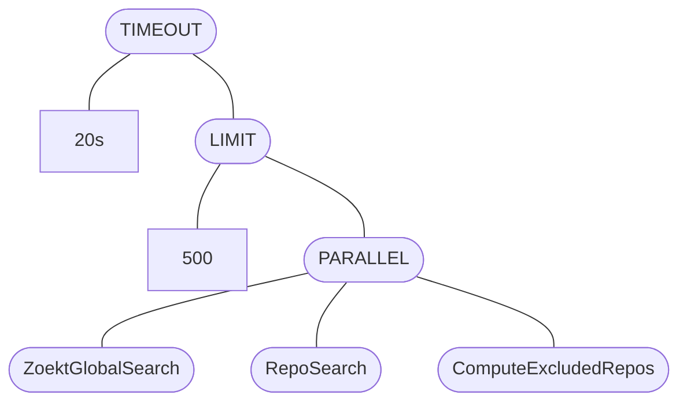
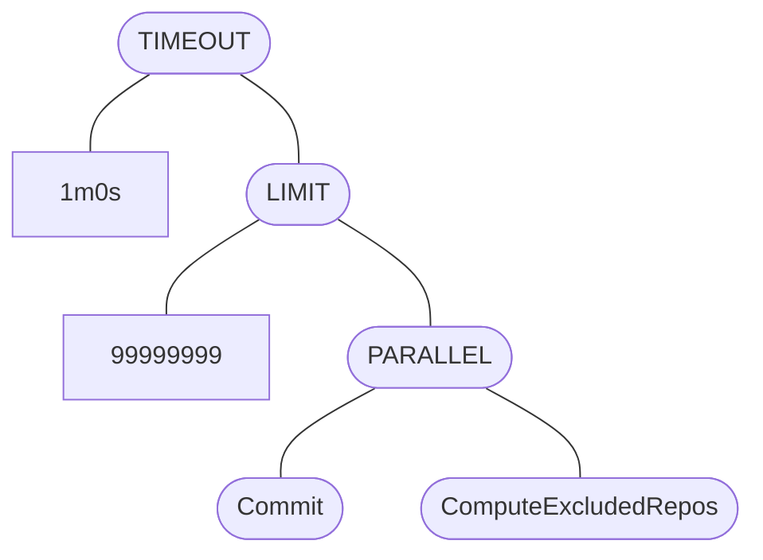
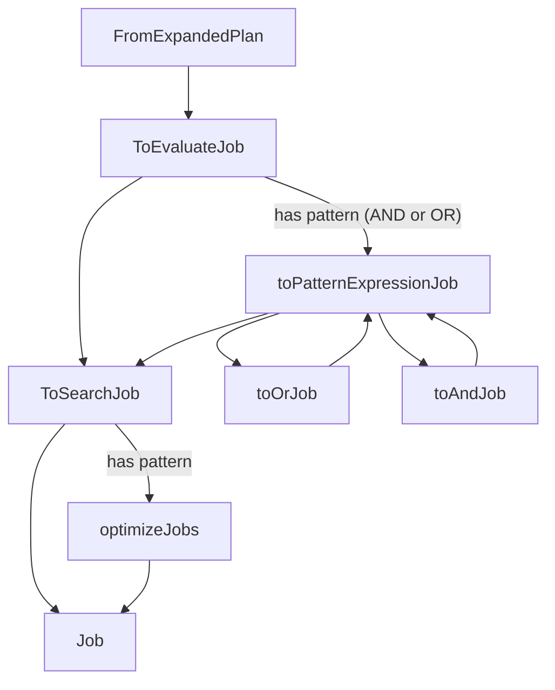
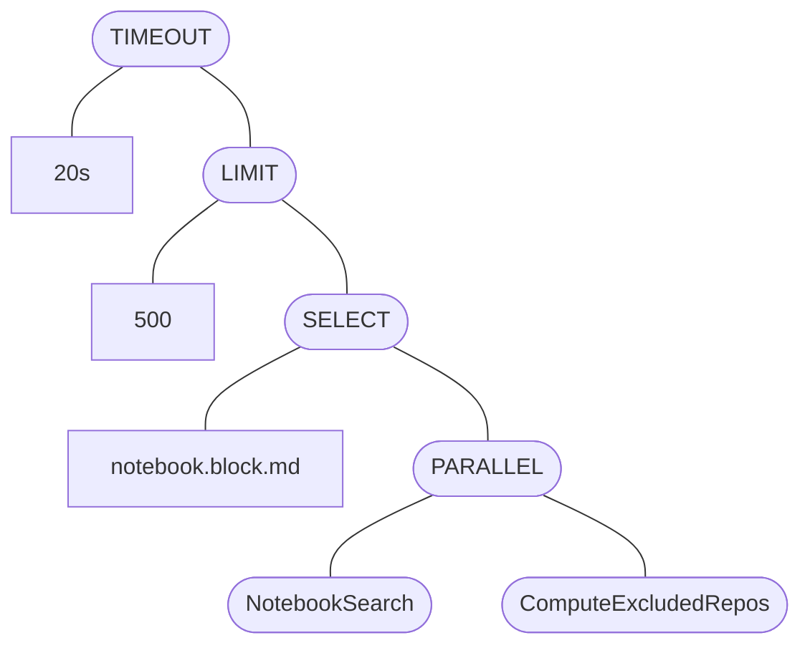

[Sourcegraph](../_experience/2021-7-5-sourcegraph.md) recently held a brief internal hackathon where we got to work on a variety of ideas related to our [freshly minted "Sourcegraph use cases"](https://about.sourcegraph.com/use-cases). One idea that was raised was extending Sourcegraph's [core code search functionality](https://about.sourcegraph.com/code-search) to allow queries over [search notebooks](https://docs.sourcegraph.com/notebooks), a new product that enables live and persistent documentation based on code search, to aid in content discovery for onboarding.

The minimum viable product of this project was to implement the ability to do the following search within the Sourcegraph search language:

```none
type:notebook my notebook query select:notebook.block.md
_____________ _________________ ________________________
       |                |                 └ render Markdown sections of the notebook match
       |                └ query string
       └ type filter
```

And render search notebooks (and/or selected "blocks", or sections) within search results! For some context, this is what Sourcegraph's code search results usually look like:

<figure>
  
</figure>

And this is what search notebooks look like, with each section being a separate notebook block:

<figure>
  <video autoplay loop muted playsinline>
    <source src="https://storage.googleapis.com/sourcegraph-assets/notebooks/notebooks_overview_v3_dark.webm" type="video/webm">
    <source src="https://storage.googleapis.com/sourcegraph-assets/notebooks/notebooks_overview_v3_dark.mp4" type="video/mp4">
  </video>
</figure>

In this post, I'll walk through a brief overview of what I learned about how Sourcegraph search works and what we did to implement an additional search and search result type!

- [Introducing a search job](#introducing-a-search-job)
- [Sending results over the wire](#sending-results-over-the-wire)
- [Querying the database for real results](#querying-the-database-for-real-results)
- [Implementing notebook blocks results](#implementing-notebook-blocks-results)
- [Rendering search notebook results](#rendering-search-notebook-results)

A sneak peak of the end result:

<figure>
  
  <figcaption>
    End-to-end notebook block search!
  </figcaption>
</figure>

Note that all the code internals mentioned in this post may change - you can view the Sourcegraph repository at [`73a484e`](https://sourcegraph.com/github.com/sourcegraph/sourcegraph@73a484e) for a accurate picture of what the codebase looked like at the time! I'd also like to thank [@tsenart](https://github.com/tsenart) who both proposed the original idea and worked with me through several brainstorming sessions to discuss the implementation.

Additionally, I am basically a complete outsider when it comes to our search internals, and the search code I interact with in this post was built by [Sourcegraph's fantastic search teams](https://handbook.sourcegraph.com/departments/product-engineering/engineering/code-graph/search/), so kudos[^kudos] to the teams for making this hack possible in the first place!

[^kudos]: So somewhat embarrassingly, on one of my iterations of this project [I complained a bit about the tedium of the many layers in the search backend](https://github.com/sourcegraph/sourcegraph/pull/33161), at which point I was educated by [Comby (structural search)](https://comby.dev/) creator [@rvantonder](https://github.com/rvantonder) on how [cleaning up the search internals is an ongoing effort and has improved significantly over the past year](https://github.com/sourcegraph/sourcegraph/pull/33161#issuecomment-1081441870). One of my biggest takeaways from this project is that search a very complex system and that building a suitable abstraction for the myriad of types of search that Sourcegraph already features is a monumental undertaking!

## Introducing a search job

The Sourcegraph docs page [Life of a search query](https://docs.sourcegraph.com/dev/background-information/architecture/life-of-a-search-query) briefly goes over what happens when, for example, you enter a query into [sourcegraph.com/search](https://sourcegraph.com/search):

1. A client makes a request to (typically) the `/.api/stream` endpoint - see [how it is done in the `raycast-sourcegraph` extension for a simplified example](https://sourcegraph.com/github.com/bobheadxi/raycast-sourcegraph@7bc6dd80ffcb714b46b1911bc8368139d061dd82/-/blob/src/sourcegraph/stream-search/index.ts?L53-56).
2. The query makes its way to `sourcegraph-frontend`, which converts the query text into a search plan composed of search jobs to execute against various backends (such as [Zoekt](https://github.com/sourcegraph/zoekt)).
3. Jobs get executed and the results get streamed back over the wire to the client.

For example, a typical query `foobar` will evaluate to a plan of jobs like the following, calling out to a variety of search backends (`ZoektGlobalSearch`, `RepoSearch`, `ComputeExcludedRepos`) within certain limits[^timeout], imposed by jobs for enforcing those limits on child jobs.



[^timeout]: By default, Sourcegraph search is limited to optimise for fast results. This extensiveness of a search is configurable through the `count:` and `timeout:`, as well as a special `count:all` mode, as described in our documentation: [Exhaustive search](https://docs.sourcegraph.com/code_search/how-to/exhaustive).

The typical example here is a search job that reaches out to our [Zoekt backends](https://github.com/sourcegraph/zoekt). A `Job` could also combine multiple search jobs, such as to [run a set of jobs in parallel](https://sourcegraph.com/github.com/sourcegraph/sourcegraph@73a484e/-/blob/internal/search/job/combinators.go?L104-121) or to [prioritise results from certain jobs before others](https://sourcegraph.com/github.com/sourcegraph/sourcegraph@73a484e/-/blob/internal/search/job/combinators.go?L38-81).

The evaluated search job varies based on your search query - an [exhaustive](https://docs.sourcegraph.com/code_search/how-to/exhaustive) commit search (`foo type:commit count:all`) will create the following job instead, with a longer timeout and higher limit:



Each search job within these plans are implemented behind the [`Job` interface](https://sourcegraph.com/github.com/sourcegraph/sourcegraph@73a484e/-/blob/internal/search/job/types.go?L23:6#tab=references):

```go
// Job is an interface shared by all individual search operations in the
// backend (e.g., text vs commit vs symbol search are represented as different
// jobs) as well as combinations over those searches (run a set in parallel,
// timeout). Calling Run on a job object runs a search.
type Job interface {
  Run(context.Context, database.DB, streaming.Sender) (*search.Alert, error)
  Name() string
}
```

So how do these jobs in the query plan get created? Poking around for constructors of the `Job` interface reveals (I think) the following flow for `Job` creation after a `query.Plan` is created (primarily with [`query.Pipeline`](https://sourcegraph.com/github.com/sourcegraph/sourcegraph@73a484e/-/blob/internal/search/query/query.go?L171:6), which handles query parsing, validation, transformation, and so on):



The [`ToSearchJob` function](https://sourcegraph.com/github.com/sourcegraph/sourcegraph@73a484e/-/blob/internal/search/job/job.go?L51:6), which appears to handle the bulk of creation of search jobs, with the additional layers applying a variety of processing.

```go
// ToSearchJob converts a query parse tree to the _internal_ representation
// needed to run a search routine. To understand why this conversion matters, think
// about the fact that the query parse tree doesn't know anything about our
// backends or architecture. It doesn't decide certain defaults, like whether we
// should return multiple result types (pattern matches content, or a file name,
// or a repo name). If we want to optimise a Sourcegraph query parse tree for a
// particular backend (e.g., skip repository resolution and just run a Zoekt
// query on all indexed repositories) then we need to convert our tree to
// Zoekt's internal inputs and representation. These concerns are all handled by
// toSearchJob.
func ToSearchJob(jargs *Args, q query.Q, db database.DB) (Job, error) {
  b, err := query.ToBasicQuery(q)
  if err != nil {
    return nil, err
  }
  types, _ := q.StringValues(query.FieldType)
  resultTypes := search.ComputeResultTypes(types, b.PatternString(), jargs.SearchInputs.PatternType)

  // ...

  var requiredJobs, optionalJobs []Job
  addJob := func(required bool, job Job) {
    if required {
      requiredJobs = append(requiredJobs, job)
    } else {
      optionalJobs = append(optionalJobs, job)
    }
  }

  // ... various conditional calls to addJob
}
```

So to start off, we add a new field type `result.TypeNotebook = "notebook"`, and attach a new `Job` when a query includes `type: notebook`:

```go
if resultTypes.Has(result.TypeNotebook) {
  notebookSearchJob := &notebook.SearchJob{
    PatternString: b.PatternString(),
  }
  addJob(true, notebookSearchJob)
}
```

For now, we want to create a stub implementation that provides a few hard-coded notebooks that sends a few results over to the `streaming.Sender` provided in the `(Job).Run` interface. This requires implementing the `result.Match` interface:

```go
type Match interface {
  ResultCount() int

  // Limit truncates the match such that, after limiting,
  // `Match.ResultCount() == limit`. It should never be called with
  // `limit <= 0`, since a single match cannot be truncated to zero results.
  Limit(int) int

  Select(filter.SelectPath) Match
  RepoName() types.MinimalRepo

  // Key returns a key which uniquely identifies this match.
  Key() Key
}
```

Right off the bat, it becomes clear that Sourcegraph's search internals are heavily geared towards repository-oriented results, with the top-level `RepoName` being part of the `Match` interface. Repository matches, file content results, symbols, commits, diffs, and so on all return results that are part of a repository. Notebooks, on the other hand, are an entirely separate entity within the Sourcegraph application, and notebooks that are tracked in the database (it is also possible to create notebooks with `.snb.md` files within repositories, but we ignore that case for now) are not strictly associated with any repository.

This is even more evident within the `Key` type, which requires an unique combination `Repo`, `Rev`, `Path`, `AuthorDate`, `Commit`, `Path`, and `TypeRank` - none of which are fields that we can use to uniquely identify a search notebook. We could use `Path` as the notebook name, but that's not strictly unique either.

To work around these issues for now, we just return a zero-value `RepoName` and add a new field `ID` to the `Key` type:

```go
type Key struct {
  // ...

  // ID is an arbitrary identifier that can be used to distinguish this result,
  // e.g. if the result type is not associated with a repository.
  ID string

  // ...
}
```

```go
type NotebookMatch struct {
  ID int64

  Title     string
  Namespace string
  Private   bool
  Stars     int
}

func (n NotebookMatch) RepoName() types.MinimalRepo {
  // This result type is not associated with any repository.
  return types.MinimalRepo{}
}

func (n NotebookMatch) Limit(limit int) int {
  // Always represents one result and limit > 0 so we just return limit - 1.
  return limit - 1
}

func (n *NotebookMatch) URL() *url.URL {
  return &url.URL{Path: "/notebooks/" + n.marshalNotebookID()}
}

func (n *NotebookMatch) Key() Key {
  return Key{
    ID:       n.marshalNotebookID(),
    TypeRank: rankRepoMatch,
  }
}

// other interface functions no-op for now
```

With our new types, we can create a stub job for searching search notebooks:

```go
type SearchJob struct {}

func (s *SearchJob) Run(ctx context.Context, db database.DB, stream streaming.Sender) (*search.Alert, error) {
  stream.Send(streaming.SearchEvent{
    Results: result.Matches{
      &result.NotebookMatch{
        Title:     "FOOBAR",
        Namespace: "sourcegraph",
        ID:        1,
        Stars:     64,
        Private:   false,
      },
      &result.NotebookMatch{
        Title:     "BAZ",
        Namespace: "robert",
        ID:        2,
        Stars:     0,
        Private:   true,
      },
    },
  })
  return nil, nil
}

func (*SearchJob) Name() string { return "NotebookSearch" }
```

The workarounds above caused some funky behaviour, such as repository permissions post-processing rejecting notebook results as not being associated with a repository the current [actor (user)](https://sourcegraph.com/notebooks/Tm90ZWJvb2s6OTI=) has access to, so I just hacked in some a condition to ignore zero-value `RepoName`s in those checks to avoid dropping our notebook results.

We can test the evaluation of the query `type:notebook select:notebook.block.md foobar` to see our new search job type being registered (after implementing the appropriate printers):



In this case, the `select:` term is just thrown in to demonstrate that it's a job that occurs *on top* of a child job, which contains the `NotebookSearch` job we created. This will be important [later](#implementing-selection)!

## Sending results over the wire

That's not the end of it! Distinct from plans, jobs, and matches, we also have *event* types, which are the types that get transmitted over the wire to search clients.

For the most part, this is a very thin layer that just simplifies the internal match types for consumption, and hydrates events with repository metadata from a cache (such how many stars the associated repository has, and when the repository was last updated) or decorations. For our new notebook results, we don't really need to support any of that yet - we can simply map results more or less directly to a new event type.

```go
func fromNotebook(notebook *result.NotebookMatch) *streamhttp.EventNotebookMatch {
  return &streamhttp.EventNotebookMatch{
    Type:      streamhttp.NotebookMatchType,
    ID:        notebook.Key().ID,
    Title:     notebook.Title,
    Namespace: notebook.Namespace,
    URL:       notebook.URL().String(),
    Stars:     notebook.Stars,
    Private:   notebook.Private,
  }
}
```

At this point, we basically have everything we need to see our results in the API results! We can confirm by [spinning up Sourcegraph locally with `sg start`](https://docs.sourcegraph.com/dev/background-information/sg#sg-start-start-dev-environments), executing a search, and inspecting the response of the network request to `/.api/stream` within a browser for our placeholder notebook results:

<figure>
  
  <figcaption>
    Look closely at the '<code>matches</code>' entry for our hard-coded notebooks!
  </figcaption>
</figure>

## Querying the database for real results

Notebooks live in the Sourcegraph database, so to replace our stub results we can make a query to look for notebooks that returns relevant matches based on the provided query string.

```sql
SELECT
  notebooks.id,
  notebooks.title,
  NOT public as private, -- invert for consistency with other match types

  -- apply post-processing after query to merge namespace_user and  namespace_org into a
  -- single 'Namespace' field (only one can be set at a time)
  users.username as namespace_user,
  orgs.name as namespace_org,

  (
    SELECT COUNT(*)
    FROM notebook_stars
    WHERE notebook_id = notebooks.id
  ) as stars
FROM
  notebooks
  LEFT JOIN users on users.id = notebooks.namespace_user_id
  LEFT JOIN orgs on orgs.id = notebooks.namespace_org_id
WHERE
  (%s) -- permission conditions
  AND (%s) -- query conditions
ORDER BY
  stars DESC
LIMIT
  25
```

To generate query conditions, we use the `notebook.SearchJob` evaluated in `ToSearchJob` as the sole parameter. The idea is to extend `SearchJob` to contain all the parameters that can be used to adjust the generated query (such as pattern types, e.g. regexp, or additional fields, such as inclusion and exclusion of notebooks with `notebook:` and `-notebook`, and so on). For now, we generate simple queries solely based on the `PatternString` parameter:

```go
func makeQueryConds(job *SearchJob) *sqlf.Query {
  conds := []*sqlf.Query{}

  // Allow querying against the 'full title'
  const concatTitleQuery = "CONCAT(users.username, orgs.name, notebooks.title)"
  if job.PatternString != "" {
    titleQuery := "%(" + job.PatternString + ")%"
    conds = append(conds, sqlf.Sprintf("%s ILIKE %s",
      concatTitleQuery, titleQuery))
  }

  if len(job.PatternString) > 0 {
    // Query against notebook contents, embedded as a tsvector field.
    conds = append(conds, sqlf.Sprintf("notebooks.blocks_tsvector @@ to_tsquery('english', %s)",
      toPostgresTextSearchQuery(job.PatternString)))
  }

  if len(conds) == 0 {
    // If no conditions are present, append a catch-all condition to avoid a SQL syntax error
    conds = append(conds, sqlf.Sprintf("1 = 1"))
  }

  return sqlf.Join(conds, "\n OR")
}
```

The `CONCAT` means that we cannot use indexes to hasten the query, but this is a hackathon so oh well. I decided to keep it in because I felt like a query for `$namespace $topic` felt like a very natural query to want to make, and I wanted to the demo supported that.

After writing a bit more boilerplate to execute the database query and scan the resulting rows, we can update our search job to return real results instead:

```go
func (s *SearchJob) Run(ctx context.Context, db database.DB, stream streaming.Sender) (*search.Alert, error) {
  store := Search(db)
  notebooks, err := store.SearchNotebooks(ctx, s)
  if err != nil {
    return nil, errors.Wrap(err, "NotebookSearch")
  }
  matches := make([]result.Match, len(notebooks))
  for i, n := range notebooks {
    matches[i] = n
  }
  stream.Send(streaming.SearchEvent{
    Results: matches,
  })
  return nil, nil
}
```

We can test this out by creating a few notebooks in our local Sourcegraph instance and inspecting the network requests in-browser again to see real notebooks being returned!

## Implementing notebook blocks results

Seeing the notebook titles that match your query is great and all, but to demonstrate the potential of this capability we wanted to make sure users can also see notebook *content* results - in other words, the matching notebook blocks - for their query.

For now, we decided to implement this such that notebook blocks only get returned with the `select:notebook.block` parameter. The Sourcegraph query language already features selections like `select:repo` or `select:commit.diff.added`, so this approach felt like it fitted in with how other search types are implemented.

Selections are part of the `Match` interface we previously implemented, and they work via [`selectJob`, which wraps the `streaming.Sender` with another `streaming.Sender`](https://sourcegraph.com/github.com/sourcegraph/sourcegraph@73a484e/-/blob/internal/search/job/select.go?L24-30) that [calls `Select` on each result it receives](https://sourcegraph.com/github.com/sourcegraph/sourcegraph@73a484e/-/blob/internal/search/streaming/stream.go?L94) before passing it to the underlying stream.

This means that all we have to do is also query for blocks within our notebooks database query, and only expose the blocks within the `Select` implementation. To start off, we extend our `NotebookMatch` with a `Blocks` field, and implement `Select` such that we generate a new `NotebookBlocksMatch` type:

```go
type NotebookMatch struct {
  // ... as before

  Blocks NotebookBlocks `json:"-"`
}

/// ... as before

func (n *NotebookMatch) Select(path filter.SelectPath) Match {
  // Only support 'select:notebook.*' on this result type
  if path.Root() != filter.Notebook {
    return nil
  }

  switch len(path) {
  case 1:
    return n // This is just 'select:notebook', so return self

  case 2, 3: // Support 'select:notebook.block' and 'select:notebook.block.*'
    if path[1] == "block" {
      if len(n.Blocks) == 0 {
        return nil // No results!
      }

      return (&NotebookBlocksMatch{
        Notebook: *n,
        Blocks:   n.Blocks,
      }).Select(path) // Allow blocks to continue selecting for 'select:notebook.block.*'
    }
  }

  return nil
}
```

To support `select:notebook.blocks.$TYPE`, where `$TYPE` is a block type (such as Markdown, query, symbol, and so on), the `NotebookBlocksMatch` type must also implement `Select` to only provide blocks of the requested type:

```go
func (n *NotebookBlocksMatch) Select(path filter.SelectPath) Match {
  // Only support 'select:notebook.*' on this result type
  if path.Root() != filter.Notebook {
    return nil
  }

  switch len(path) {
  case 2:
    if path[1] == "block" {
      return n // This is just 'select:notebook.block', so return self
    }

  case 3:
    // Filter by the requested block type, which is the third path parameter. For example,
    // 'select:notebook.block.md' will filter for blocks of type 'md'.
    blockType := path[2]
    var blocks NotebookBlocks
    for _, b := range n.Blocks {
      if b["type"] == blockType {
        blocks = append(blocks, b)
      }
    }
    if len(blocks) == 0 {
      return nil // No results!
    }
    return &NotebookBlocksMatch{
      Notebook: n.Notebook,
      Blocks:   blocks,
    }
  }

  return nil
}
```

And as before, we need to implement an event type `EventNotebookBlockMatch` and the relevant adapters as well.

```go
func fromNotebookBlocks(blocks *result.NotebookBlocksMatch) *streamhttp.EventNotebookBlockMatch {
  return &streamhttp.EventNotebookBlockMatch{
    Type:     streamhttp.NotebookBlockMatchType,
    Notebook: *fromNotebook(&blocks.Notebook),
    Blocks:   blocks.Blocks,
  }
}
```

For the database layer, we now need to add blocks to our result type. Blocks are currently store as a JSON blob within the `notebooks.blocks` column, so adding that to our `SELECT` and including it in the result scan is fairly straight-forward.

However, this does mean that we can't only select relevant blocks within the database query. A better long-term solution to this is likely to split `notebooks.blocks` out into a separate table and joining it at query time, but that's a lot of work for a hackathon so I decided to go for a cheap hack: post-filtering! This isn't too bad for now because the `notebooks.blocks_tsvector @@ to_tsquery` in our query conditions means that the returned notebooks are likely to have a matching block, but it definitely isn't very pretty.

Even worse, blocks of various types have varying shapes (i.e. there's no single `block.text` field we can filter on), and I didn't want to special-case each block type for now. A closer look at [`notebooks.blocks_tsvector`](https://sourcegraph.com/github.com/sourcegraph/sourcegraph@73a484e/-/blob/migrations/frontend/1528395957/up.sql?L1-2) reveals it is backed by [a magic Postgres feature](https://www.postgresql.org/docs/current/functions-textsearch.html) that indexes all fields of type `string` within the `notebooks.blocks` JSON:

```sql
ALTER TABLE
  notebooks
ADD
  COLUMN
IF NOT EXISTS
  blocks_tsvector TSVECTOR
GENERATED ALWAYS AS
  (jsonb_to_tsvector('english', blocks, '["string"]')) STORED;
```

It is a neat implementation that does not require any knowledge of blocks fields, but sadly there does not seem to be an equivalent function built with Go for us to post-filter with. So I just marshal each block as JSON and do a regexp search over the whole thing:

```go
func (s *notebooksSearchStore) SearchNotebooks(ctx context.Context, job *SearchJob) ([]*result.NotebookMatch, error) {
  // ... query for notebooks

  // do our post-filtering
  if len(job.PatternString) > 0 {
    searchRe, err := regexp.Compile("(?i).*(" + job.PatternString + ").*")
    if err != nil {
      return nil, err
    }
    for _, n := range notebooks {
      var matchBlocks result.NotebookBlocks
      // filter notebook blocks
      for _, block := range n.Blocks {
        b, err := json.Marshal(block)
        if err != nil {
          continue
        }
        // regexp match over the marshalled block
        if searchRe.Match(b) {
          matchBlocks = append(matchBlocks, block)
        }
      }
      n.Blocks = matchBlocks
    }
  }

  return notebooks, nil
}
```

Hey, it's a hackathon!

Similarly to before, we can verify this works end-to-end by running a `type:notebook select:notebook.block` query and inspecting the response:

<figure>
  
</figure>

## Rendering search notebook results

Rendering results in the network tab is great and all, but we want to demo something pretty as well! We start off by adding types in the web app that correspond to our new event types:

```ts
export type SearchType = /* ... */ | 'notebook' | null
export type SearchMatch = /* ... */ | NotebookMatch | NotebookBlocksMatch

export interface NotebookMatch {
    type: 'notebook'
    id: string
    title: string
    namespace: string
    url: string
    stars?: number
    private: boolean
}

export interface NotebookBlocksMatch {
    type: 'notebook.block'
    notebook: NotebookMatch
    // TODO lots of variants of these types, leave as any for now and massage the data
    // as needed
    blocks: any[]
}
```

To extend `type:` completions in the search bar, we update [`FILTERS`](https://sourcegraph.com/github.com/sourcegraph/sourcegraph@73a484e/-/blob/client/shared/src/search/query/filters.ts?L289-292):

```ts
export const FILTERS: Record<NegatableFilter, NegatableFilterDefinition> &
    Record<Exclude<FilterType, NegatableFilter>, BaseFilterDefinition> = {
    /* ... */
    [FilterType.type]: {
        description: 'Limit results to the specified type.',
        discreteValues: () => [/* ... */, 'notebook'].map(value => ({ label: value })),
    },
    /* ... */
}
```

And similarly for `select:` completions, we update [`SELECTORS`](https://sourcegraph.com/github.com/sourcegraph/sourcegraph@73a484e/-/blob/client/shared/src/search/query/selectFilter.ts?L8:14):

```ts
export const SELECTORS: Access[] = [
  /* ... */
  {
    name: 'notebook',
    fields: [
      {
        name: 'block',
        fields: [{ name: 'md' }, { name: 'query' }, { name: 'file' }, { name: 'symbol' }],
      },
    ],
  },
]
```

<figure>
  
  <figcaption>
    Suggestions!
  </figcaption>
</figure>

And now things get a bit hacky. For plain notebook results, we can leverage the same components used for repository matches with reasonable results by extending [the `StreamingSearchResultsList` component](https://sourcegraph.com/github.com/sourcegraph/sourcegraph@73a484e/-/blob/client/search-ui/src/results/StreamingSearchResultsList.tsx?L67:14):

```tsx
export const StreamingSearchResultsList: React.FunctionComponent<StreamingSearchResultsListProps> = ({
    /* ... */
}) => {
    /* ... */

    const renderResult = useCallback(
        (result: SearchMatch, index: number): JSX.Element => {
            switch (result.type) {
                /* ... */
                case 'notebook':
                    return (
                        <SearchResult
                            icon={NotebookIcon}
                            result={result}
                            repoName={`${result.namespace} / ${result.title}`}
                            platformContext={platformContext}
                            onSelect={() => logSearchResultClicked(index, 'notebook')}
                        />
                    )
            }
        }
    )

    return (/* ... */)
}
```

<figure>
  
</figure>

For notebook blocks, things started to get *really* hacky. I had originally expected to just render the parameters encoded in the block (for example, the query in a query block). However, [@tsenart](https://github.com/tsenart) pointed out that maybe we could render the blocks *exactly* as it is rendered within a notebook. I thought this would be brilliant! Surely it would be as easy as simply importing the correct component and providing it with the blocks in a block match - how messy could this be?

Well, using [`NotebookComponent`](https://sourcegraph.com/github.com/sourcegraph/sourcegraph@73a484e/-/blob/client/web/src/notebooks/notebook/NotebookComponent.tsx?L99:14) ended up looking like this:

```tsx
  case 'notebook.block':
      return (
          <ResultContainer
              icon={NotebookIcon}
              title={
                  <Link to={result.notebook.url}>
                      {result.notebook.namespace} / {result.notebook.title}
                  </Link>
              }
              collapsible={false}
              defaultExpanded={true}
              resultType={result.type}
              onResultClicked={noop}
              expandedChildren={
                  <div className={styles.notebookBlockResult}>
                      <NotebookComponent
                          key={`${result.notebook.id}-blocks`}
                          isEmbedded={true}
                          noRunButton={true}
                          // TODO HACK: DB, component, and GraphQL block types
                          // don't align so we need to massage it into a type
                          // this component finds acceptable
                          blocks={result.blocks.map(b => {
                              if (b.queryInput) {
                                  return { ...b, input: { query: b.queryInput.text } }
                              }
                              return {
                                  ...b,
                                  input:
                                      b.markdownInput || b.fileInput || b.symbolInput || b.computeInput,
                              }
                          })}
                          authenticatedUser={null}
                          globbing={false}
                          isReadOnly={true}
                          extensionsController={extensionsController}
                          hoverifier={hoverifier}
                          platformContext={platformContext}
                          exportedFileName={result.notebook.title}
                          onSerializeBlocks={noop}
                          onCopyNotebook={() => NEVER}
                          streamSearch={() => NEVER} // TODO make this jump to new search page instead
                          isLightTheme={isLightTheme}
                          telemetryService={telemetryService}
                          fetchHighlightedFileLineRanges={fetchHighlightedFileLineRanges}
                          searchContextsEnabled={searchContextsEnabled}
                          settingsCascade={settingsCascade}
                          isSourcegraphDotCom={isSourcegraphDotCom}
                          showSearchContext={showSearchContext}
                      />
                  </div>
              }
          />
      )
```

Gnarly, eh? All these fields required me to do all sorts of things to `StreamingSearchResultsListProps` to get the props needed. Full disclaimer: I am far from a professional when it comes to web apps and React, so I'm sure there's a better way to do this than prop drilling, but oh well. The `NotebookComponent` also doesn't feel like it was meant for this kind of import and use, given notebooks is a pretty new product and the whole philosophy of iterate fast and polish later and all.

That said, once the compiler stopped complaining the results were great - everything kind of *just worked*, and looked pretty good after some CSS adjustments! Even running query blocks worked nicely.

<figure>
  
</figure>

Of course, this begs the question - what if you make a notebook search, within a search notebook? Well, that works too!

<figure>
  <video autoplay loop muted playsinline>
    <source src="/assets/images/posts/extending-search/recursive-notebook.mp4" type="video/mp4">
  </video>
  <figcaption>
    Search-notebooks-ception?
  </figcaption>
</figure>

You can also check out a brief final demo I made of the state of the project at the end of the hackathon for how this all ties together:

[](https://www.loom.com/share/23c8d3f23bf942f3ba24896472047f5b)

You can also check out the (messy) (and incomplete) code here: [sourcegraph#33316](https://github.com/sourcegraph/sourcegraph/pull/33316)

<br />

## Wrapup

Thanks for reading! I hope this was an interesting glimpse at how search works at Sourcegraph. I'm not sure if this will ever make it into the product, but regardless, this was a really fun foray into a part of the codebase I've only interacted with at a surface level through my [Sourcegraph for Raycast extension project](https://github.com/bobheadxi/raycast-sourcegraph), and learning about the abstractions used to power code search (and more!) was fascinating, and a nice change of pace from [my usual work](../_experience/2021-7-5-sourcegraph.md)!

<br />

## About Sourcegraph

Sourcegraph builds universal code search for every developer and company so they can innovate faster. We help developers and companies with billions of lines of code create the software you use every day.
Learn more about Sourcegraph [here](https://about.sourcegraph.com/).

Interested in joining? [We're hiring](https://about.sourcegraph.com/jobs/)!

---
