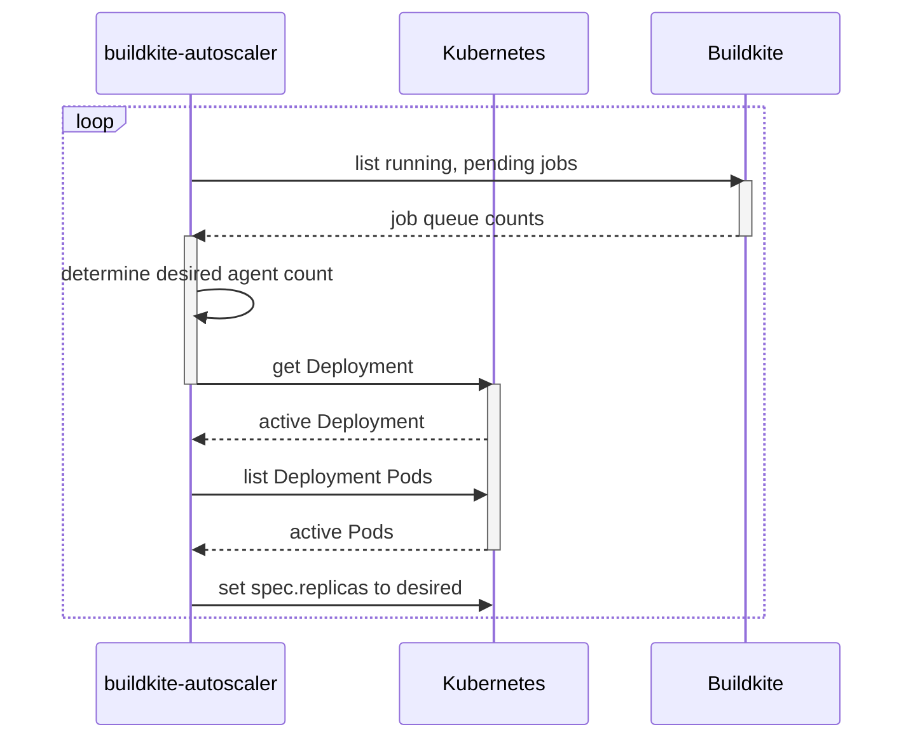
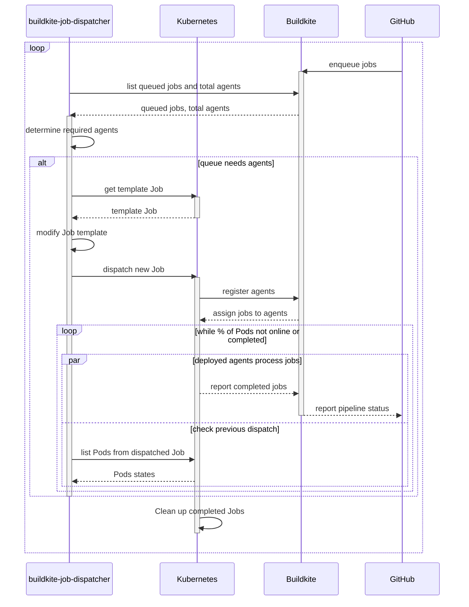

[Sourcegraph](../_experience/2021-7-5-sourcegraph.md)'s continuous integration infrastructure uses [Buildkite](https://buildkite.com/), a platform for running pipelines on CI agents we operate. After using the default approach of scaling persistent agent deployments for a long time, we've recently switched over to completely stateless agents on dynamically dispatched Kubernetes Jobs to improve the stability of our CI pipelines.

In Buildkite, events (such as a push to a repository) trigger "builds" on a "pipeline" that consist of multiple "jobs", each of which correspond to a "pipeline step". This is all of which is managed by the hosted Buildkite service, which then dispatches Buildkite jobs onto any Buildkite agents that are live on our infrastructure that meet each job's "queue" requirements.

Previously, our Buildkite agent fleet was operated as a simple [Kubernetes Deployment](https://kubernetes.io/docs/concepts/workloads/controllers/deployment/):

```yaml
apiVersion: apps/v1
kind: Deployment
metadata:
  name: buildkite-agent
  # ...
spec:
  replicas: 5
  # ...
  template:
    metadata:
      # ...
    spec:
      containers:
        - name: buildkite-agent
          # ...
```

A separate deployment, running a custom service called `buildkite-autoscaler`, would poll the Buildkite API for a list of running and schedule jobs and scale the fleet accordingly by making a Kubernetes API call to update the `spec.replicas` value in the base Deployment:



As long as there are jobs in the Buildkite queue, deployed agent pods would remain online until the autoscaler deems it appropriate to scale down. As such, multiple jobs could be dispatched onto the same agent before the fleet gets scaled down.

While Buildkite has mechanisms for mitigating state issues across jobs, and most Sourcegraph pipelines have cleanup and best practices for migitating them as well, we occasionally still run into "botched" agents. These are particularly prevalent in jobs where tools are installed globally, or Docker containers are started but not correctly cleaned up (for example, if directories are moounted), and so on. We've also had issues where certain pods encounter network issues, causing them to fail all the jobs they accept. We also have jobs work "by accident", especially in some of our more obscure repositories, where jobs rely on tools being installed by other jobs, and suddenly stop working if they land on a "fresh" agent, or those tools get upgraded unexpected.

All of these issues eventually lead us to decide to build a stateless approach to running our Buildkite agents.

## Preparing for the switch

The main Sourcegraph mono-repository, [`sourcegraph/sourcegraph`](https://github.com/sourcegraph/sourcegraph), uses [generated pipelines](./2022-2-20-self-documenting-self-updating.md#continuous-integration-pipelines) that create pipelines on the fly for Buildkite. Thanks to this, we could easily implement a flag within the generator to redirect builds to the new agents on a gradual basis.

```go
var FeatureFlags = featureFlags{
	StatelessBuild: os.Getenv("CI_FEATURE_FLAG_STATELESS") == "true" ||
		// Roll out to 50% of builds
		rand.NewSource(time.Now().UnixNano()).Int63()%100 < 50,
}
```

This feature flag could be used to apply `queue` configuration and environment variables on builds, allowing us to easily test out larger loads on the new agents and roll back changes with ease.

## Static Kubernetes Jobs

The initial approach undertaken by the team used a single persistent [Kubernetes Job](https://kubernetes.io/docs/concepts/workloads/controllers/job/). Agents would start up with [`--disconnect-after-job`](https://buildkite.com/docs/agent/v3/cli-start#disconnect-after-job), indicating that they should consume a single job from the queue and immediately disconnect.

A new autoscaler service, `job-autoscaler`, was set up that pretty much did the exact same thing as the old `buildkite-autoscaler`, but instead of adjusting `spec.replicas`, it updated `spec.parallelism` instead, setting `spec.completions` and `spec.backoffLimit` to arbitrarily large values to prevent the Job from ever completing and shutting down.

This initial approach was used to iterate on some refinements to our pipelines to accomodate stateless agents (namely improved caching of resources). Upon rolling this out on a larger scale, however, we immediately ran into issues resulting in major CI outages, after which I outlined my thoughts in [sourcegraph#32843 dev/ci: stateless autoscaler: investigate revamped approach with dynamic jobs](https://github.com/sourcegraph/sourcegraph/issues/32843). It turns out, we probably should not be applying a stateful management approach (scaling a single Job entity up and down) to what should probably be a stateless queue processing mechanism. I decided to take point on re-implementing our approach.

## Dynamic Kubernetes Jobs

In [sourcegraph#32843](https://github.com/sourcegraph/sourcegraph/issues/32843) I proposed an approach where we dispatch agents by creating new Kubernetes Jobs with `spec.parallelism` and `spec.completions` set to roughly number of agents needed to process all the jobs within the Buildkite jobs queue. This would mean that as soon as all the agents within a dispatched Job are "consumed" (have processed a Buildkite job and exited), [Kubernetes can clean up the Job and related resources](https://kubernetes.io/docs/concepts/workloads/controllers/job/#ttl-mechanism-for-finished-jobs), and that would be that. If more agents are needed, we simply keep dispatching more Jobs. This is done by a new service called `buildkite-job-dispatcher`.

Luckily, all the setup has been done for stateless agents with the existing Buildkite Job, so the way the dispatcher works is by fetching the deployed Job, resetting a variety of fields used internally by Kubernetes:

- in `metadata`: [UID](https://kubernetes.io/docs/concepts/overview/working-with-objects/names/#uids), resource version, and labels
- in the Job spec: `selector` and `template.metadata.labels`

Making a few changes:

- setting `parallelism` = `completions` = number of jobs in queue + buffer
  - this means that we are dispatching agents to consume the queue, and exit when done
- setting [`activeDeadlineSeconds`](https://kubernetes.io/docs/concepts/workloads/controllers/job/#job-termination-and-cleanup), [`ttlSecondsAfterFinished`](https://kubernetes.io/docs/concepts/workloads/controllers/job/#ttl-mechanism-for-finished-jobs) to reasonable values
  - `activeDeadlineSeconds` prevents stale agents from sitting around for too long in case, for example, a build gets cancelled
  - `ttlSecondsAfterFinished` ensures resources are freed after use
- adjusting the [`BUILDKITE_AGENT_TAGS`](https://buildkite.com/docs/agent/v3/cli-start#setting-tags) environment variable on the Buildkite agent container

And deploying the adjusted spec as a new Job!



As noted in the diagram above, there's also a "cooldown" mechanism where the dispatcher waits for the previous dispatch to roll out at least partially before dispatching a new Job to account for delays in our infrastructure. Without it, the dispatcher could continuously create new agents as the visible agent count appears low, leading to overprovisioning. We do this by simply listing the Pods associated with the most recently dispatched Job, which is easy enough to track within the dispatcher.

## Observability

`buildkite-job-dispatcher` runs on a loop, with each run associated with a `dispatchID`, a simplified [UUID](https://en.wikipedia.org/wiki/Universally_unique_identifier) with all special character removed. Everything that happens within a dispatch iteration is associated with this ID, starting with log entries, built on [`go.uber.org/zap`](https://github.com/uber-go/zap):

```go
import "go.uber.org/zap"

func (d *Dispatcher) run(ctx context.Context, k8sClient *k8s.Client, dispatchID string) error {
	// Allows us to key in on a specifc dispatch run when looking at logs
	runLog := d.log.With(zap.String("dispatchID", dispatchID))
	runLog.Debug("start run", zap.Any("config", config))
	// {"msg":"start run","dispatchID":"...","config":{...}}
}
```

Dispatched agents have the dispatch ID attached to their name and labels as well:

```yaml
apiVersion: batch/v1
kind: Job
metadata:
  annotations:
    description: Stateless Buildkite agents for running CI builds.
    kubectl.kubernetes.io/last-applied-configuration: # ...
  creationTimestamp: "2022-04-18T00:04:34Z"
  labels:
    app: buildkite-agent-stateless
    dispatch.id: 3506b2adb17945d7b690bd5f9e6a6fb0
    dispatch.queues: stateless_standard_default_job
```

This means that when something unexpected happens - for example, when agents are underpovisioned or overprovisioned, we can easily look at the Jobs dispatched and link back to the log entries associated with their creation:

<figure>
  
</figure>

The dispatcher's structured logs also allow us to leverage [Google Cloud's log-based metrics](https://cloud.google.com/logging/docs/logs-based-metrics) by generating metrics from numeric fields within log entries. These metrics form the basis for our at-a-glance overview dashboard of the state of our Buildkite agent fleet and how the dispatcher is responding to demand, as well as alerting for potential issues (for example, if Jobs are taking too long to roll out).

<figure>
  
</figure>

Based on these metrics, we can make adjustments to the numerous knobs available for fine-tuning the behaviour of the dispatcher: target minimum and maximum agents, the frequency of polling, the ratio of agents to require to come online before starting a new dispatch, agent TTLs, and more.

## Git mirror caches

TODO

<br />

## About Sourcegraph

Sourcegraph builds universal code search for every developer and company so they can innovate faster. We help developers and companies with billions of lines of code create the software you use every day.
Learn more about Sourcegraph [here](https://about.sourcegraph.com/).

Interested in joining? [We're hiring](https://about.sourcegraph.com/jobs/)!
