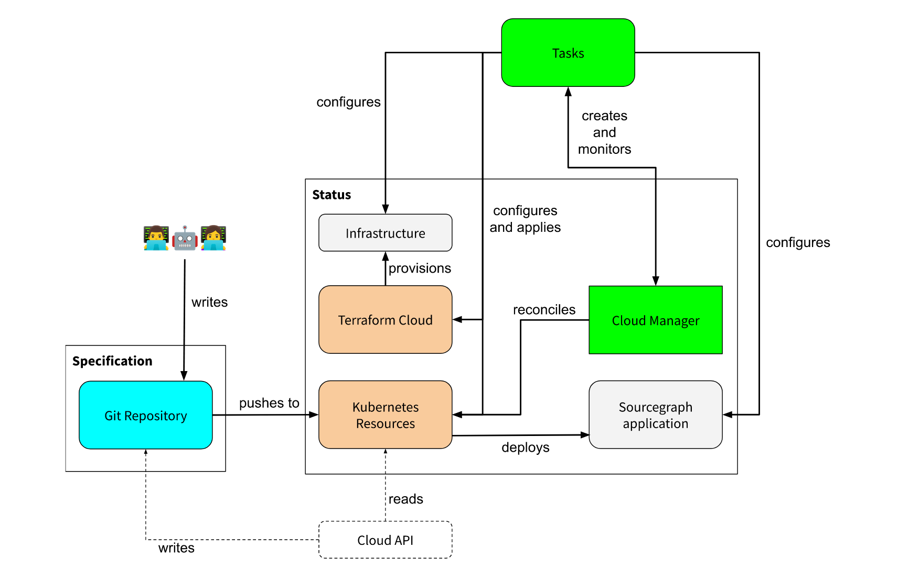
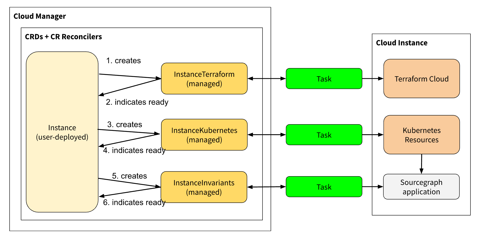
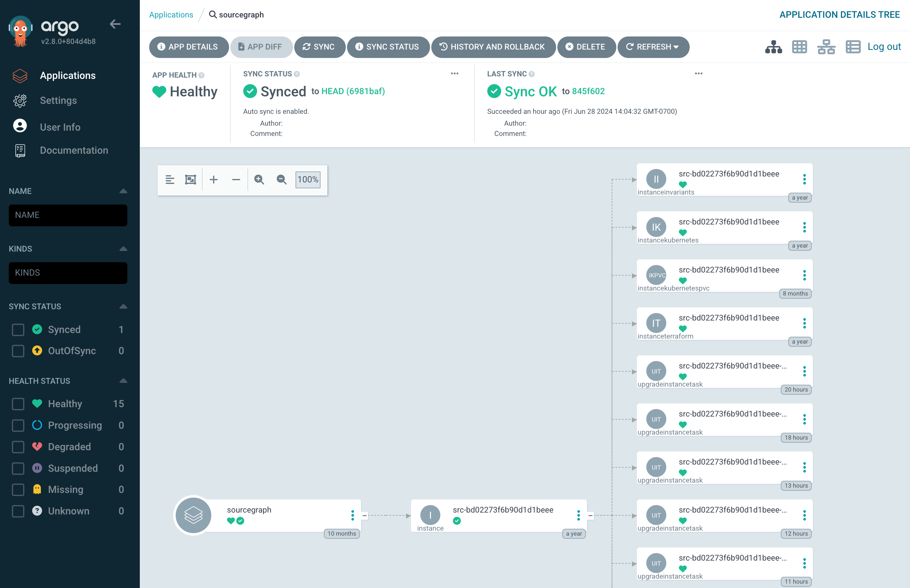

As the customer base for [Sourcegraph](../_experience/2021-7-5-sourcegraph.md)'s "multi-single tenant" Sourcegraph Cloud offering grew, I had the opportunity to join the team to scale out the platform to support the hundreds of instances the company aimed to reach - which it does today!

Sourcegraph's first stab at a managed offering of our [traditionally self-hosted, on-premises code search product](https://sourcegraph.com/code-search) started way back during my [internship at Sourcegraph](../_experience/2020-5-7-sourcegraph-intern.md). Dubbed "managed instances", this was a "multi-single tenant" product where each "instance" was a normal Sourcegraph deployment operated on isolated infrastructure managed by the company. A rushed implementation was built to serve the very small number of customers that were initially interested in a managed Sourcegraph offering.

Managed Sourcegraph instances proved to be a good model for customers and Sourcegraph engineers alike: customers did not need to deal with the hassle of managing infrastructure and upgrades, and Sourcegraph engineers had direct access to diagnose problems and ensure a smooth user experience. The multi-single-tenant model ensured customer data remained securely isolated.

The decision was made to invest more in the "managed instances" platform with the goal of bringing "Sourcegraph Cloud" to  general availability, and eventually make it the preferred option for all customers onboarding to Sourcegraph. A team of talented engineers took over to build what was internally referred to as "Cloud V2".

I'm pretty proud of the work I ended up doing on this project, the "Cloud control plane", and am very happy to see what the project has enabled since I left the Sourcegraph Cloud team in September 2023. So I thought it might be cool to write a little bit about what we did!

- [The prototype](#the-prototype)
- [Version 2](#version-2)
- [Taking things to the control plane](#taking-things-to-the-control-plane)
  - [Reconciliation](#reconciliation)
  - [Writing the code](#writing-the-code)
  - [Control plane lifecycle summary](#control-plane-lifecycle-summary)
- [The future](#the-future)

## The prototype

The first "managed instances" was managed by copy-pasting Terraform configuration and some basic VM setup scripts. I maintained and worked on this briefly before I [rejoined Sourcegraph as a full-time engineer in the Dev Experience team](../_experience/2021-7-5-sourcegraph.md). Operating these first "managed instances" was a very manual ordeal. At the scale of less than a dozen instances, a fleet-wide upgrade would take several days of painstakingly performing blue-green deploys for each by copy-pasting Terraform configurations and applying them directly, one instance at a time. The only automation to speak of was some gnarly Terraform-rewriting scripts that I built using Typescript and [Comby](https://comby.dev/) to make the task marginally less painful, and even this was prone to breaking on any unexpected formatting of the hand-written Terraform configurations.

The state of the first "managed instances" was a necessary first step to quickly serve the customers that first asked for the offering, and validate that customers were willing to allow a small company like Sourcegraph to hold the keys to their private code and secret sauce. As the customer base grew, however, upgrades were needed.

## Version 2

By the time I joined the newly formed "Cloud team" that had inherited the first "managed instances" platform, the sweeping upgrades that comprised "Cloud V2" had been built, and the migration was already underway. These upgrades, largely driven by the talented and knowledgeable [Michael Lin](https://github.com/michaellzc), were sorely needed: operating individual Sourcegraph instances with Kubernetes and Helm instead of docker-compose, and leveraging off-the-shelf solutions like [GCP Cloud SQL](https://cloud.google.com/sql) and Terraform Cloud to operate the prerequisite infrastructure. [CDKTF](https://developer.hashicorp.com/terraform/cdktf) was also adopted so that Terraform manifests could be generated using a Go program, instead of being hand-written. Each instance got a YAML configuration file that was used to generate Terraform with CDKTF based on the desired attributes, which all got committed to a centralised configuration repository. These upgrades were the pieces needed to kickstart the company's transition to [bring the Cloud platform to general availability](https://sourcegraph.com/blog/enterprise-cloud) and encourage customers to consider "managed Sourcegraph" as the preferred option to self-hosting.

This infrastructure was managed by a CLI tool we called `mi2`, based on its predecessor `mi`, which stood for "managed instances". The tool was generally run by a human operator to perform operations on the fleet of instances by manipulating its infrastructure-as-code components, such as the aforementioned CDKTF and Kubernetes manifests, based on each instance's YAML specification. It was also used to configure "runtime" invariants such as application configuration, also based on each instance's YAML specification.

"Cloud V2" wasn't the end of the planned upgrades, however: defining each instance as a YAML configuration was a hint at what [Michael](https://github.com/michaellzc)'s grand vision for the "Cloud V2" platform was: to treat instances as [Kubernetes custom resources](https://kubernetes.io/docs/concepts/extend-kubernetes/api-extension/custom-resources/), and manage each instance with individual "instance specifications", just like any other native Kubernetes resource. The design of the "Cloud V2" instance specifications also featured Kubernetes-like fields, such as `spec` and `status`, similar to native Kubernetes resources like [Pods](https://kubernetes.io/docs/concepts/workloads/pods/pod-lifecycle/), for example:

> In the Kubernetes API, Pods have both a specification and an actual status. The status for a Pod object consists of a set of Pod conditions.

In other words, each instance:

- ...was defined by its `spec`: the *desired* state and attributes. For example, the version of Sourcegraph, the domain the instance should be served on, or the number of replicas for a particular services it should have (for services that can't scale automatically).
- ...reports its `status`: the *actual* deployed state and as details that are only known after deployment, such as randomly generated resource names or IP addresses. A difference between `spec` and `status` for attributes that are reflected in both would indicate that the configuration change has not been applied yet.

When the team first launched "Cloud V2", both `spec` and `status` were set in the configuration file, such that `spec` was generally handwritten, and `status` would be set and written to the file by the platform's CLI, `mi2`. In addition, there were some generated Kustomize and Helm assets that also required a human to run some generation command with the `mi2` CLI.

This meant that Git diffs representing a change usually must be made *after* changes have been already applied to GCP and other infrastructure, so that the status of the instance can be correctly reflected in the repository. This approach was error-prone and constantly caused drift between the repository state (where configurations were committed), and actual state of an instance in our infrastructure. Because the changes between specification and status are closely intertwined, pull requests with updates usually require review, further adding latency to the drift between actual status and the recorded status when left un-merged.


To complicate matters further, there were various other "runtime configurations" that were applied by hand using the `mi2` tool. These were needed in scenarios where we did not have an infrastructure-as-code offering off-the-shelf, so we built ad-hoc automation to make API calls against various dependencies to make required configuration changes. This included configuration changes for Sourcegraph itself, and external dependencies like email delivery vendors[^managedsmtp].

The key problems this situation posed were:

1. The possibility of accidents and conflicts was very real. The consequences of mistakes were also very real, as we were highly reliant on customer trust that the service they paid for would be secure and reliable.
2. The overhead required to operate the fleet, though much improved from the first "managed instances", was still high: it was very unlikely the small team could handle a fleet size in the hundreds of instances with the tooling we had.
	1. To compound the problem further, instances had to be created and torn down on a frequent basis to enable customers to trial the product - this was partially automated by had to be manually triggered, and would frequently require intervention.
3. We started relying heavily on [GitHub Actions](https://github.com/features/actions) for automation. This worked well for simple processes like "create a specification from a template and run the necessary commands to apply it", but the number of workflows grew, and some of them got very complex. These were difficult to test and prone to typos and conflicts due to the way our "Git ops" setup worked.

To enable the Cloud V2 platform to scale out to more customers reliably, we had to take it further. Michael and I started discussing our next steps in earnest sometime in January 2023. Together, we circulated 2 RFCs within the team: [RFC 775: GitOps in Sourcegraph Cloud with Cloud control plane](https://docs.google.com/document/d/10ZZbY9FThT9FdmI5UWnPsBh6A-nTrn5AExlDOSM6EbU/edit) by myself, and [RFC 774: Task Framework for Sourcegraph Cloud Orchestration](https://docs.google.com/document/d/1eFct3CnypItxMG_wyAjcX1VRAajOyOIkdhw486WlQC8/edit) by Michael.[^rfcs]

These two RFCs formed the key building blocks of the "Cloud control plane" project.

## Taking things to the control plane

In [my RFC](https://docs.google.com/document/d/10ZZbY9FThT9FdmI5UWnPsBh6A-nTrn5AExlDOSM6EbU/edit), I drew this diagram to try and illustrate the desired architecture:



There's a lot to unpack here, but the overall gist of the plan was:

1. There would be no writing-to-the-repository by state changes. Operators (and operator-triggered automations) would commit changes to instances specifications (denoted by the blue box), and the required changes would somewhat opaquely happen in the "control plane".
	- This would significantly reduce conflicts we were seeing in our existing Cloud infrastructure-as-code repository, because changes would now only occur in one direction when a change is merged, without needing to write back what changed to the repository.
2. The platform would have a central "control plane", denoted by the green boxes ("Cloud Manager" and "Tasks").
	- "Tasks" are an internal abstraction for [serverless jobs using Cloud Run](https://cloud.google.com/run). They allow us to run arbitrary tasks that mirror the `mi2` commands a human operator would run today.
	- The "Cloud Manager" is the Kubernetes "controllers" service that would manage our Sourcegraph instances.  We called it “manager” since that is [the terminology used in `kubebuilder`](https://book.kubebuilder.io/reference/platform.html?highlight=manager#manager) - in the sense that a single manager service implements multiple "controllers", and each controller owns the reconciliation of one Kubernetes custom resource type.
3. We would continue to rely on off-the-shelf components, like existing dependencies on Terraform Cloud and Kubernetes + Helm (illustrated by the brown boxes).

In the central "control plane", each instance specification would be "applied" as a custom resource in Kubernetes. This is enabled by [`kubebuilder`](https://github.com/kubernetes-sigs/kubebuilder), which makes it easy to write custom resource definitions (CRDs) and "controllers" for managing each custom resource type.

By defining a custom resource definition, operators can interact with the instance specifications via the Kubernetes API just like any other Kubernetes resource, including using `kubectl`. For example:

```sh
kubectl apply -f environments/dev/deployments/src-1234/config.yaml
kubectl get instance.cloud.sourcegraph.com/src-1234 -o yaml    
```

Would dump the custom resource from Kubernetes:

```yaml
apiVersion: cloud.sourcegraph.com/v1
kind: Instance
metadata:
  annotations:
    kubectl.kubernetes.io/last-applied-configuration: |
      {...}
  creationTimestamp: "2023-01-24T00:19:35Z"
  generation: 1
  labels:
    instance-type: trial
  name: src-1234
spec:
  # ...
status:
  # ...
```

I proposed a design that would build on Michael's "Tasks" abstraction by representing each "Task" type (for example, "apply these changes to the cluster" or "update the node pool to use another machine type") with a "subresource" in the control plane. Each subresource would be another custom resource we define, and each subresource type's sole task would be to detect if changes to resources it owns needs to be reconciled, and execute the required "Task" to bring the relevant resources to the desired state.


In the diagram above, `InstanceTerraform` is one of our "subresource" types. It manages changes to an instance's underlying infrastructure. The example showcases an infrastructure change, for example:

1. Human operator updates the `Instance` spec to use a new machine type
2. `Instance` controller propagates the change to instance's child `InstanceTerraform` spec
3. `InstanceTerraform` would detect that its current spec differs from the last known infrastructure state. It will then regenerate the updated Terraform manifests using [CDKTF](https://developer.hashicorp.com/terraform/cdktf) and apply it directly using Terraform Cloud using "Tasks".
4. Once the "task" execution completes, `InstanceTerraform` will updates its own status, which will be reflected by the `Instance`. This may cause cascading changes to "subsequent" subresourcs with dependencies on the modified subresource to apply.

Operators would rarely interact directly with these subresources -  instead, they would only interact with the top-level `Instance` definition to request changes to the underlying infrastructure. Changes to the instance specification would automatically propagate to these subresources through the top-level `Instance` controller. Each subresource implemented an abstraction called "task driver" that generalised the ability for the top-level `Instance` controller to poll for completion or errors in a uniform manner.

<figure>
    
    <figcaption>
    Updated diagram adapted from my original RFC illustrating how the parent "Instance" controller creates child "subresources", which each own reconciling a specific component of an instance's state.
    </figcaption>
</figure>

### Reconciliation

This was a pretty new concept for me, though Kubernetes experts out there will probably find this familiar. The idea is to achieve "eventual consistency" by repeatedly "reconciling" and object until the specified state (`spec`) and desired state (`status`) are aligned. I think the most relevant dictionary definition is:[^reconcile]

> [...] make (one account) consistent with another, especially by allowing for transactions begun but not yet completed.

At reconciliation time, each reconcile should be idempotent - the cause of the reconciliation cannot be used to change its behaviour. The goal of `Reconcile` implementations should be to bring the actual state closer to the desired state. This means that you don't need to do everything in a single reconcile: you can do one thing, and then requeue for an update - the next reconciliation should proceed to the next thing, and so on. There may be a difference between actual state and the desired state for some time, but the system will eventually shift to the correct configuration.

For example, consider reconciling object `O`, where `O.x` and `O.y` are not yet in the desired state.

1. Reconcile on object `O`. Fix `O.x` and requeue for another update immediately.
2. Reconcile on object `O` (again). `O.x` is now fixed, so fix `O.y` and requeue for another update immediately (again).
3. Reconcile on object `O` (again!).  Everything is in the desired state! Do not requeue for update immediately, because all is now right in this (particular) world.

After the steps above, where `O` is reconciled several times, all attributes of `O` are now in the desired state. Nice!

### Writing the code

In [Kubebuilder](https://github.com/kubernetes-sigs/kubebuilder) code terms (the SDK we use to build custom Kubernetes CRDs), reconciliations are effectively the `Reconcile` method of a controller implementation being called repeatedly on an object in the cluster. `Reconcile` implementations can get pretty long, however, even from examples I looked at from other projects. Using [gocyclo](https://github.com/fzipp/gocyclo) to evaluate the "cyclomatic complexity" (a crude measure of "how many code paths are in this function") of the top-level `Instance` controller today, we get a cyclomatic complexity score almost twice as high as the rule-of-thumb "good" score of 15:

```
$ gocyclo ./cmd/manager/controllers/instance_controller.go
31 controllers (*InstanceReconciler).Reconcile ./cmd/manager/controllers/instance_controller.go:107:1
```

Even with a cyclomatic complexity score of 31, this is already fairly abstracted, as a lot of the complicated reconciliation that needs to take place by executing and tracking "Tasks" is delegated to subresource controllers. The top-level `Instance` controller only handles interpreting what subresources need to be updated to bring the Cloud instance to the desired state.

To keep this complexity under control, I developed a pattern for making "sub-reconcilers": using package functions `<some resource>.Ensure`, these mini reconcilers would accept a variety of interfaces, with a touch of generics, that help us reuse similar behaviour over many subresources. The largest of these is `taskdriver.Ensure`, which encapsulates most of the logic required to dispatch task executions, track their progress, and collect their output.

```
$ gocyclo ./cmd/manager/controllers/taskdriver/taskdriver.go
57 taskdriver Ensure ./cmd/manager/controllers/taskdriver/taskdriver.go:123:1
```

With a cyclomatic complexity score of 57, this implementation spans around 550 lines, and is covered by nearly 1000 lines of tests providing 72% coverage on `taskdriver.Ensure` - not bad for a component dealing extensively with integrations.

This investment in a robust, re-usable component has paid dividends: the abstraction serves 5 "subresources" today, each handling a different aspect of Cloud instance management, and generalises the implementation of:

- **Diff detection**: During reconciliation you cannot (by design) refer to a "previous version" of your resource. `taskdriver.Ensure` handles detecting if a task execution has already been dispatched, and whether a new one needs to be dispatched for the current inputs.
- **Tracking Task executions**: `taskdriver.Ensure` handles creating Task executions, tracking their status, and collecting their outputs across many reconciles. Notable events are tracked in "conditions", an ephemeral state field that records the last *N* interesting events to a subresource.

<figure>
    
    <figcaption>
    Sequence of TaskDriver events as viewed in <a href="https://argo-cd.readthedocs.io/en/stable/">ArgoCD</a>, from creation, to checking for completion, to detected completion.
    </figcaption>
</figure>

- **Concurrency control**: Subresources often need global concurrency management (to throttle the rate at which we hit external resources like Terraform Cloud) as well as per-instance concurrency management (e.g. an upgrade can't happen at the same time as a `kubectl apply`). `taskdriver.Ensure` consumes a configurable concurrency controller that can be tweaked based on the workload.
- **Teardown and orphaned resource management**: On deletion of a subresource, `taskdriver.Ensure` can handle ["finalisation"](https://kubernetes.io/docs/concepts/overview/working-with-objects/finalizers/) of tasks resources, deleting past executions in GCP Cloud Run. This is most useful for one-time-use subresources like instance upgrades - over time, we can delete our records of past upgrades for an instance. `taskdriver.Ensure` has also since been extended to handle picking up and clearing Task executions.
- **Uniform observability**: Logs and metrics emitted by `taskdriver.Ensure` allow our various subresources to be monitored the same way for alerting and debugging.

To illustrate how this works in code, because I like interfaces, here's an abbreviated version of what the abstraction looks like:

```go
// Object is the interface a CRD must implement for managing tasks with Ensure.
//
// Generally, each CRD should only operate one Task type.
type Object[S any] interface {
	object.Kubernetes

	// object.Specified implements the ability to retrieve the driver resource's
	// specification, which should be exactly the Task's explicit inputs.
	object.Specified[S]

	// taskdrivertypes.TaskDriver implements the ability to read condition events for Tasks.
	taskdrivertypes.TaskDriver

	// AddTaskCondition should add cond as the first element in conditions -
	// cond will be the latest condition. This is interface is unqiue to
	// taskdriver.Object, as this package is the only place we should be adding
	// conditions.
	AddTaskCondition(cond cloudv1.TaskCondition)
}

// EnsureOptions denotes parameters for taskdriver.Ensure. All fields are required.
type EnsureOptions[
	// S is the type of subresource spec
	S any,
	// TD is the type of subresource that embeds the spec
	TD Object[S],
] struct {
	// Task is the type of task runs to operate over.
	Task task.Task
	// OwnerName is used when acquiring locks, and should denote the name of the
	// owner of Resource.
	OwnerName string
	// Resource is the resource that drives tasks runs of this type, changes to
	// the generation (spec) of which should driver a re-run of this
	// reconciliation task.
	Resource TD
	// Events must be provided to record events on Resource.
	Events events.Recorder
  // ...
}

// Ensure creates a reconciliation task run if there isn't one known in
// conditions, or retrieves its status. Both return values may be nil if the
// task is in progress with no error and no result.
//
// The caller MUST call handle.Update on resource if *result.Combined is not nil.
// The caller MUST apply a Status().Update() on resource if a result is returned.
func Ensure[SpecT any, TD Object[SpecT]](
	ctx context.Context,
	logger log.Logger,
	runs task.RunProvider,
	limiter concurrency.Checker,
	opts EnsureOptions[SpecT, TD],
) (_ any, _ result.ObjectUpdate, res *result.Combined) {
  // ...
}
```

The big hodgepodge of interfaces allow us to do a few things:

1. **Easy mocking in tests**: Integration components can easily be provided as mock implementations for robust testing of every aspect of the `taskdriver.Ensure` lifecycle, which is pretty important given the complexity and business-critical nature of this one function. The `taskdriver.Ensure` test spans 20+ cases over 1000+ lines of assertions.
2. **Composable interfaces**: In other parts of the codebase, we will leverage small parts of a complex implementation to do other sorts of work. For example, `taskdrivertypes.TaskDriver` indicates that it exposes interfaces for reading a task driver's conditions - this is a critical part of `taskdriver.Ensure`, but is also useful for summarization capabilities elsewhere.
3. **Clearly express dependencies**: It doesn't matter too much what a "task run" really means in the context of `taskdriver.Ensure`, but it's important to understand that the implementation needs to be able to dispatch runs and check on their status. For that we accept a `task.RunProvider`, and similarly, we accept a `concurrency.Checker`, and so on.

An abbreviated version of the callsite, a particular subresource's reconciler, would then look like:

```go
// Reconcile is part of the main kubernetes reconciliation loop which aims to
// move the current state of an upgrade instance task closer to the desired state.
//
// For more details, check Reconcile and its Result here:
// - https://pkg.go.dev/sigs.k8s.io/controller-runtime@v0.14.1/pkg/reconcile
func (r *UpgradeInstanceTaskReconciler) Reconcile(ctx context.Context, req ctrl.Request) (ctrlResult ctrl.Result, err error) {
	// Get the resource being reconciled
	var resource cloudv1.UpgradeInstanceTask
	if err := r.Get(ctx, req.NamespacedName, &resource); err != nil {
		return ctrl.Result{}, client.IgnoreNotFound(err)
	}

	// Find the parent resource.
	instance, logger, err := taskdriver.MustResolveOwner(ctx, logger, r.Client, &resource)
	if err != nil {
		return ctrl.Result{}, client.IgnoreNotFound(err)
	}

	// Set up task execution. Upgrades are immutable task drivers, so we use
	// resource.GetName() for convenience, since our name is unique.
	runProvider, err := r.TaskRunProvider(ctx, logger, *instance, resource.GetName())
	if err != nil {
		return ctrl.Result{}, err
	}
	defer runProvider.Close()

	// Run the taskdriver loop
	_, update, resultErr := taskdriver.Ensure(ctx, logger, runProvider,
		concurrency.NewSubresourceChecker(logger, r.Client, instance.GetName(), &resource,
			// Low concurrency - we are heavily limited by TFC
			concurrency.WithGlobalTypeConcurrency(...)),
		UpgradeInstanceTaskEnsureTaskOptions{
			Task:      upgradeinstance.Task,
			OwnerName: instance.Name,
			Resource:  &resource,
			Events:    r.Events,
		})
	if resultErr != nil {
		update.Handle(ctx, logger, r.Client, &resource)
		return resultErr.Handle(logger, "EnsureTask")
	}

	return ctrl.Result{}, r.Status().Update(ctx, &resource)
}
```

This allows the system to be easily extended to accommodate more types of subresources to handle different tasks, allowing implementors to focus on the Task execution that gets the work done, before plugging it into the control plane with a fairly small integration surface.

### Control plane lifecycle summary

Putting it all together, here's a diagram I wrote up for some internal dev docs showing the lifecycle of a change a human operator might make to an instance:


I don't know if that helps much, but I think it looks nice!

## The future

Sadly, I no longer work on the Sourcegraph Cloud platform, but since its launch, this system has delivered on our goals: today, the Cloud control plane operates over 150 completely isolated single-tenant Sourcegraph instances with a core team of just 2 to 3 engineers, nearly double the size of the fleet when we started this project.

The Cloud control plane has also proven extensible: I've seen some pretty nifty extensions built since I departed the project, like an automatic disk resizer and "ephemeral instances", which can be used internally to deploy a branch of a Sourcegraph codebase to a temporary Cloud instance with just a few commands. Various features have also been added to accommodate scaling needs and specific customer requirements.

The rollout of the Cloud control plane, and adoption of Cloud from customers, have battle-tested the platform, and a lot of work has been done to cover more edge cases and improve the resilience of the Cloud control plane. There's also DX improvements, such as robust support for our internal concepts in [ArgoCD](https://argo-cd.readthedocs.io/en/stable/), allowing health and progress summaries to be surfaced in a friendly interface:

<figure>
    
    <figcaption>
    Note the parent resource ("instance") and the subresources it owns ("instanceinvariants", "instancekubernetes", and friends).
    </figcaption>
</figure>

The design of the Cloud control plane has allowed all these additions to be built in a sustainable fashion for the small Cloud team that operates it. The core concepts we initially designed for the Cloud control plane have largely remained intact, which is a relief for sure. I'm very excited to see where else the team goes with the Sourcegraph Cloud offering, both internally and externally!

<br />

---

[^managedsmtp]: I built and launched this ("managed SMTP"), which configured an external email vendor automatically so that Cloud instances could start sending emails "off the shelf".
[^rfcs]: RFCs at Sourcegraph used to be primarily published as public Google Documents. This has become a bit rarer over the years, but hopefully this link doesn't stop working!
[^reconcile]: I just found this with a Google search - the provided definition should have a permalink [here](https://www.oed.com/dictionary/reconcile_v?tab=meaning_and_use).
