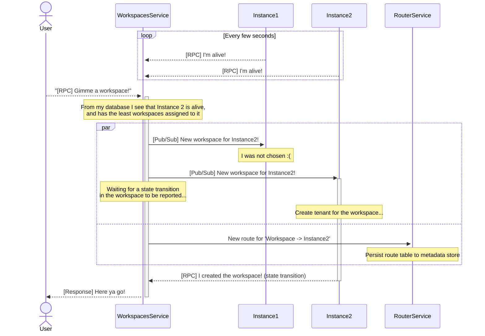

In February 2025, Sourcegraph quietly launched the ability to click a few buttons, leave your credit card details, and get a full-fledged Sourcegraph experience for yourself and your team - from the same application that, for nearly a decade, had been single-tenant only and enterprise-only. We called this platform [Sourcegraph Workspaces](https://workspaces.sourcegraph.com/)[^workspaceslaunch], internally dubbed the "multi-tenant Sourcegraph" project.

Sourcegraph Workspaces were meant to bring the code search experience that our big enterprise customers loved to a wider self-serve audience. Individual Sourcegraph instances are expensive and complex to operate - code search at scale is hard! - and it can be quite hard to get a Sourcegraph deployment spun up and ready to go, on-prem or in our [managed single-tenant offering](./2024-8-23-multi-single-tenant.md). Bringing multi-tenancy to Sourcegraph would allow us to offer code search at a dramatically lower cost, and allow customers to get started in just seconds, instead of hours and days.

On a more personal level, working to bring the multi-tenant Sourcegraph ambition to fruition over a period of about 6 months is one of the highlights of my career so far. Collaborating with some extremely talented teammates along the way, meeting up in Montreal and Berlin to push this project to completion, was an awesome and fun experience. The launch of multi-tenant Sourcegraph was the satisfying culmination of a couple of things that I've worked on at Sourcegraph for the past few years:

- [Automating the operation of a fleet of single-tenant Sourcegraph instances](./2024-8-23-multi-single-tenant.md)
- [Building a reusable services platform](./2025-08-18-managed-services-platform.md), and leading the [Core Services team](../_experience/2021-7-5-sourcegraph.md#core-services) to launch a number of services that made user accounts, telemetry ingestion, and other core capabilities available in a composable manner.
- TODO

My contributions mostly pertained to the coordination machinery required to make this happen, which I will talk about in this post - the internal changes that enabled multi-tenancy without an insurmountable amount of rewrites, were made by other engineers across the company.

## The strategy

TODO



State graph

```
stateDiagram-v2
	ACTIVE_RECONCILE_FAILED
	ACTIVE_RECONCILE_SUCCESS
	DESTROY_FAILED
	DESTROY_PENDING
	DESTROY_SUCCESS
	DORMANT_RECONCILE_FAILED
	DORMANT_RECONCILE_SUCCESS
	PROVISION_FAILED
	PROVISION_PENDING
	PROVISION_PENDING
	SUSPENSION_FAILED
	SUSPENSION_PENDING
	state ACTIVE {
			ACTIVE_RECONCILE_FAILED
			ACTIVE_RECONCILE_SUCCESS
	}

	state DESTROY {
			DESTROY_FAILED
			DESTROY_PENDING
			DESTROY_SUCCESS
	}

	state DORMANT {
			DORMANT_RECONCILE_FAILED
			DORMANT_RECONCILE_SUCCESS
	}

	state PROVISION {
			PROVISION_FAILED
			PROVISION_PENDING
			PROVISION_PENDING
	}

	state SUSPENSION {
			SUSPENSION_FAILED
			SUSPENSION_PENDING
	}

	ACTIVE_RECONCILE_FAILED --> ACTIVE_RECONCILE_SUCCESS
	ACTIVE_RECONCILE_FAILED --> DORMANT_RECONCILE_SUCCESS
	ACTIVE_RECONCILE_SUCCESS --> ACTIVE_RECONCILE_FAILED
	ACTIVE_RECONCILE_SUCCESS --> DORMANT_RECONCILE_SUCCESS
	DESTROY_FAILED --> DESTROY_SUCCESS
	DESTROY_PENDING --> DESTROY_FAILED
	DESTROY_PENDING --> DESTROY_SUCCESS
	DESTROY_SUCCESS --> [*]
	DORMANT_RECONCILE_FAILED --> ACTIVE_RECONCILE_FAILED
	DORMANT_RECONCILE_FAILED --> ACTIVE_RECONCILE_SUCCESS
	DORMANT_RECONCILE_FAILED --> DORMANT_RECONCILE_SUCCESS
	DORMANT_RECONCILE_SUCCESS --> ACTIVE_RECONCILE_FAILED
	DORMANT_RECONCILE_SUCCESS --> ACTIVE_RECONCILE_SUCCESS
	DORMANT_RECONCILE_SUCCESS --> DORMANT_RECONCILE_FAILED
	PROVISION_FAILED --> ACTIVE_RECONCILE_SUCCESS
	PROVISION_PENDING --> ACTIVE_RECONCILE_SUCCESS
	PROVISION_PENDING --> PROVISION_FAILED
	SUSPENSION_FAILED --> SUSPENSION_SUCCESS
	SUSPENSION_PENDING --> SUSPENSION_FAILED
	SUSPENSION_PENDING --> SUSPENSION_SUCCESS
	[*] --> PROVISION_PENDING
```

---

[^workspaceslaunch]: https://sourcegraph.com/blog/introducing-sourcegraph-enterprise-starter
