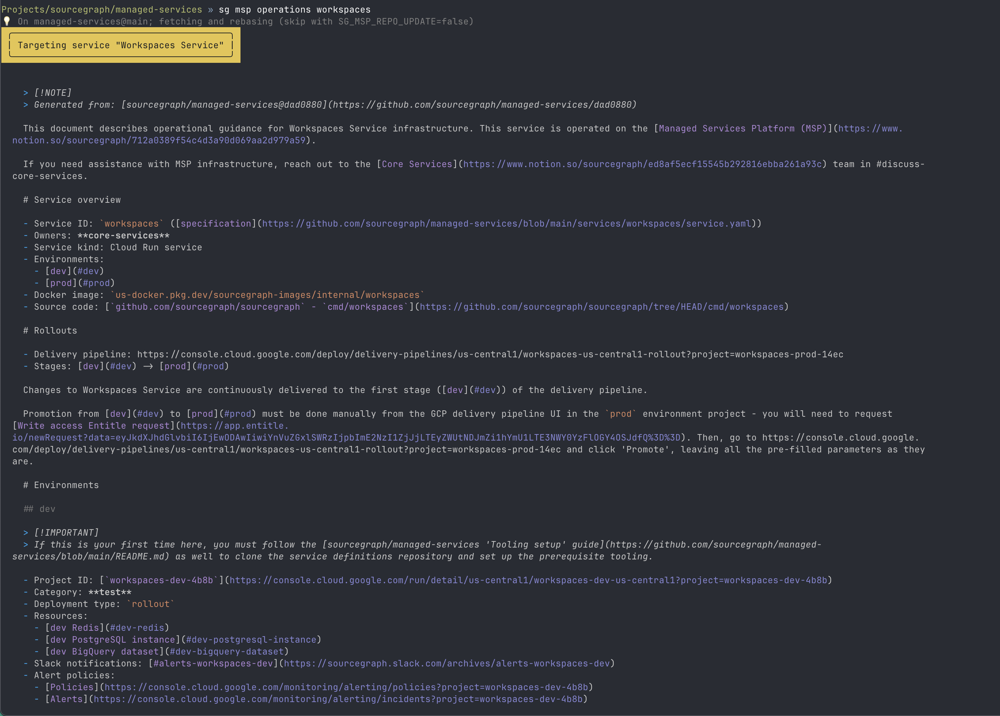
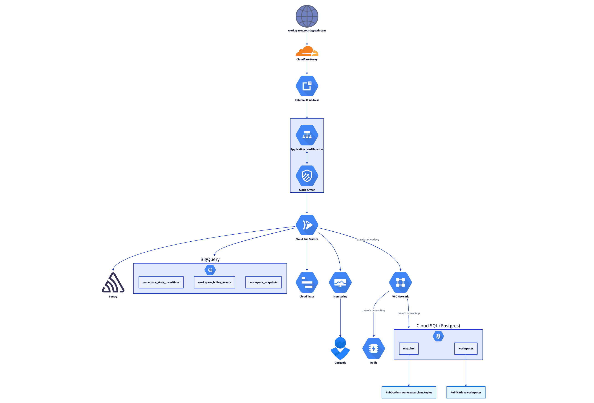
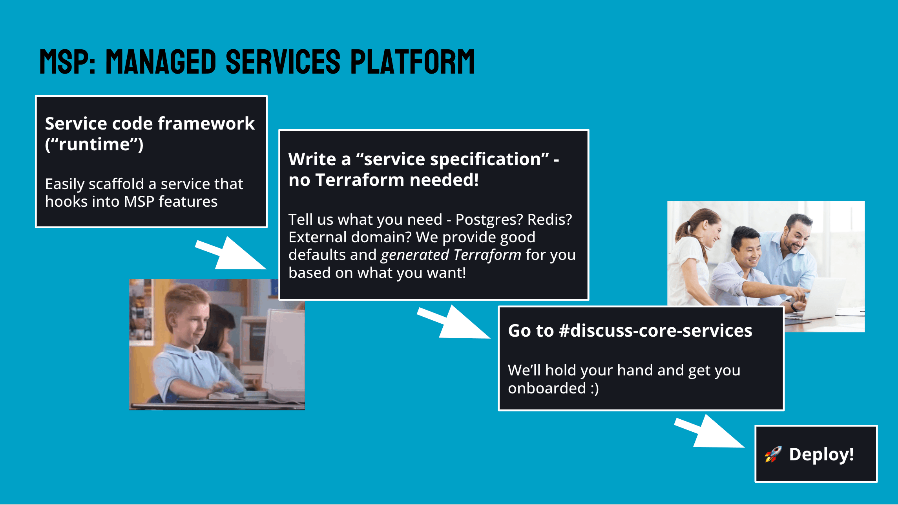

The advent of LLMs and "AI-enabled" products lead to a rapid pivot within [Sourcegraph](../_experience/2021-7-5-sourcegraph.md) from a purely single-tenant product, into new product surfaces with key managed, multi-tenant components. This required rethinking how we built and operated mutli-tenant services.

For a very long time, the public deployment of Sourcegraph's single-tenant, self-hosted code search product at [sourcegraph.com/search](https://sourcegraph.com/search) - internally dubbed "dotcom" - was the only user-facing service that we operated. As a result, anything that required an online, central service was simply glued onto our self-hosted product and conditionally enabled. This was easier in some ways, but later began to present a significant liability.

Use cases for these glued-on capabilities varied: there was an early attempt from many years ago at a Stripe integration for purchasing Sourcegraph licenses, which we would obviously not want to ship to our self-deployed customers. There were also core product needs like license key management, telemetry collection, and more that provided functionality required for our self-deployed product, but had to live in a service operated by the company - so into "dotcom" it went.

As the LLM hype really started to kick off in 2023-ish, we began building [Cody](https://sourcegraph.com/cody) in earnest. This also meant that even our most security-conscious enterprise customers were interested in accessing LLM-enabled features, necessitating an easy way to get them onboarded - which is where this story starts.

## Managed LLM Proxy

The advent of the big LLM providers like OpenAI and Anthropic meant that to get the latest and greatest LLM functionality, one had to send data to a third party and be charged on a metered basis. This was a significant paradigm shift in Sourcegraph's enterprise customer base, where many customers signed annual commitments and would sometimes even opt for a completely air-gapped deployment that could not make *any* requests outside of the customer's defined network boundaries. Now, we suddenly needed an option for these customers to make LLM requests using our pre-negotiated agreements with various LLM providers.

Given the self-hosted nature of many of Sourcegraph's largest customers at the time, issuing Anthropic and OpenAI API keys for them was a non-starter, both for operational and security reasons. We decided to build a LLM proxy service[^llmproxy]: this proxy would accept an API key derived from the license keys we already issue to each customer, and use that to determine the LLM usage quota allocated to the customer.

By this point, the long tradition of tacking functionality like this onto "dotcom" had started to show its flaws:

- Code search at scale is hard, and "dotcom" hosted huge numbers of repositories that would cause instability that cascaded to some of its add-on capabilities
- Deploying "dotcom" continuously was a poor experience, as the self-hosted code search product was designed for once-a-month deployments, adding to the instability of all services within
- Configuration options and feature flags for "dotcom"-only functionality contributed to complexity and technical debt
- The "Sourcegraph monolith"[^monolith] was designed for high-trust, single-tenant environments, which often resulted in design choices and mechanisms that ran contrary to the needs of a multi-tenant service[^dotcom-security]

I joined the project to build out this LLM proxy - later dubbed "Cody Gateway"[^codygateway] - as Sourcegraph's first ever standalone customer-facing online service. The technology was ultimately quite simple: we picked an infrastructure platform, [GCP Cloud Run](https://cloud.google.com/run?hl=en)[^cloudrun], built out a bunch of Terraform around it, and wrote a service.

Straight-forward as it sounded, the greenfield nature of the project meant we sunk a lot of time answering questions that previously weren't really a concern within the core "monolith" codebase frameworks: do we borrow patterns for X, Y, Z? Where do we need to diverge, what must we avoid importing? What security patterns and requirements do we need to follow? What can we simplify, or do better, in an independent service? Documentation and standard operating procedures also needed to be written down and defined for this custom infrastructure.

The investment paid off, however! The standalone nature of Cody Gateway allowed us to quickly develop a small service that satisfied our requirements, and we had a successful rollout that allowed all Sourcegraph customers to begin using our new AI product with zero additional configuration. In August 2023, I authored an internal document titled "Post-GA Cody Gateway: takeaways for future Sourcegraph-managed services" which opened with a paragraph highlighting some of the big throughput numbers we were already serving, and then an idea:

> Since this is Sourcegraph’s first major managed service that isn’t a Sourcegraph instance, Cody Gateway’s infrastructure setup is completely new. This document outlines how Cody Gateway is operated and deployed, and takeaways and ideas we can apply towards building future Sourcegraph-managed services, including a proposal that we generalise Cody Gateway’s infrastructure setup and use a generative approach to allow it to be re-used by future managed Sourcegraph services. This platform can be used to deploy the new services slated to be built by Core Services: <u>Core Services team scope for FY24 Q3+</u>, as proposed in <u>RFC 805 PRIVATE: Sourcegraph Managed Services Platform</u>.

The document featured a cost analysis, overview of the technical components that seemed obviously reusable, and some of the benefits of operating a service with this new methodology.

I remember this document well because the proposed "Managed Services Platform" - which I will refer to as "MSP"[^msp] - became one of the [Core Services team's](../_experience/2021-7-5-sourcegraph.md#core-services) cornerstone projects and the foundation of how we build and operate online services at Sourcegraph.

## Building on the fly

As usually happens, the need for such a platform surfaced at the same time as a number of projects that would benefit from it, two of which fell within [my team's](../_experience/2021-7-5-sourcegraph.md#core-services) ownership. One of these projects was a time-sensitive push to build "Sourcegraph Accounts"[^sams], a standalone user accounts management service that was needed to more robustly back the company's venture into a self-serve "PLG" (product-lead-growth) product, "Cody Pro"[^codypro].

These other projects helped with cementing the need for a platform like MSP, but I knew that adoption from the get-go would be key to the platform's success. If any of these started up either as "dotcom" add-ons as before, or used some other hand-crafted infrastructure, migration to the envisioned platform would likely be time-consuming and difficult to justify. This meant that the ability to adopt MSP components incrementally as they reached readiness was crucial.

As a result, the first piece of MSP that came together was an bare-bones infrastructure generator. From a simple service specification, we would be able to run a command to generate a bunch of Terraform. Generated Terraform configuration could be applied using our standard Terraform Cloud setup, and even augmented with custom Terraform if the use case called for it.

This had the effect of being very easy to adopt in a similar manner to hand-crafting infrastructure based on each project's needs, but instead of writing plain Terraform, we wrote code to generate equivalent Terraform and encoded each requirement into the service specification.

```yaml
# service.yaml
service:
  id: accounts
  # ...
environments:
  - id: dev
    domain:
      # Where this service will be served, e.g. accounts.sourcegraph.com
    resources:
      # Declare requirements for a Postgres database or Redis instance
    # ... other options like scaling, etc
```

Ensuring each addition to MSP did not block progress on dependent proejcts required very active involvement, but as a result, MSP was able to "own" the infrastructure for several services from the very start. The approach saved us from potentially frustrating migrations down the road and presented a fantastic dogfooding opportunity to ensure the platform actually served all our needs.

## Scaling changes

The Terraform generation tooling is built on CDKTF, the ["Cloud Development Kit for Terraform"](https://developer.hashicorp.com/terraform/cdktf). We use official SDK and generated bindings[^cdktf-generator] for existing Terraform modules to build a single entrypoint for "given this service specification, give me all the infrastructure I should have". This was a tech stack first introduced [for our managed multi-single-tenant platform](./2024-8-23-multi-single-tenant.md), and existing experience helped us hit the ground running.

For example, the following Terraform:

```terraform
terraform {
  required_providers {
    google = {
      source  = "hashicorp/google"
      version = "~> 4.0"
    }
  }
}

variable "project_id" {
  description = "The GCP project ID"
  type        = string
  default     = "my-project-123"
}

variable "project_name" {
  description = "The GCP project name"
  type        = string
  default     = "My Project"
}

provider "google" {
  project = var.project_id
  region  = "us-central1"
}

resource "google_project" "main" {
  name                = var.project_name
  project_id          = var.project_id
  billing_account     = "123456-ABCDEF-789012"
  auto_create_network = false
}
```

Looks like the following in our Terraform generator, written in Go using generated CDKTF bindings - note the similarities:

```go
package main

import (
    "github.com/aws/constructs-go/constructs/v10"
    "github.com/aws/jsii-runtime-go"
    "github.com/hashicorp/terraform-cdk-go/cdktf"
    "github.com/sourcegraph/controller-cdktf/gen/google/project"
    google "github.com/sourcegraph/controller-cdktf/gen/google/provider"
)

type ProjectConfig struct {
    ProjectID string
    Name      string
}

func NewProjectStack(scope constructs.Construct, name string, config ProjectConfig) cdktf.TerraformStack {
    stack := cdktf.NewTerraformStack(scope, &name)

    // Configure Google provider
    google.NewGoogleProvider(stack, jsii.String("google"), &google.GoogleProviderConfig{
        Project: jsii.String(config.ProjectID),
        Region:  jsii.String("us-central1"),
    })

    // Create the project
    project.NewProject(stack, jsii.String("main"), &project.ProjectConfig{
        Name:              jsii.String(config.Name),
        ProjectId:         jsii.String(config.ProjectID),
        BillingAccount:    jsii.String("123456-ABCDEF-789012"),
        AutoCreateNetwork: jsii.Bool(false),
    })

    return stack
}

func main() {
    app := cdktf.NewApp(&cdktf.AppOptions{})
    
    // Configure the app
    NewProjectStack(app, "project-stack", ProjectConfig{
        ProjectID: "my-project-123",
        Name:      "My Project",
    })
    
    // Generate Terraform!
    app.Synth()
}
```

The similarities allowed me, with some luck, to feed OpenAI or Anthropic LLM models some existing Terraform as reference, and use that to generate some CDKTF Go equivalents as starter code. Once implemented in CDKTF Go, having a full programming language available for templating Terraform with type-safe bindings gave us a *ton* of flexibility, and is significantly easier to work with than the semantics that HCL or Terraform modules offer. The concept is similar to [Pulumi](https://www.pulumi.com/), another very popular tool for declaring infrastructure in mainstream programming languages. 

For example, we used this Terraform generator such that:

- based the "tier" of the service (test, internal, or external/customer-facing) to conditionally apply stricter access control rules in line with our security policies, without any intervention from the service operator
- when GCP Cloud Run made a more efficient VPC connection mechanism available, we were able to update our generator to use this new mechanism for all services that needed it, and apply the change across the MSP fleet
- for services that had to meet SOC2 requirements for testing changes, service owners can deploy multiple service environments and configure a multi-stage deployment pipeline for them
- recently - more than 2 years since the start of the MSP project - a new audit logging strategy for MSP databases was introduced: any service that had a database automatically got an upgrade that applied the new strategy, and all that was needed was a single code change within the generator

This approach has also been very helpful when building integrations with other company functions, like data analytics: all that great data stored within service databases is very interesting for our analytics team to build dashboards that provided important insights for decision-making processes across the company. Collaborating with the analytics team, we added a few configuration fields that would provision a PostgreSQL publication for tables of choice, integrate them into [GCP Datastream](https://cloud.google.com/datastream/docs/overview), and plumb data into [BigQuery](https://cloud.google.com/bigquery) for analysis. The setup is fairly involved, but doing it once in our Terraform generator made this easy to reproduce and familiar for our analytics team: this feature was eventually used in nearly a third of the MSP fleet.

This year, we reached a state where we had so many security features available on an on-by-default or opt-in basis in MSP that completing a SOC2 audit has never been easier: time-bound access, staged rollouts, audit trails, observability, debugging, profiling, and more was bundled in a single solution. Our investments were put to the test when we decided to include [Amp](https://ampcode.com/) in our SOC2 audit: by flipping on a bunch of MSP features and performing some light application auditing to tidy up a few things, we were able to get Amp into a SOC2-compliant state with just a week's heads up.

The explicit update-spec-and-regenerate-infrastructure-then-commit flow can definitely be clunky at times, and it is nowhere near as polished as the [fully magical, self-managing control plane](2024-8-23-multi-single-tenant.md). As a result, major service changes still require handholding from someone on my team, especially during initial setup. However, even after several years, we've still found this compromise acceptable, and it makes "hacking" on MSP infrastructure a lot easier for teammates more well-versed in MSP internals.

## Developer experience

My ambitions for MSP did not stop at just an infrastructure specification and generator. My time [working on Sourcegraph Cloud](2025-8-29-multi-single-tenant.md) and the Cody Gateway's build-operate-transfer project[^handover] informed another three key components I wanted to offer:

1. **Operational tooling:** the Sourcegraph Cloud CLI offered a wide range of commands for interacting with instances and performing common operations, like connecting to the database with all the right IAP tunnelling and `gcloud` CLI invocations. It made things like checking data and performing manual surgery to fix broken states just as easy as if it were in local development, as long as you had the required time-bound access.
2. **Generated documentation:** I introduced a comprehensive documentation generator for Sourcegraph Cloud instances, which allowed us to create in-depth operational guidance with copy-pastable commands and links directly to the resources relevant to that instance. I wanted each service to have service-specific guidance like this, for free, just by opting in to MSP.
3. **All-batteries-included SDK:** we had to reinvent a few wheels to get Cody Gateway out the door. I wanted MSP to provide a "runtime" that engineers could build their service around, and encode best practices for accessing deployed resources (like databases), setting up observability, and more into this "runtime".

The vision was for engineers to focus on building cool things, and let us handle the plumbing. Once MSP had its initial tenants confirmed, I quickly built out the foundation for all of the above:

1. I extended [Sourcegraph's developer tool `sg`](2022-10-10-investing-in-development-of-devx.md) with a new set of tools under `sg msp`. This toolchain already included our new Terraform generator, but it eventually became home to commands like:
   - `sg msp db connect $SERVICE $ENV` to connect to the database with the appropriate IAP tunnelling and configuration. We later added an analogous `sg msp redis connect`, which was another common use case.
   - `sg msp logs $SERVICE $ENV` and other resource quick-links to get service operators to exactly where they needed to go, without having to figure things out themselves.
2. I added a MSP service operation guide generator that would write documentation for each service through Notion's API[^notionapi], so that engineers could easily figure out what they might need to do to work with their deployed service. Generated documentation is highly tailored to each service specification, so that only relevant guidance is included.
  - This was also available in Markdown via `sg msp operations`, which came in handy when it later turned out that LLMs are *really good* at figuring things out if provided some Markdown documentation.

<figure>
    
    <figcaption>
    Part of the generated documentation for a MSP service, as viewed in the terminal.
    </figcaption>
</figure>

<figure>
    
    <figcaption>
    A teammate even introduced generated architecture diagrams based on the resources provisioned in the service specification, which came in handy in explanations!
    </figcaption>
</figure>

For our all-batteries-included SDK, I introduced a new package in our monorepo, `lib/managedservicesplatform/runtime`, which services could adopt to ensure they had the latest and greatest in service initialization conventions. For example, with the following:

```go
// main.go
package main

import (
  "github.com/sourcegraph/sourcegraph/lib/managedservicesplatform/runtime"

  // Your implementation!
  "github.com/sourcegraph/my-service/service"
)

func main() {
  runtime.Start(service.Service{})
}
```

You could rest easy that knowing that everything you might need for error reporting, profiling, tracing, and more would be set up in accordance with our suggested best practices. In your service implementation, you would also be able to easily access all the resources you've provisioned via your MSP service specification using the corresponding runtime SDK:

```go
// Interface required for runtime.Start(...)
func (s Service) Initialize(ctx context.Context, logger log.Logger, contract runtime.ServiceContract, config Config) (background.Routine, error) {
  // Connect to Redis
  redisClient, ) := contract.Redis.NewClient()

  // MSP conventions for running database migrations
  if err := contract.PostgreSQL.ApplyMigrations(/** ... */); err != nil {
    return nil, errors.Wrap(err, "failed to apply migrations")
  }
  pool, _ := contract.PostgreSQL.GetConnectionPool(ctx, databaseName)
}
```

Over time, more and more elaborate features were added to the runtime, giving most service requirements a straight-forward "golden path". The runtime eventually included integrations with other core services like telemetry and our central Sourcegraph Accounts service, and we even added a wrapper around [OpenFGA](https://openfga.dev/) so that a full-blown fine-grained authorization integration could be provisioned for a few services that needed it.

With infrastructure, tooling, documentation, processes, and even the general shape of service implementations all guided by MSP, providing support and guidance to MSP users across the company became much easier: we could simply guide people to resources and options that we've already invested in. Whenver a gap was raised, we would improve the relevant aspect of MSP, and it would become available to all MSP services. New features and integrations for standalone managed services now had an obvious home in the MSP stack, no matter that layer of the application stack the addition pertained to.

## Adoption

When we first set out to build this "managed services platform", I had hoped to see it adopted in maybe 2 or 3 production services and maybe a handful of internal utilities to justify our initial investment in the platform.

Today, the platform hosts over 30 services, just under half of which are denoted "external" or customer-facing. Some of these projects required a decent amount of hand-holding, encouragement, and influence to get them to adopt MSP, but especially in the past year I've seen many clever and useful internal services get themselves up and running on MSP. Even more exciting than adoption has been the eagerness from some teams to contribute new integrations to MSP to make everyone's lives easier, and the efforts of my own teammates to advocate for the platform and provide hands-on support for our users and integrators. The impact of this fairly simple project has far exceeded my expectations.

Getting the ball rolling, however, undeniably required quite a lot of advocacy. I wrote documentation of various shapes and forms in Notion to advertise the headache-solving potential of MSP, and to convince engineers that we had a solid, well-thought-out platform that they could trust. The occasional rushed feature addition was required to demonstrate that the platform had our full commitment. I spoke at company offsites, recorded demo videos, and got caught up in many a Slack debate. But I'm glad we put in the time, and I'm grateful for the many contributions from across the company to make MSP a valuable component of Sourcegraph's engineering ecosystem.

<figure>
    
    <figcaption>
    One example of my attempts at relatable humour during a company offsite.
    </figcaption>
</figure>

---

[^codypro]: This was recently spun down in favour of Sourcegraph's [Amp](https://ampcode.com/) efforts: [https://sourcegraph.com/blog/changes-to-cody-free-pro-and-enterprise-starter-plans](https://sourcegraph.com/blog/changes-to-cody-free-pro-and-enterprise-starter-plans)
[^llmproxy]: The [first commit](https://github.com/sourcegraph/sourcegraph-public-snapshot/pull/50774) in April 2023!
[^codygateway]: [https://sourcegraph.com/docs/cody/core-concepts/cody-gateway](https://linear.app/sourcegraph/issue/SEC-3349/enable-pgaudit-for-amp#comment-95cf5c6f)
[^monolith]: This is a term I use to refer to all the bits and bobs that go into the core self-hosted Sourcegraph product. We have a monorepo that had nothing else for a long time, so a special term felt needed.
[^msp]: Not to be confused with the [medical services plan](https://www.gov.bc.ca/medicalservicesplan) of British Columbia, Canada
[^cloudrun]: A respected colleague was a Xoogler and advocated strongly for this, and it's served us well (a few hiccups aside)
[^sams]: [https://accounts.sourcegraph.com](https://accounts.sourcegraph.com), [designed by my colleagues Joe](https://unknwon.io/posts/250910-babysitting-and-ai-agents/#things-that-i-am-proud-of)
[^cdktf-generator]: We use a custom CDKTF binding gneerator built by a talented colleague: [https://github.com/sourcegraph/cdktf-provider-gen](https://github.com/sourcegraph/cdktf-provider-gen)
[^dotcom-security]: My former colleague wrote briefly about the disconnect between Sourcegraph's single-tenant designs and its multi-tenant ambitions in his blog post: [https://unknwon.io/posts/250910-babysitting-and-ai-agents/#why-now](https://unknwon.io/posts/250910-babysitting-and-ai-agents/#why-now)
[^handover]: After building the initial Cody Gateway service and using its takeaways to kick off the MSP project, the Cody team took over further development and operation. 2 years later, in 2025, we finally managed to migrate Cody Gateway onto the infrastructure it inspired!
[^notionapi]: I did not, and still do not, have a good time with Notion's API. Prior to adopting Notion, we used Markdown docsites: I frequently find myself wishing we were still using those.
