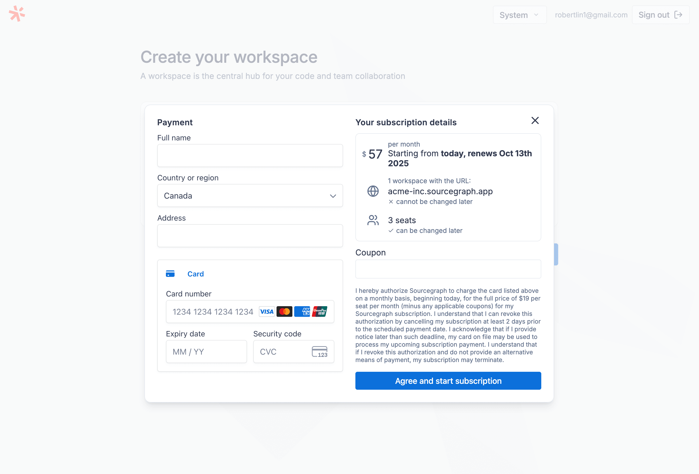
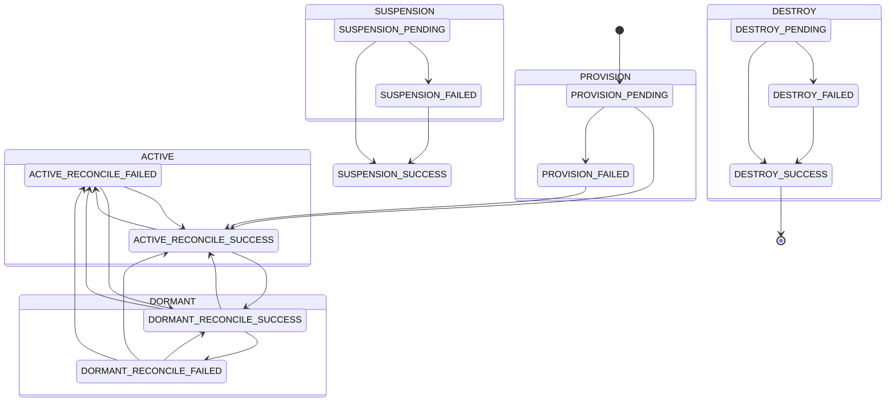
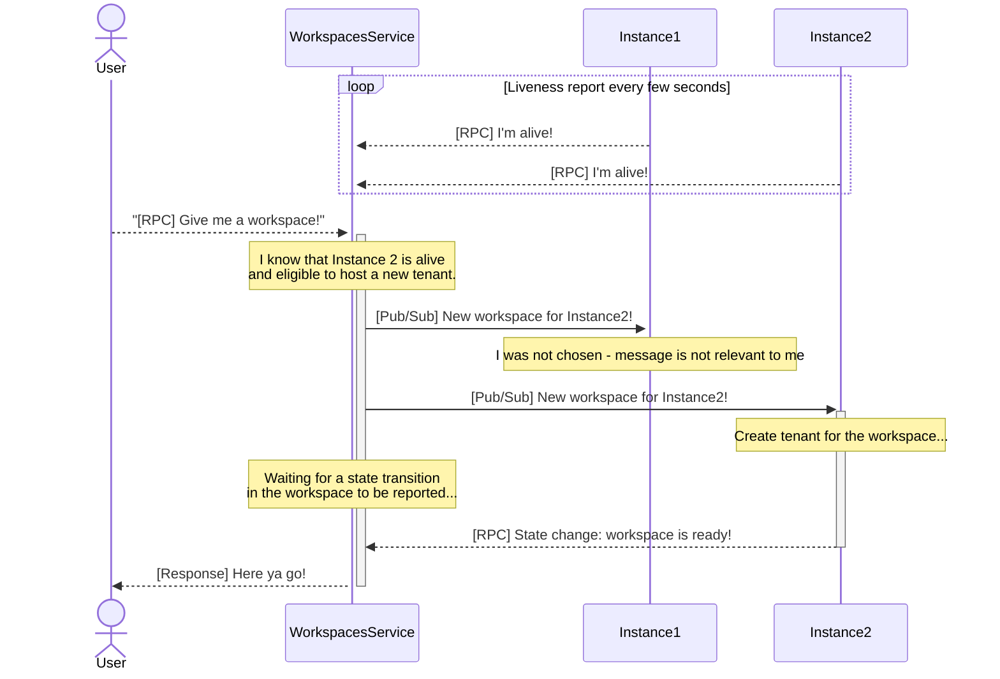
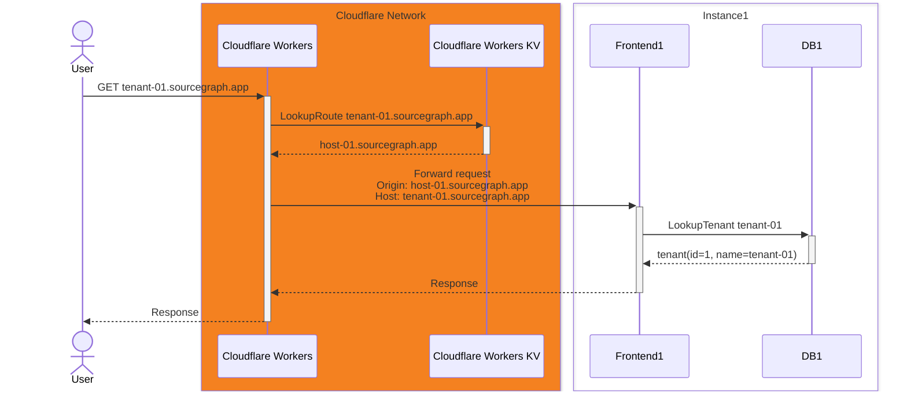

In February 2025, Sourcegraph quietly launched the ability to click a few buttons, leave your credit card details, and get the full-fledged Sourcegraph code search experience for yourself and your team. This was only possible thanks to a project internally dubbed the "multi-tenant Sourcegraph" project.

The Sourcegraph [code search product](https://sourcegraph.com/code-search) had been a single-tenant, self-hosted product for nearly a decade. Because individual Sourcegraph instances are expensive and complex to operate - code search at scale is hard! - it can be quite an investment to try it out, and even our [managed single-tenant offering](./2024-8-23-multi-single-tenant.md) requires reaching out to sales and all that. For most people, our public code search deployment at [sourcegraph.com/search](https://sourcegraph.com/search) was the only way to easily get access to reliable Sourcegraph code search, and this was limited to public code.

We wanted to bring the code search experience that Sourcegraph's big enterprise customers loved to a wider self-serve audience, at a much lower price. Bringing multi-tenancy to Sourcegraph would allow us to offer code search at a dramatically lower cost, and allow users to get started in just seconds, instead of hours and days. Externally, we called this new multi-tenant Sourcegraph platform 
"Sourcegraph Workspaces"[^workspaceslaunch].

<figure>
    
    <figcaption>
    Sourcegraph code search, just a click and your credit card away!
    </figcaption>
</figure>

Working on the 6-month project to bring Sourcegraph Workspaces to fruition will always be one of the highlights of my career. It was an exciting experience to collaborate with some extremely talented colleagues, meeting up in Montreal and Berlin to bring the many pieces of the project together. As a bonus, several components of the project represented a satisfying culmination of things that I've worked on at Sourcegraph over the past few years:

- [Automating the operation of managed single-tenant Sourcegraph instances](./2024-8-23-multi-single-tenant.md), which opened the door to a scalable multi-tenant offering hosted on the same infrastructure, where each instance might be able to host many hosts at a time
- [Building a reusable services platform](2025-9-20-managed-services-platform.md) and [leading my team](../_experience/2021-7-5-sourcegraph.md#core-services) to launch a number of services that made user accounts[^sams], telemetry ingestion, and many other core capabilities available in a composable manner

My direct contributions to Sourcegraph Workspaces during the project mostly pertained to the coordination machinery required to make this happen and guiding some of the architectural decisions, which I will focus on in this post. The changes that enabled multi-tenancy without an insurmountable amount of rewrites were made by other talented engineers across the company, and I'll try to cover the strategy here lightly as well.

## The requirements

A few requirements for the multi-tenancy in Sourcegraph was decided upon from the onset:

1. Data isolation between each workspace must be extremely strict and robust by design, and there must be minimal engineering overhead for day-to-day feature development to handle multi-tenant special cases
2. Creating a workspace must be seamless, and users must have be able to start setting up their workspace within 10 seconds of clicking "purchase"
3. The local development story for the entire multi-tenant experience, including creating and testing multiple workspaces locally, must be rock-solid and easy to set up

## The strategy

The core concept was enable each Sourcegraph instance "host" to house many "tenants", with strict data isolation between tenants living on the same host. The [multi-single-tenant Sourcegraph Cloud](./2024-8-23-multi-single-tenant.md) platform would be the key technology to allow us to confidently scale the fleet horizontally to accommodate more tenants.

There are a few capabilities, however, that necessitated another level of abstraction on top of "tenants":

- Creating a tenant, and providing your billing details, must happen *somewhere* outside of any tenant, as this needed to be done before the user has a tenant to work with at all.
- Our multi-tenancy model would be predicated upon a fleet of many hosts that could scale horizontally to accommodate more tenants as needed - this necessitated a coordination mechanism to decide where new tenants go, and track the host that each tenant lives on.

This is where the user-facing concept of a "workspace", which would abstract away the concepts of "hosts" and "tenants" so that users would only interact with a workspace that they access at `my-workspace.sourcegraph.app/search`.

For our on-host tenant isolation mechanism, this also abstracts away the concept of coordinating across multiple hosts and product requirements like billing from the design of tenant isolation, simplifying the workspaces-specific capabilities that needed to be baked into the core Sourcegraph product.

We built this workspaces coordination layer around a standalone "Workspaces service" (referred to with a capital "W" because naming is hard) operated on our [services platform](./2025-9-20-managed-services-platform.md). This service would serve as a source-of-truth for workspace state, handle billing concerns, keep track of all hosts in the fleet, and assign newly created workspaces as tenants on available hosts.

- [Workspace and tenant coordination](#workspace-and-tenant-coordination)
- [Workspace creation](#workspace-creation)
- [Treating each workspace as a full Sourcegraph instance](#treating-each-workspace-as-a-full-sourcegraph-instance)
- [Tenant isolation](#tenant-isolation)

### Workspace and tenant coordination

I drew heavily from [my work on multi-single-tenant Sourcegraph Cloud](./2024-8-23-multi-single-tenant.md) in designing the architecture for the workspaces coordination layer. I proposed that tenants should be provisioned and managed in an eventually-consistent reconciliation model, with each host serving as the reconciler of the tenants assigned to it. This side-stepped issues around potential host downtime, particularly during Sourcegraph version upgrades, or general instability.

First, we needed awareness of all available hosts within a fleet. This is done via a registration and heartbeat process: hosts would frequently report liveness state to the central Workspaces service, and would only be eligible for tenant assignment if they have reported in healthy within the last `N` seconds. This was also used to report capcity pressure, if the host became overpopulated or came under heavy load.

```proto
service IntegrationsService {
  // ...

  // ReportInstanceState should be used by Sourcegraph instances to report their
  // status and eligibility as a host for workspaces.
  rpc ReportInstanceState(ReportInstanceStateRequest) returns (ReportInstanceStateResponse) {
    option idempotency_level = IDEMPOTENT;
    option (sams_required_scopes) = "workspaces::instance::write";
  }

  // ...
}

message ReportInstanceStateRequest {
  // Static, globally unique, self-reported instance ID.
  string instance_id = 1;
  // The current state of the instance.
  InstanceState instance_state = 2;
  // The class of the instance. Should be a string of the format 'cloudv1://...'
  // denoting the class of the Cloud instance.
  string instance_class = 3;
}

message ReportInstanceStateResponse {}
```

In our design, hosts would make requests to the central Workspaces service to retrieve desired workspace state, while the Workspaces service would only communicate to the host via GCP Pub/Sub messages. This kept the data and control flow in one direction only, from the Workspaces service to hosts.

Pub/Sub messages published by the Workspaces service was the primary trigger[^trigger-fallback] for tenant reconciliation, with individual hosts requesting the desired state from the central Workspaces service to ensure a single source of truth. During each tenant reconciliation, each host would be able to create tenants, add users to the tenant, and bring the tenant closer to the desired state, as dictated by the Workspaces service.

For example, consider what happens when a workspace owner purchases an additional seat and adds a member[^membership], user `A`. The seat purchase and membership change is persisted to the Workspaces service, and now we broadcast a message: this is our Pub/Sub trigger.

> Hello **INSTANCE_X**! Something has changed within a tenant you host, **TENANT_Y**. Please make sure everything is up to date and report back when done.

All hosts will receive the message, but only the indicated host will attempt to reconcile the corresponding tenant. It pulls the tenant's desired state from the Workspaces service, and compares it to the state of the tenant locally. The reconciler notices that user `A` is not in the tenant, and corrects the diff to grant user `A` access to the tenant.

During this process, we needed a system for each host to report the state of each tenant in case something goes wrong - somewhat analogous to `ReportInstanceState`, but for individual workspaces - which we use for alerting, retries, and informing users of various error states:

```proto
service IntegrationsService {
  // ...

  // ReportWorkspaceState should be used by Sourcegraph instances to report the
  // status of workspaces they host.
  rpc ReportWorkspaceState(ReportWorkspaceStateRequest) returns (ReportWorkspaceStateResponse) {
    option idempotency_level = IDEMPOTENT;
    option (sams_required_scopes) = "workspaces::workspace::write";
  }

  // ...
}

message ReportWorkspaceStateRequest {
  // ID of the Sourcegraph instance hosting the workspace and reporting on the
  // workspace's state.
  string instance_id = 1;
  // The ID of the relevant workspace, of the format 'ws_...'
  string workspace_id = 2;
  // The state of the workspace.
  WorkspaceState workspace_state = 3;
}

message ReportWorkspaceStateResponse {}
```

We used a state machine library[^statetrooper] to ensure that workspaces can only make predictable, known state transitions. For example, the reconciler can say that "workspace was in provision pending, but is now provision failed", but it cannot say that "workspaces is now pending deletion" - that is something that can only be done by the customer, or by a human operator. Every state transition would be validated against the state machine's rules to ensure the transition was legal, and each transition would be recorded to a durable audit log. The state machine for what the host's tenant reconciler looks like the following, for example - note how certain state transitions are not possible:



This made for some case-heavy code in our host-side tenant reconciler, as various error and success paths must carefully take into account the current state of the workspace to evaluate the appropriate error or success state to report, but it kept things explicit.

Putting everything together, we have the following lifecycle for changes to workspaces, where each change would:

1. Start with a user action, which would update the state of the workspace in the Workspaces service
2. Trigger a Pub/Sub message, prompting a tenant reconciliation within the tenant's host
3. `ReportWorkspaceState` would indicate the end of the reconcile, whether successful or not


As mentioned earlier, the local development experience needed to be rock solid for this complicated back-and-forth. We built the Workspaces service on [our managed services platform](./2025-9-20-managed-services-platform.md), which came with a number of local development conventions that integrated nicely with [our standard developer tooling](./2022-10-10-investing-in-development-of-devx.md) for running services locally. To emulate the Pub/Sub component, we built a wrapper around [the official `pstest` package](https://github.com/googleapis/google-cloud-go/tree/pubsub/v1.49.0/pubsub/pstest) to mock a GCP Pub/Sub API that had the desired topics and subscriptions configured.

In combination with using shared credentials for the live staging instance of our accounts provider, "Sourcegraph Accounts", this allowed a simple command (`sg start multitenant`) to give you the full workspaces experience, from creation to purchasing and more, locally with zero additional configuration.

### Workspace creation

While eventual consistency has many nice properties, it was somewhat contrary to one of our core goals: provisioning a workspace must feel seamless and frictionless to the user. There should not be a step where we tell the user to hang in there and just check back *eventually*. We needed certain time-sensitive events - namely workspace creation, and joining a workspace - to be able to synchronously await the resolution of an event within our trigger-reconcile-report lifecycle.


To solve this, the design included the ability to subscribe to changes within the Workspaces service as well, when a Pub/Sub notification is issued to instance hosts. This was implemented with PostgreSQL's [`LISTEN`](https://www.postgresql.org/docs/current/sql-listen.html) and [`NOTIFY` commands](https://www.postgresql.org/docs/current/sql-notify.html), and the lifecycle of a synchronous series of events would go:

1. User initiates action - in this example, "take my money and create my workspace"
2. Workspaces service processes this request:
   1. Create a workspace entity and assign it to a host
   2. Broadcast a Pub/Sub message with the workspace ID, and the host the workspace should be assigned to
   3. Register a `LISTEN` on a notification channel for the workspace, and wait for an update
3. While the Workspaces service waits for an update, the target host:
   1. Receives the Pub/Sub message
   2. Creates a tenant to represent the workspace
   3. Uses `ReportWorkspaceState` to indicate completion
4. Workspaces service processes the `ReportWorkspaceState` to validate and commit the workspace state transition, using `NOTIFY` to let the waiting `LISTEN` know the workspace is ready and the request can proceed
5. User gets redirected to active workspace

This flow had the speed properties we needed, and it also gave reasonable error-handling opportunities in the event the tenant creation fails, as the workspace entity is a durable one (agnostic of tenant) and we can be alerted to manually handle any issues.

To put all the concepts explained so far into a single illustration:



Note that this doesn't cover the many things that happen within behind the scenes in the seconds between the purchase event and the user being seamlessly directed to their workspace:

1. Basic validation for bad names, existence checks, discount codes, etc.
2. Stripe integration: we need to validate the provided payment method and track it for future billing needs[^billing] before we could finalize instance provisioning
3. Cloudflare workers: we need to ensure that [request routing](#treating-each-workspace-as-a-full-sourcegraph-instance) is configured correctly for the workspace
4. Host-side tenant provisioning: we've alluded to this, but creating an [isolated tenant](#tenant-isolation) is a whole thing

It's very fun imagining all this back-and-forth happening in the short time you see the loading spinner during workspace creation (which I did many times in manual testing), completely invisible to the user.

### Treating each workspace as a full Sourcegraph instance

Because of Sourcegraph's single-tenant history, *everything* is built around the concept of Sourcegraph instances living on a URL like `sourcegraph.my-company.com` or `mycompany.sourcegraphcloud.com` (for [Sourcegraph Cloud](./2024-8-23-multi-single-tenant.md) customers): our editor extensions, telemetry reporting, application URL paths, and more. Making sure that each workspace in multi-tenant Sourcegraph looked and behaved more or less exactly the same as single-tenant Sourcegraph instance helped us plug in neatly into existing assumptions.

A key part of this is ensuring each workspace gets its own domain, namely `my-workspace.sourcegraph.app`. To route users correctly, we needed to be able to efficiently and dynamically route users of `my-workspace` to the host where `my-workspace` lives in as a tenant. [Michael](https://github.com/michaellzc) selected [Cloudflare Workers](https://workers.cloudflare.com/) for this task - latency was crucial as this must happen for *every* single request to a workspace, and Cloudflare Workers' at-the-edge properties, combined with equally-at-the-edge [Cloudflare Workers KV](https://developers.cloudflare.com/kv/) for data storage, made them a good choice[^cfworkers].

The implementation of this routing layer was simple:

1. The Workspaces service, which knows which host each workspace lives in, writes workspace-to-host mappings to the "routes table" in Cloudflare Workers KV
2. Each request to a worksapce goes through our Cloudflare Worker, which would check the KV store for where the request should go and redirect it to the appropriate host
3. The host would look up the tenant corresponding to the requested workspace, and attach the correct [tenant context](#tenant-isolation) to the request

This basically allowed all Sourcegraph integrations, and even [unofficial Raycast extensions](../_open-source/2022-5-14-raycast-sourcegraph.md), to "just work" by pointing them to a workspace's URL.



Prior to the multi-tenant Sourcegraph project, I also lead a redesign of Sourcegraph's telemetry system to enable collection of usage telemetry from (nearly) all Sourcegraph instances to a central telemetry ingestion service. This made it easy to extend the telemetry ingestion system to account for a new source, "workspaces", analogous to sources like "licensed instance", and also have all our telemetry collection "just work" in workspaces. Our analytics team could treat workspaces just like all our other single-tenant Sourcegraph instances, and all our existing dashboarding for analysing usage could used to study workspace usage with minimal changes. Later, we were able to extend our [customer-facing analytics service](https://sourcegraph.com/docs/analytics) to support workspaces with minimal effort as well thanks to this property.

A number of other abstractions also had to be redesigned to accommodate workspaces - for example, I also hacked on building a new "gating" abstraction on top of our traditional license enforcement code, so that we could have feature gating backed by either licenses, or be "granted" by the workspace corresponding to the tenant. This contributed to our goal of making workspaces support as simple as possible when building new features.

### Tenant isolation

This is not a component that I worked significantly in, but without tenant isolation, we wouldn't have a multi-tenant offering to speak of, so I will try my best to summarise it here. The core strategy, designed largely by talented colleague [Erik](https://linkedin.com/in/erik-seliger)[^erik], was to push enforcement of data isolation as close to stored data as possible, with varying approaches based on the data storage system:

1. [Row-level security](https://www.postgresql.org/docs/current/ddl-rowsecurity.html) in Postgres
2. Namespacing in Redis, e.g. `tnt_42:somekey:...`
3. Stateful services use directory namespacing, e.g. `/data/tenant/42/...`
4. Enforcement of standardised tenancy-enforcing in-memory data structure libraries

This was coupled in-application with an audit of our usage of Go `context.Context` propagation. Since all the microservices within a Sourcegraph instance is written in Go, we could leverage context propagation both within and between services to enforce tenant data isolation, by attaching the acting tenant to the context. Notably, we don't provide a way to create a new context with a specific tenant ID — for safety, we only allow this in places like our HTTP middleware where tenant context must be propagated over the wire within Sourcegraph services (but *not* from external traffic).

To use the context, for example, enforcing tenant isolation in in-memory data structures looks like:

```go
type keyWithTenant[K comparable] struct {
  tenant int // ensure identical keys are still separated by tenant ID
  key    K
}

func newKey[K comparable](tenantID int, key K) keyWithTenant[K] {
  return keyWithTenant[K]{tenant: tenantID, key: key}
}

// Get looks up a key's value from the cache.
func (c *LRU[K, V]) Get(ctx context.Context, key K) (value V, ok bool, err error) {
  tnt, err := tenant.FromContext(ctx)
  if err != nil {
    return value, false, err
  }
  v, ok := c.cache.Get(newKey(tnt.ID, key))
  return v, ok, nil
}
```

To most application components, tenancy concerns do not have to be handled explicitly, as long as the approved data management mechanisms are used (which we enforce in linters). This was important for our requirement that building new features with tenancy in mind should require minimal engineering overhead. For example, when using the above cache, note the lack of any explicit tenancy checks:

```go
import (
  // ...
  "github.com/sourcegraph/sourcegraph/internal/memcache"
)

var globalRevAtTimeCache = memcache.NewLRU[revAtTimeCacheKey, api.CommitID](/* ... */)

func (g *gitCLIBackend) RevAtTime(ctx context.Context, spec string, t time.Time) (api.CommitID, error) {
  // ...
  key := revAtTimeCacheKey{g.repoID, sha, t}
  entry, ok, err := g.revAtTimeCache.Get(ctx, key)
  // ...
}
```

The same goes for database access: for all the many, many database queries used throughout Sourcegraph, as long as the shared database connection infrastructure is used, the appropriate session variable is added to satisfy PostgreSQL row-level security policies before access to data is granted.

```go
func (n *extendedConn) setTenant(ctx context.Context) error {
  tnt, err := tenant.FromContext(ctx)
  if err != nil { /* ... */ }

  _, err := n.execerContext.ExecContext(ctx, 
    // Set variable for policies, which are automatically injected and look like:
    //
    //   ((tenant_id = (SELECT (current_setting('app.current_tenant'::text))::integer AS current_tenant)))
    //
    // where `tenant_id` is a column required on every single table.
    fmt.Sprintf("SET app.current_tenant = '%s'", strconv.Itoa(tenantID)),
    nil,
  )
  // ...
}
```

Note that all the descriptions above - particularly the consistent enforcement of row-level security policies in our databases - is *very* simplified. Adding a `tenant_id` column to all tables alone came with the discovery of all sorts of edge cases, performance issues, and difficult migrations. A lot of work had to be put into polishing the implementation of background jobs, for example: how do you efficiently and fairly queue and process background work on a per-tenant basis, for potentially thousands of tenants on a single host? How do we make sure this system is leak-proof, and what tools can we add to make plugging the gaps as simple as possible? 

The questions and problems seemed to go on and on, and while I didn't get to work very closely on most of this side of things, it was really cool to see the team systematically build tools and processes to cover everything.

## The launch

As launch day approached, the excitement within the team was palpable. Everyone working on every aspect of Sourcegraph Workspaces - from tenant isolation, to workspace coordination, to host management, to billing integrations, to the local development experience, to a fully functional staging environment for QA, to the in-product experience, to the Linear issue trackers that managed this sprawling project, to the operational playbooks for every conceivable scenario - had worked very hard to deliver the most robust, polished experience with the resources we had on hand. We knew Sourcegraph had a solid product that our customers already loved and paid a *lot* of money for. We were hopeful that, with the company's support, we were about to turn a new page in the Sourcegraph's history in making this product more accessible than ever.

Much to our relief, the launch went smoothly: we had no show-stopping issues, and everything seemed to be chugging along more or less exactly as designed. It "just worked", and I was very happy to see the product come together.

Unfortunately, the launch also became a (perhaps obvious) learning experience for me: that even the most polished product can will not do well without a *lot* of other factors also aligning in just the right way. It was not the game-changer we hoped for, but Sourcegraph Workspaces continues to serve some customers well, and I'm proud of what we achieved.

---

[^workspaceslaunch]: February 2025 launch post: [https://sourcegraph.com/blog/introducing-sourcegraph-enterprise-starter](https://sourcegraph.com/blog/introducing-sourcegraph-enterprise-starter)
[^sams]: In particular, the [standalone Sourcegraph Accounts service from my colleague Joe](https://unknwon.io/posts/250910-babysitting-and-ai-agents/#things-that-i-am-proud-of) was an instrumental piece of the story, as it gave us the cross-tenant identity provider we needed to get started.
[^statetrooper]: [https://github.com/hishamk/statetrooper](https://github.com/hishamk/statetrooper)
[^trigger-fallback]: Host-wide reconciles are also triggered on a cron as a fallback.
[^billing]: We implemented our own payment scheduler, also designed by my colleague [Joe](https://unknwon.io), using Stripe only for processing invoices as determined by the Workspaces service. This gave us a lot more flexibility.
[^membership]: Workspace membership was implemented a concept tracked by the Workspaces service, even though there is a rudimentary in-Sourcegraph user management system for Sourcegraph administrators. The decision to not use the in-Sourcegraph user management system largely came from a need for "workspace billing admin" state to live in Workspaces service as a source of truth, and to make it easier to build the more product-lead-growth-oriented invitation flows that we anticipated building.
[^cfworkers]: Michael made a very in-depth evaluation of a number of options, comparing pricing, latency, operational overhead, implementation complexity, and more before landing on this choice. Like many aspects of this project mentioned here, there's a lot of details that I probably can't get into as much as I would like to in a public post!
[^erik]: MVP of this whole project, really.
